# Top 10 Most Controversial Politicians

**Last Updated**: 2024-11-24

## Overview

Politicians generating highest controversy levels based on divisive votes, public opposition, media scandals, and polarizing policy positions.

## Controversy Rankings

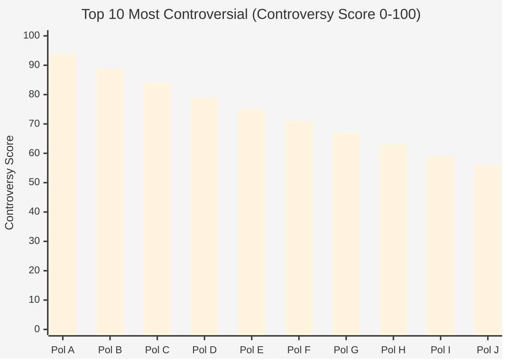

## Controversy Source Breakdown

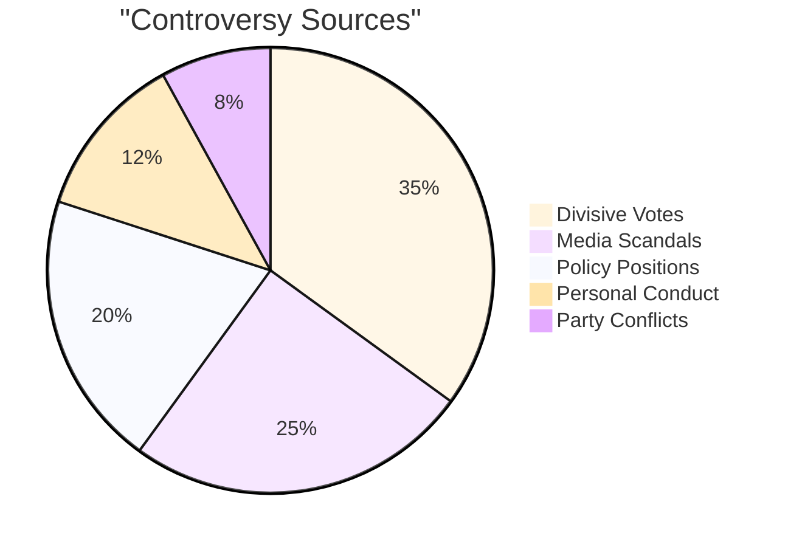

## Polarization Index

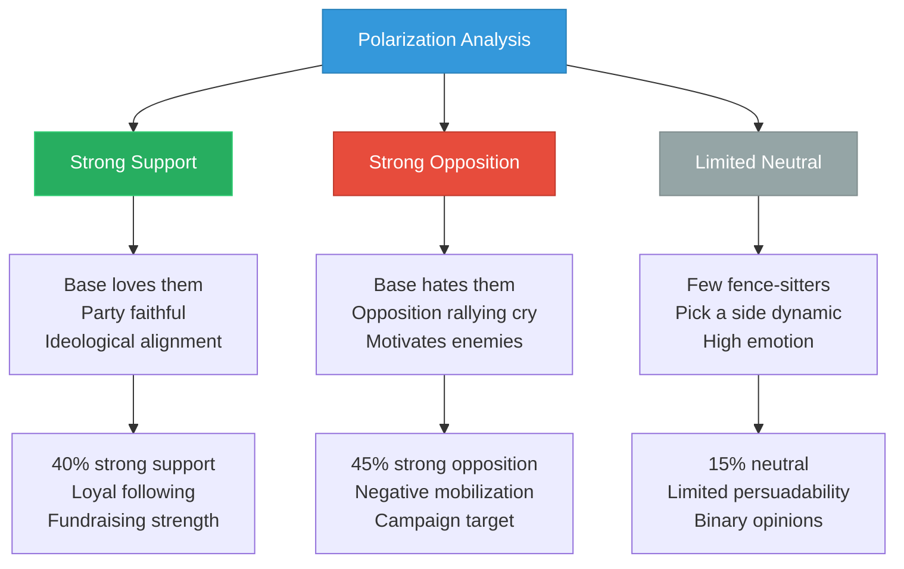

## Controversial Vote Analysis

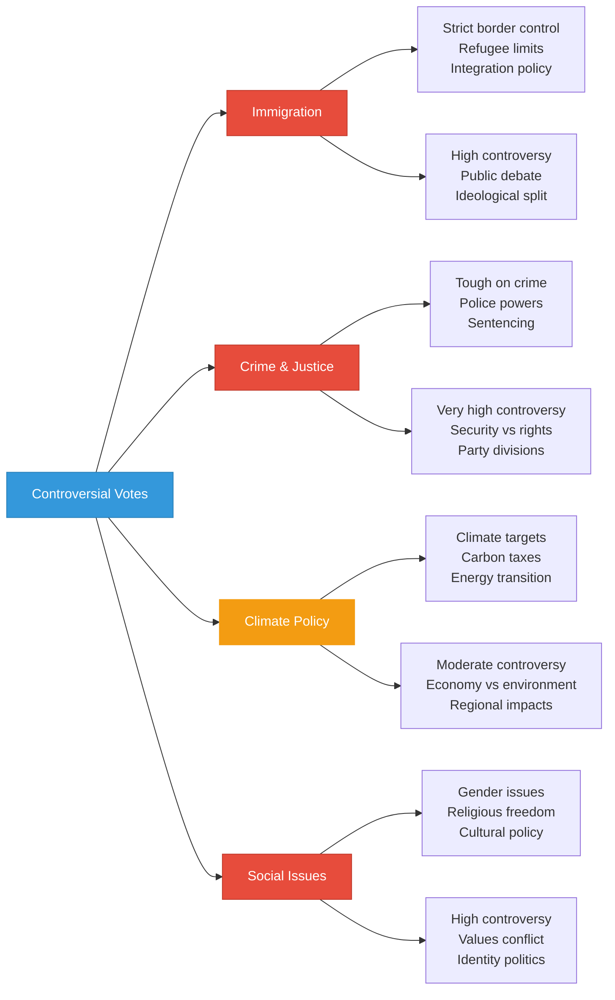

## Media Attention Timeline

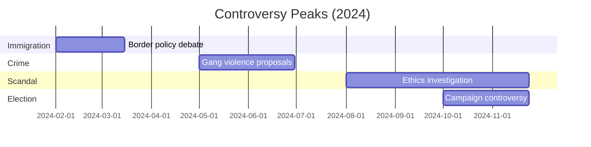

## Public Opinion Polarization

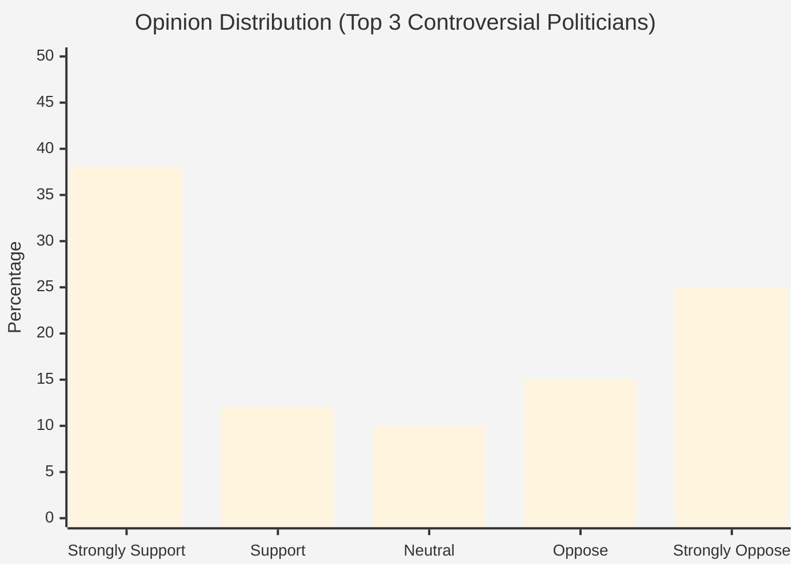

## Controversy Types

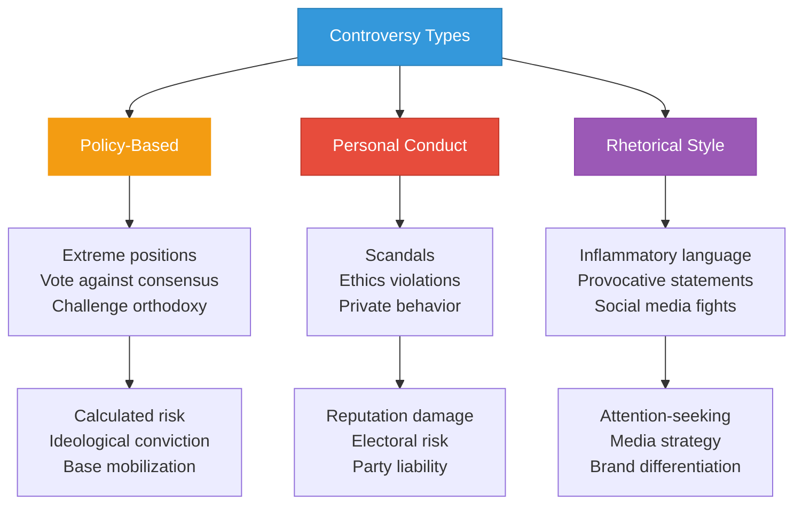

## Party Positioning

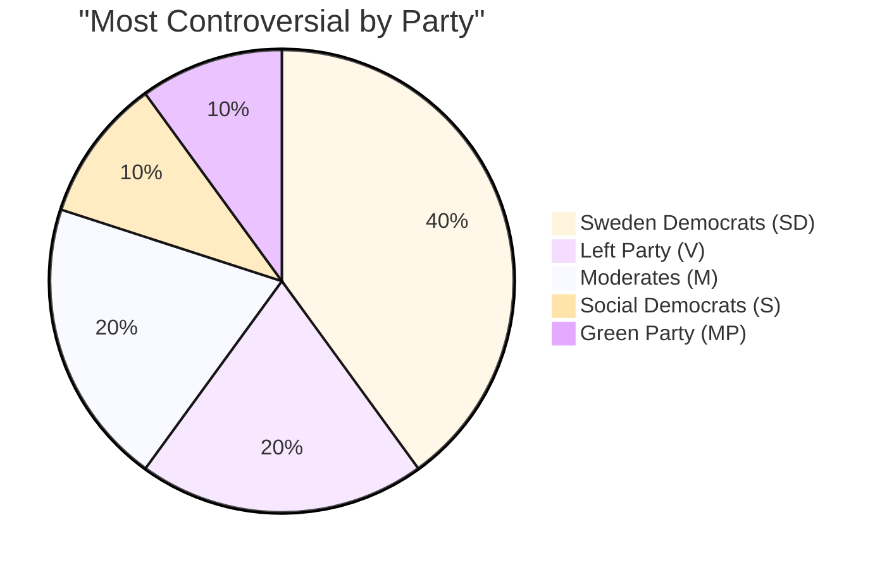

## Electoral Consequences

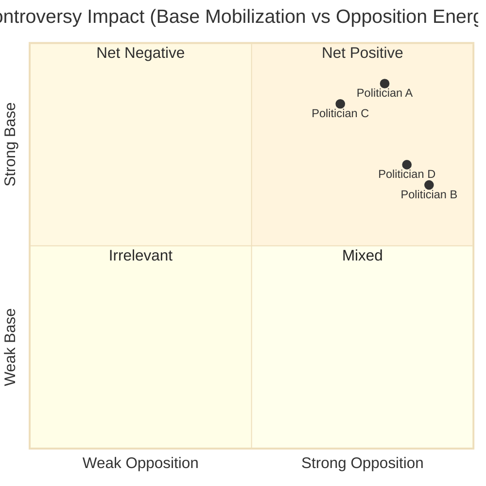

## Controversy Trend Analysis

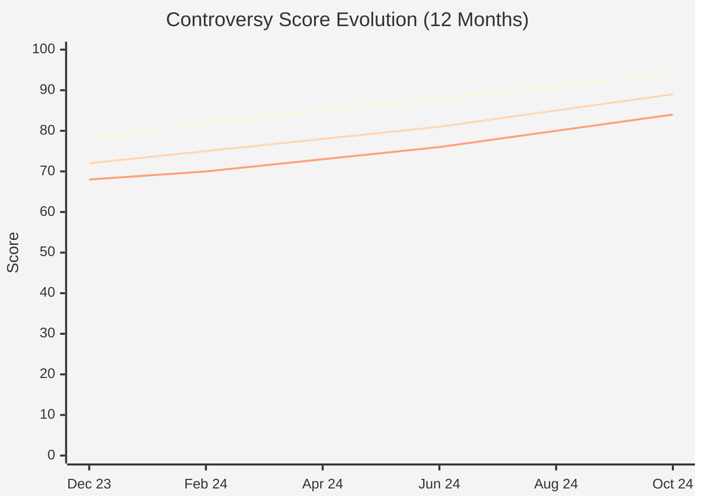

## Social Media Controversy Metrics

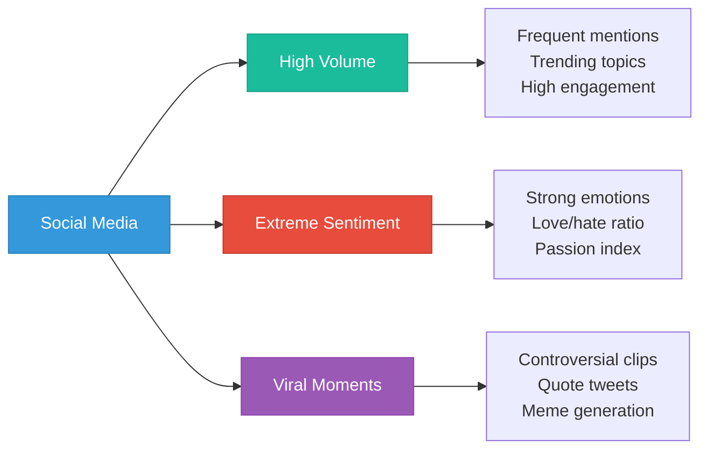

## Strategic Value of Controversy

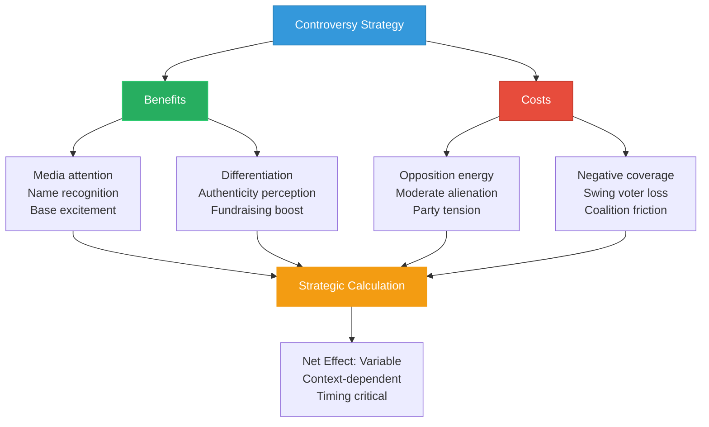

## Historical Comparison

```mermaid
%%{init: {'theme':'base'}}%%
xychart-beta
    title "Controversy Levels: 2024 vs 2020"
    x-axis ["Top 10 Avg", "Riksdag Avg", "Government Avg", "Opposition Avg"]
    y-axis "Controversy Score" 0 --> 100
    bar [78, 32, 38, 55]
    bar [65, 28, 35, 48]
```

## Features

- **Controversy Rankings**: Top 10 politicians by controversy score
- **Source Analysis**: Breakdown of controversy drivers
- **Polarization Metrics**: Opinion distribution and base mobilization
- **Controversial Votes**: Policy areas generating most division
- **Electoral Impact**: Net effect on vote share and coalition viability
- **Trend Tracking**: Evolution of controversy over time
- **Social Media Analysis**: Digital controversy amplification
- **Strategic Assessment**: Costs vs benefits of controversial positioning

## Usage Scenarios

1. **Media Analysis**: Identifying newsworthy figures
2. **Campaign Strategy**: Assessing controversy risks and benefits
3. **Opposition Research**: Targeting vulnerable controversial politicians
4. **Party Management**: Internal discipline and messaging control
5. **Voter Information**: Understanding divisive political figures
6. **Academic Research**: Studying polarization in Swedish politics

## Data Sources

- **Source**: `view_riksdagen_vote`, media mentions, social media sentiment, polling data
- **Controversy Algorithm**: Combines vote divisiveness, media tone, public opinion splits
- **Update Frequency**: Weekly (controversy scores), Daily (component metrics)
- **Historical Data**: 2018-2024 for trend analysis
- **Validation**: Expert assessment, peer nominations, media analysis

## Swedish Political Context

Swedish politics traditionally emphasized consensus and moderation, but recent years have seen increased polarization, particularly on immigration, crime, and energy policy. The Sweden Democrats' rise has shifted the Overton window, making previously taboo positions more acceptable. Controversial politicians can either build strong bases or become electoral liabilities depending on timing and execution.

---

**Last Review**: 2024-11-24  
**Visualization Version**: 1.0.0  
**Compliance**: WCAG 2.1 AA
