# Top 10 Most Influential Politicians

**Last Updated**: 2024-11-24

## Overview

Politicians wielding greatest political influence based on network centrality, legislative success, coalition power, and agenda-setting capacity.

## Influence Rankings

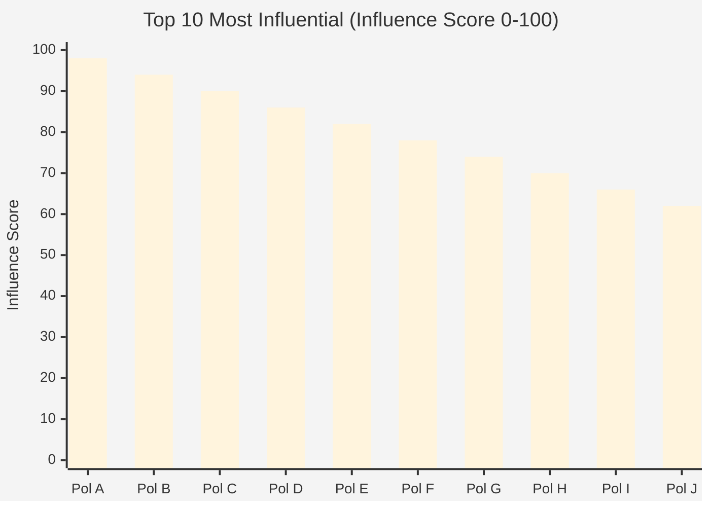

## Influence Dimensions

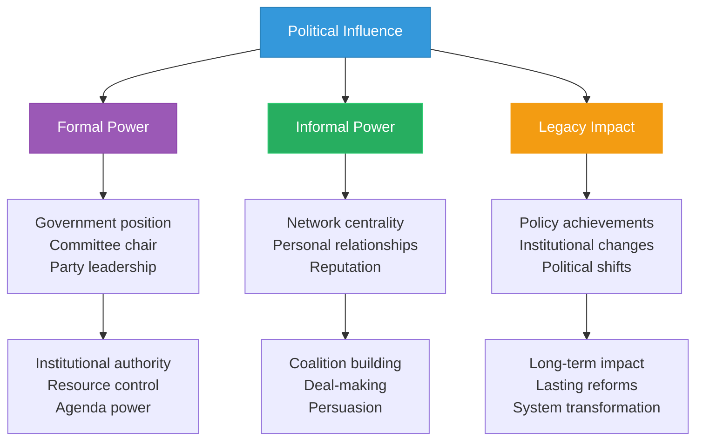

## Power Base Analysis

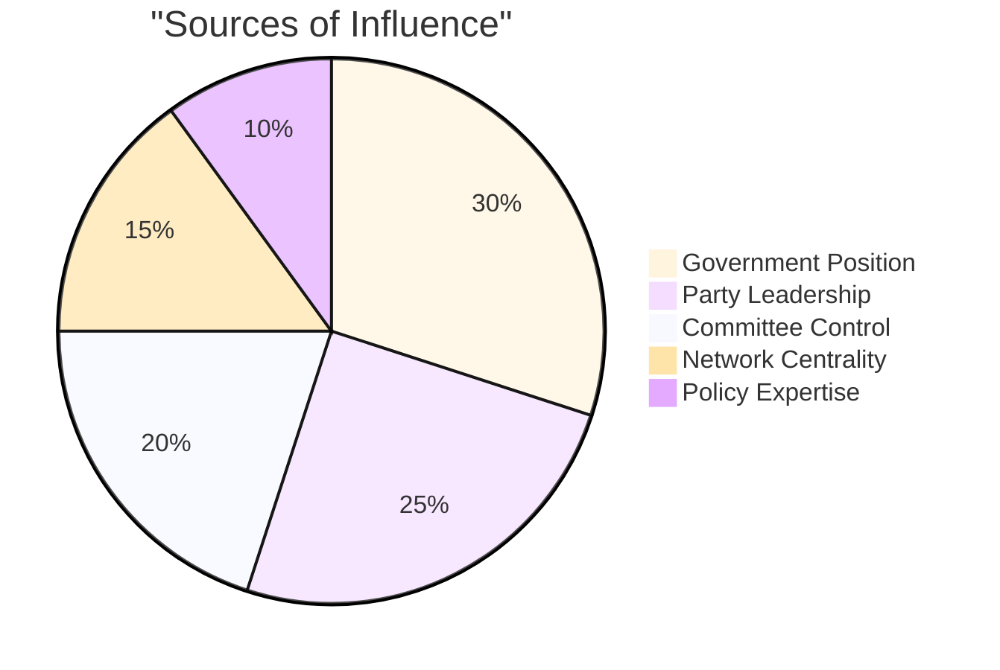

## Network Centrality

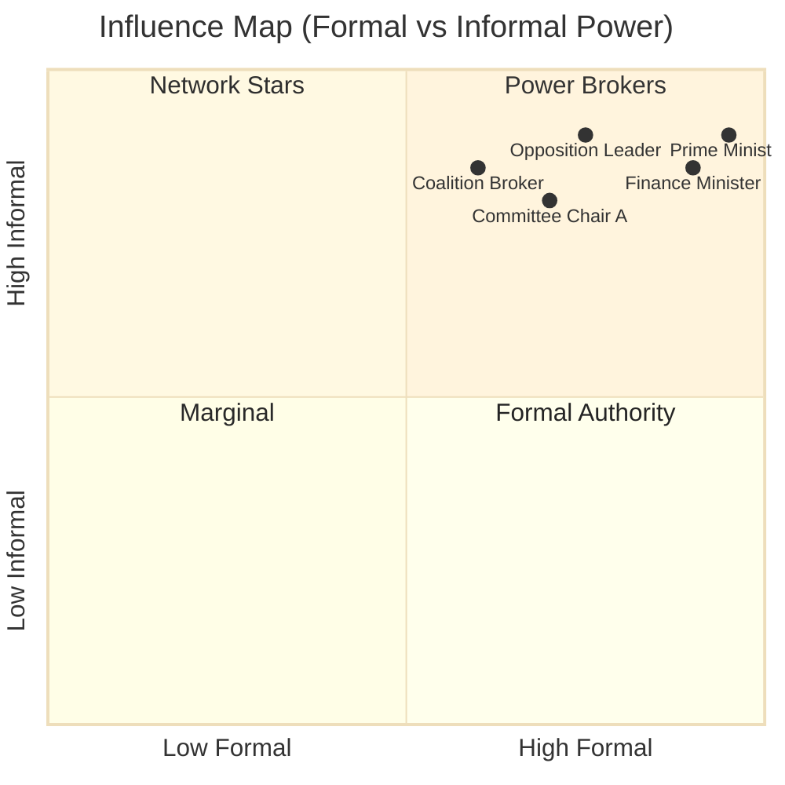

## Legislative Success Rate

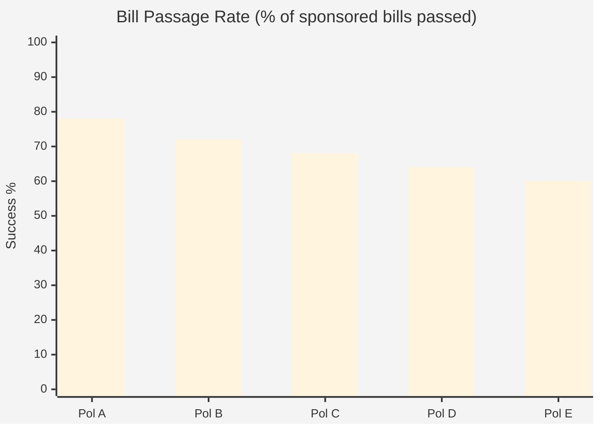

## Agenda-Setting Power

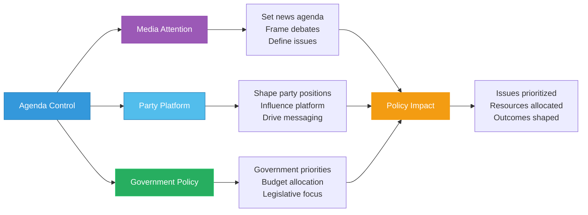

## Coalition Influence

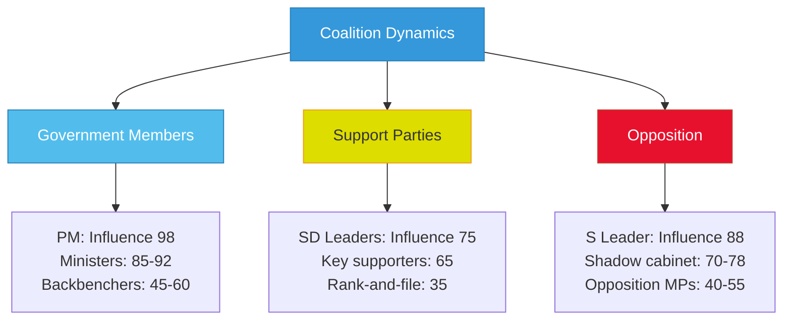

## Influence Evolution

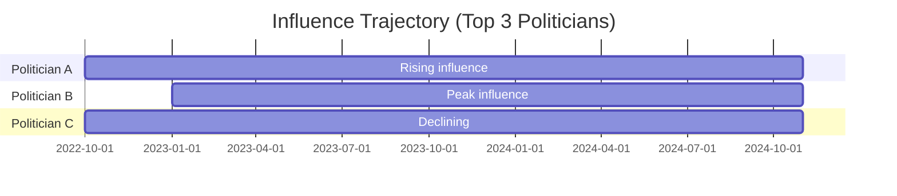

## Influence Mechanisms

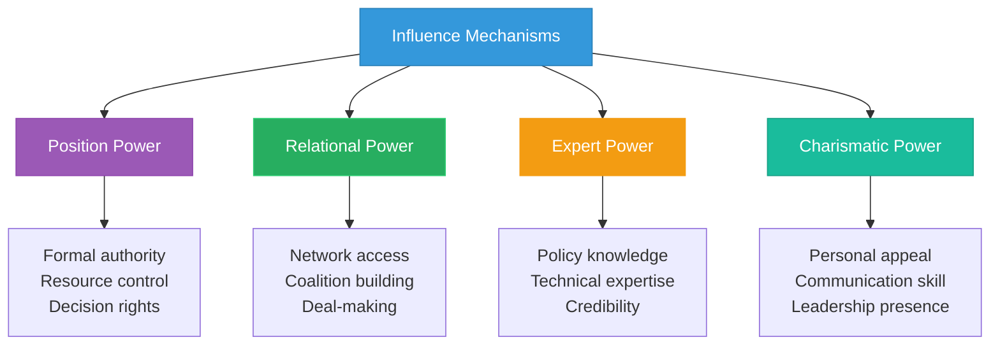

## Policy Impact Areas

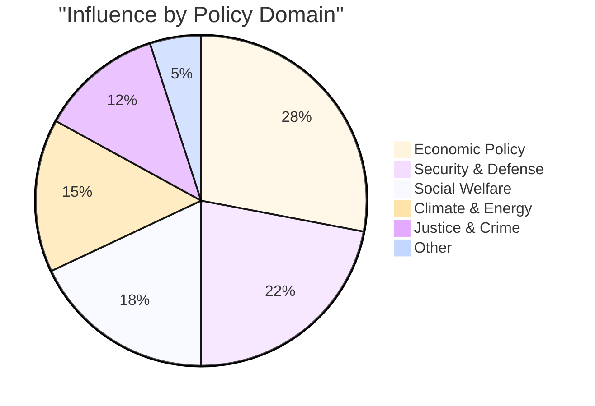

## Mentorship Networks

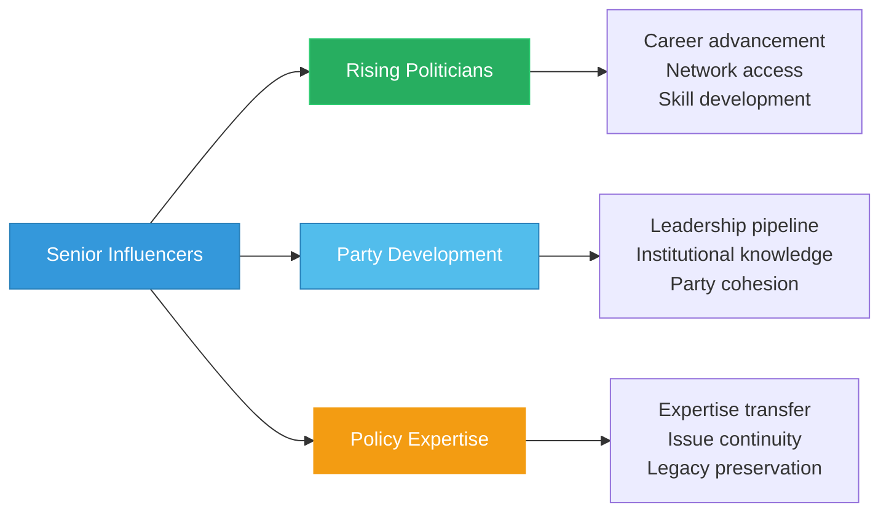

## Institutional Influence

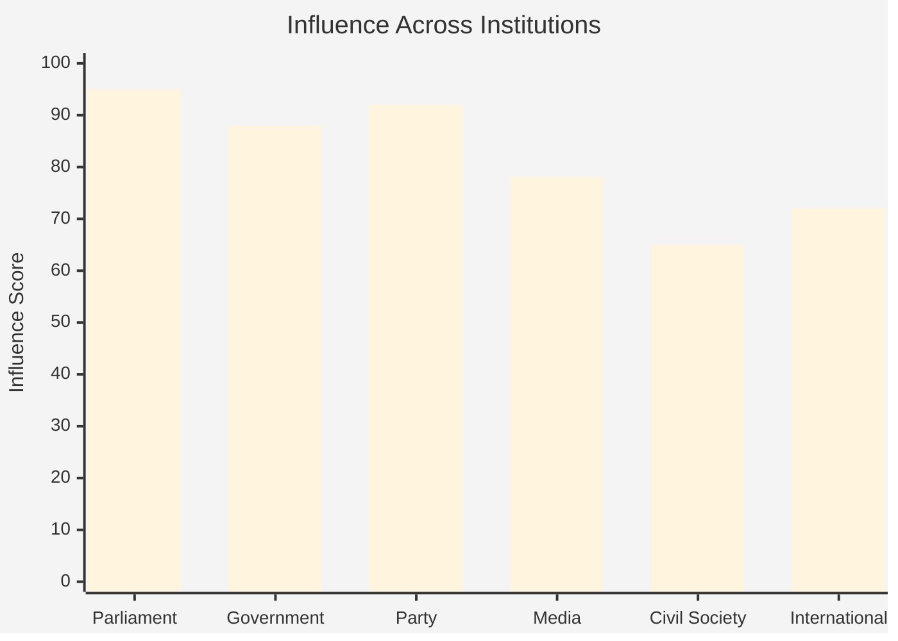

## Features

- **Influence Rankings**: Top 10 politicians by comprehensive influence score
- **Multi-dimensional Analysis**: Formal, informal, and legacy power
- **Network Centrality**: Position in political relationship networks
- **Legislative Success**: Bill passage and policy achievement rates
- **Agenda Power**: Capacity to shape political discourse and priorities
- **Coalition Dynamics**: Influence within government and opposition
- **Mechanism Analysis**: How power is built and exercised
- **Impact Assessment**: Policy outcomes and institutional changes

## Usage Scenarios

1. **Political Analysis**: Understanding power dynamics in Riksdag
2. **Lobbying Strategy**: Identifying key decision-makers
3. **Coalition Building**: Finding influential partners
4. **Media Analysis**: Profiling political power brokers
5. **Academic Research**: Studying political influence networks
6. **Career Planning**: Role models for aspiring politicians

## Data Sources

- **Primary Views**:
  - `view_riksdagen_politician_influence_metrics` - Influence and network analysis
  - `view_riksdagen_politician` - Core politician profiles
  - `view_riksdagen_vote_data_ballot_politician_summary_annual` - Legislative success
- **Network Analysis**: 
  - Co-sponsorship networks (bill collaboration patterns)
  - Voting alignment matrices
  - Committee membership overlaps
  - Coalition building indicators
- **Influence Dimensions**:
  - **Formal Power**: Government position, committee chair, party leadership
  - **Informal Power**: Network centrality, personal relationships, reputation
  - **Legacy Impact**: Policy achievements, institutional changes, lasting reforms
- **Key Metrics**:
  - Network centrality scores (betweenness, closeness, degree)
  - Bill passage rates and amendment success
  - Agenda-setting capacity (media influence, policy framing)
  - Coalition formation effectiveness
- **Influence Model**: Position (30%) + Network (25%) + Success (25%) + Agenda (20%)
- **Update Frequency**: Monthly (influence scores), Weekly (component metrics)
- **Network Data**: Co-sponsorship, voting patterns, committee membership
- **Validation**: Expert surveys, peer nominations, media analysis cross-reference

---

**Last Review**: 2024-11-24  
**Visualization Version**: 1.0.0  
**Compliance**: WCAG 2.1 AA
