# Top 10 Most Productive Politicians

**Last Updated**: 2024-11-24

## Overview

Politicians with highest legislative productivity based on bills sponsored, amendments proposed, committee work, and parliamentary questions.

## Productivity Rankings

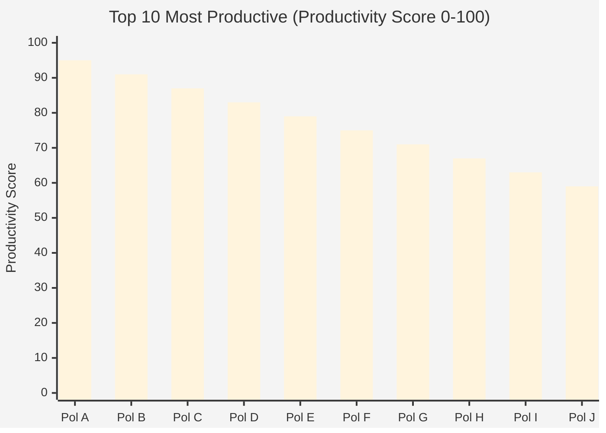

## Activity Breakdown

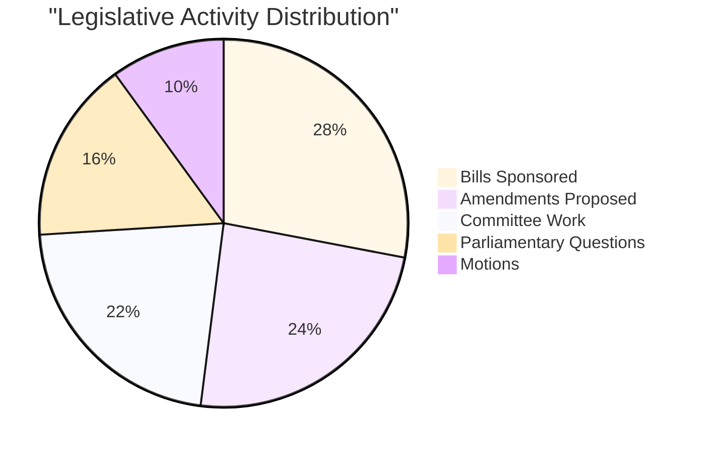

## Bills Sponsored

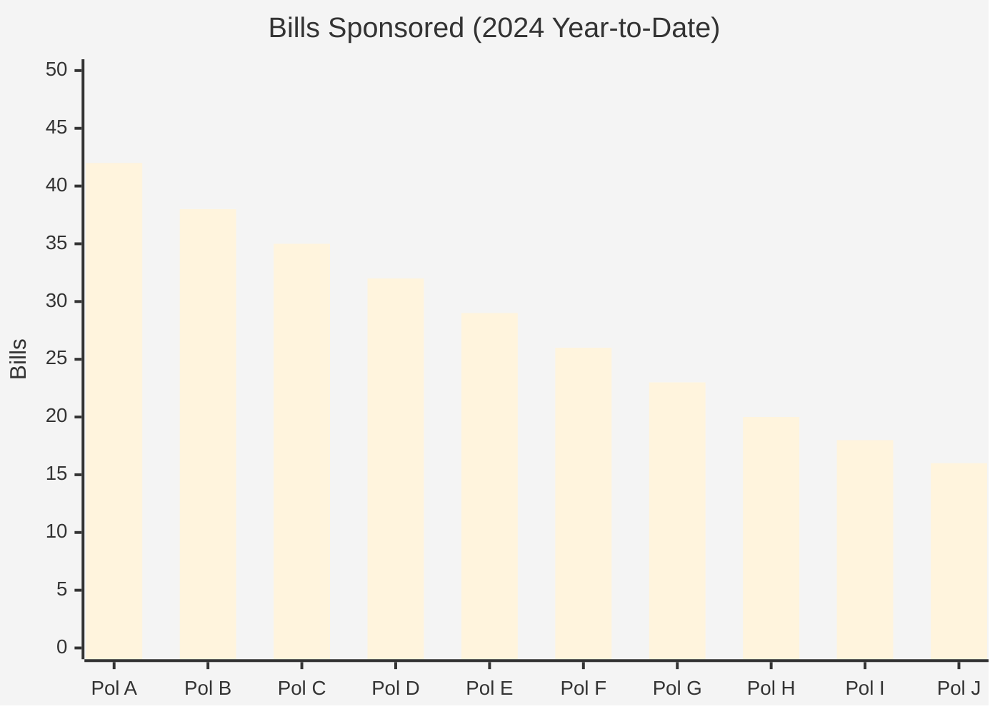

## Success Rate Analysis

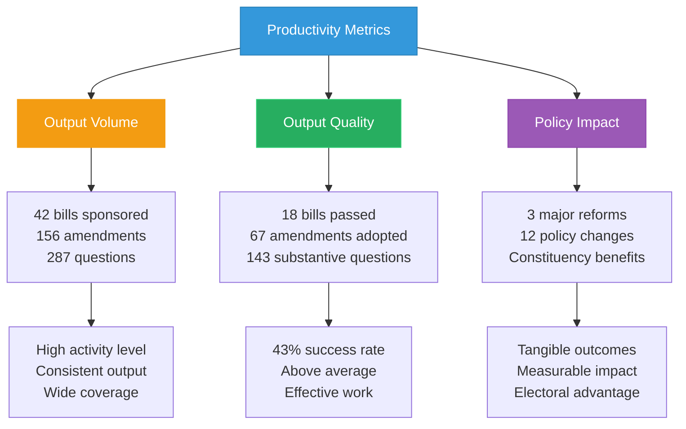

## Committee Contributions

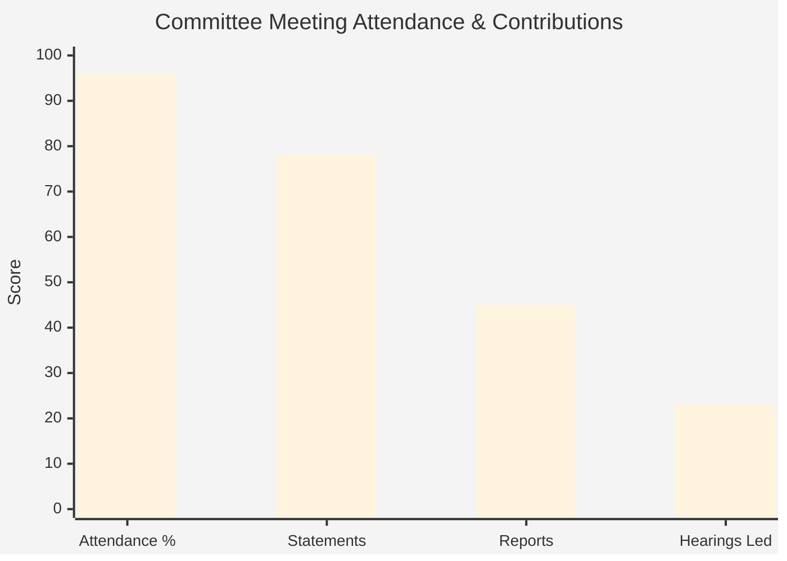

## Productivity by Policy Area

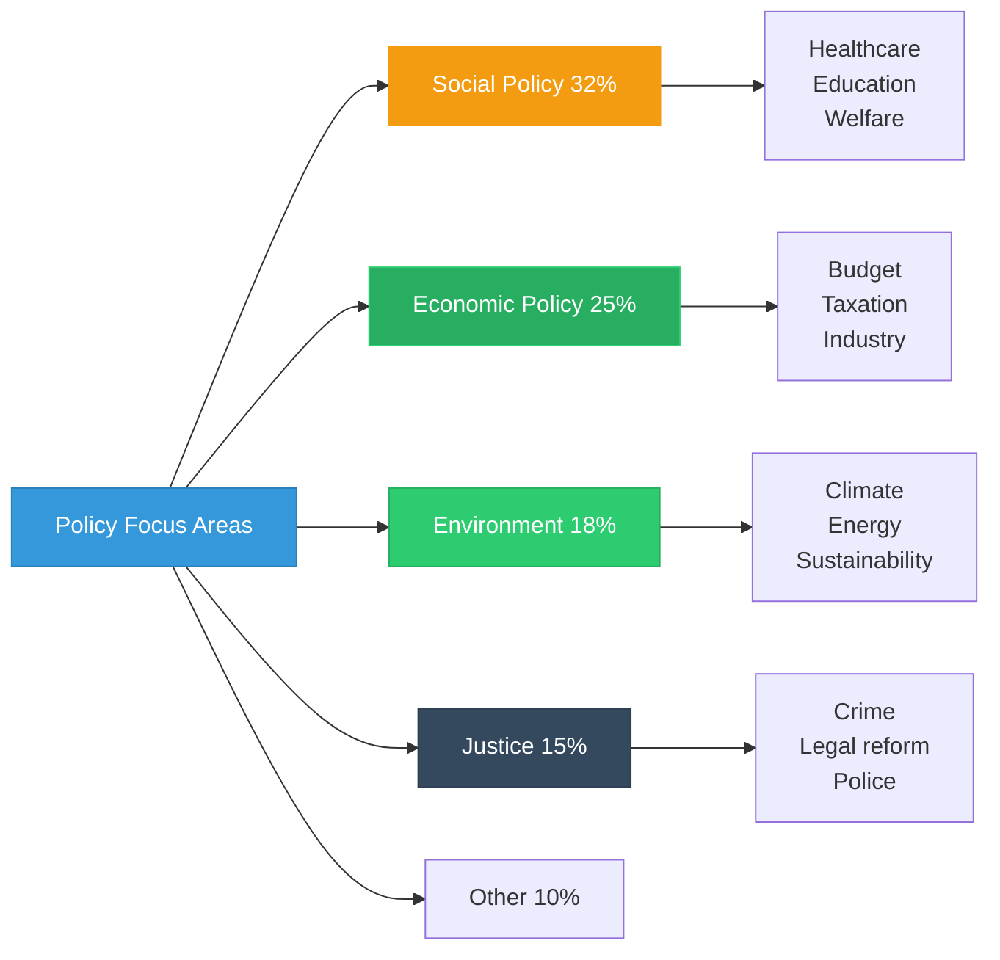

## Productivity Timeline

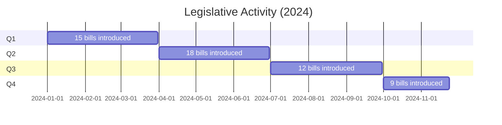

## Quality vs Quantity

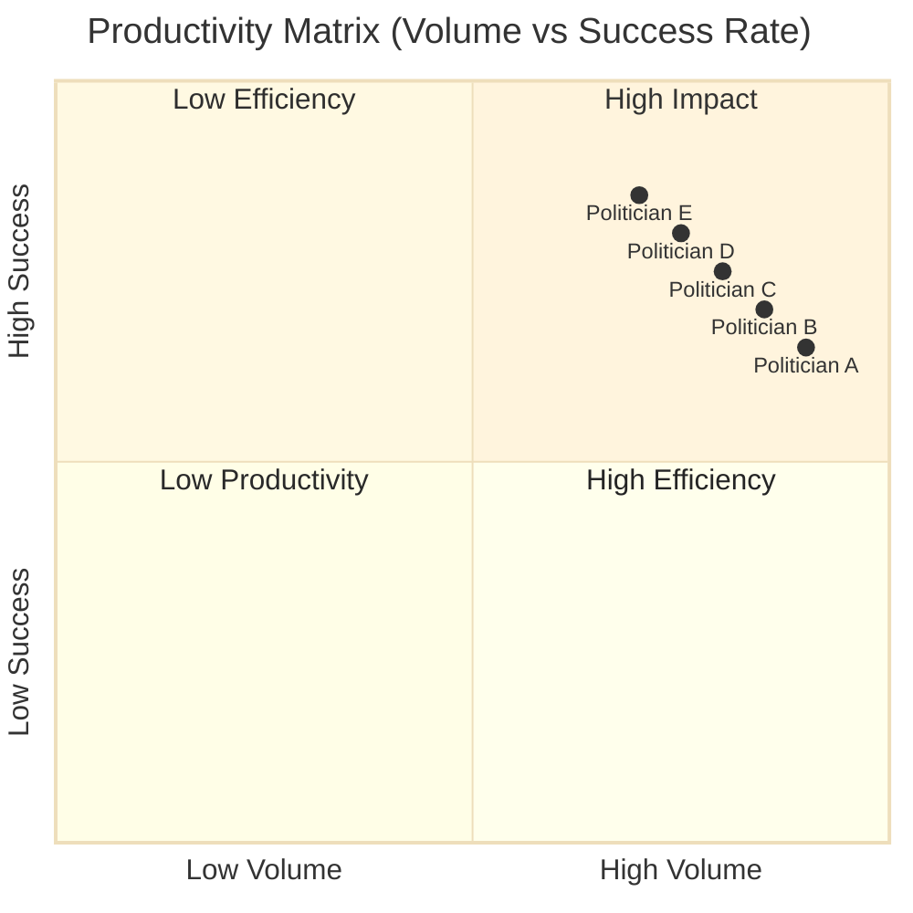

## Parliamentary Questions

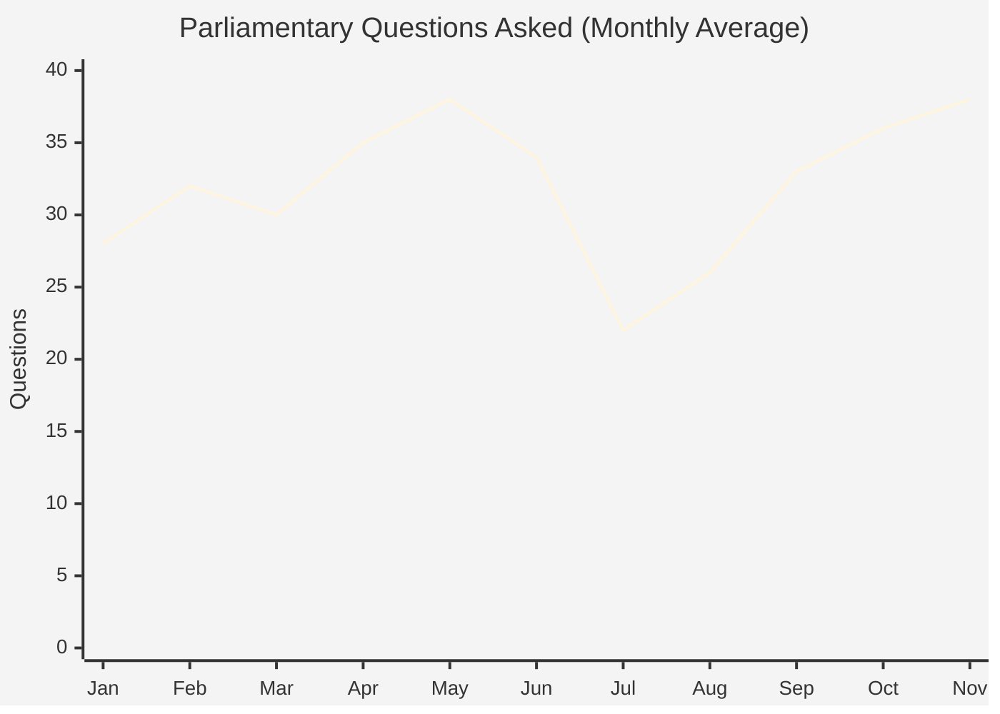

## Work Style Classification

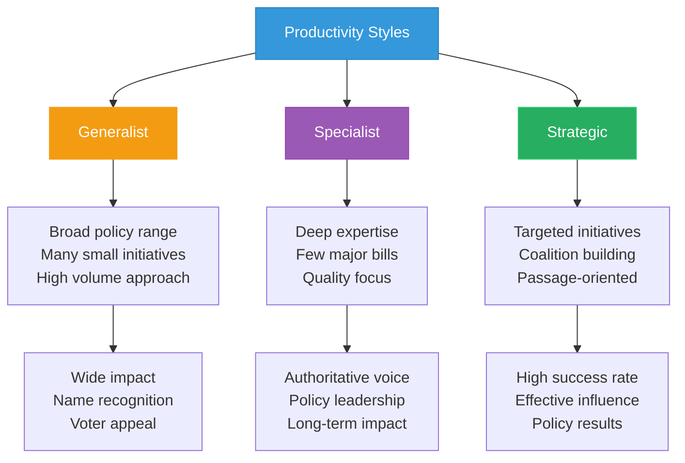

## Collaboration Patterns

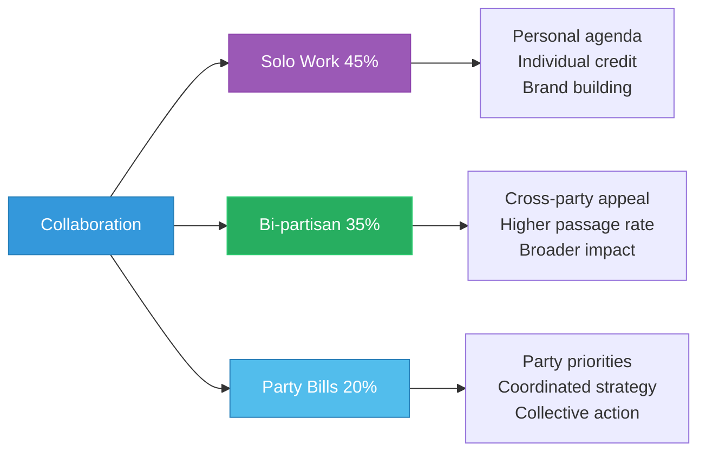

## Time Investment

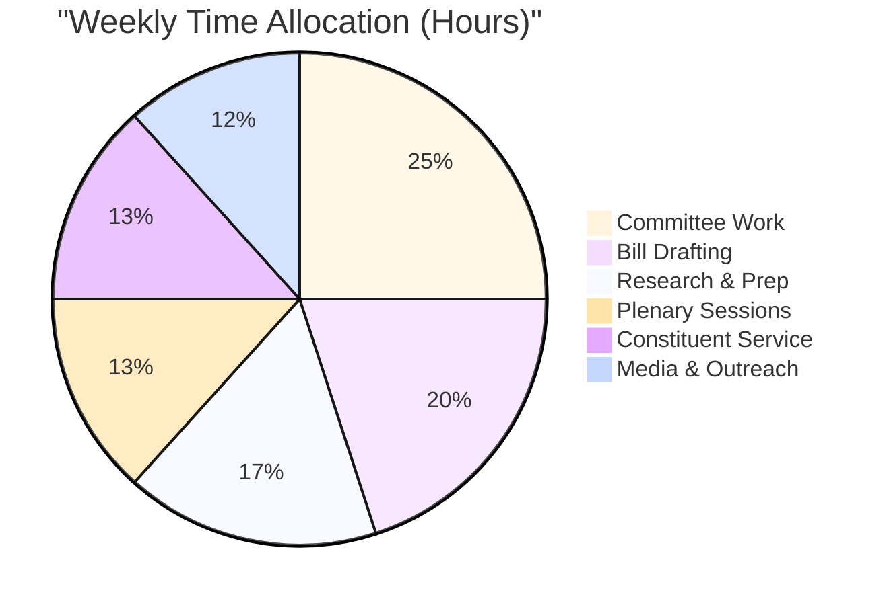

## Productivity Factors

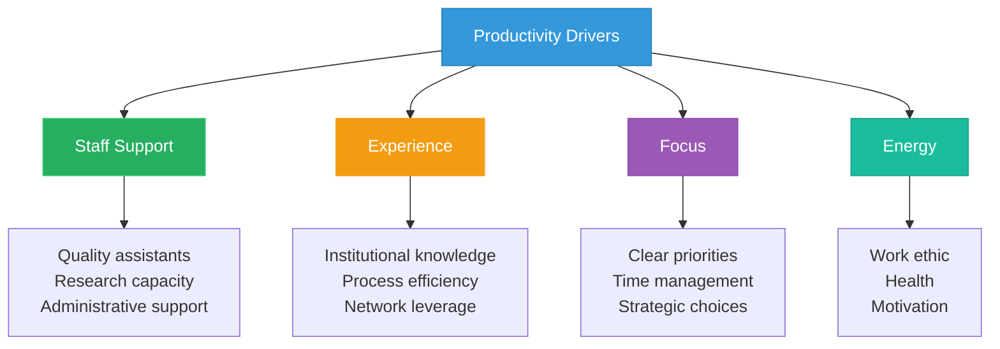

## Features

- **Productivity Rankings**: Top 10 by comprehensive productivity score
- **Activity Breakdown**: Distribution across legislative activities
- **Success Metrics**: Passage rates and policy impact
- **Committee Contributions**: Meeting participation and leadership
- **Policy Coverage**: Range and focus of legislative work
- **Quality Analysis**: Volume vs effectiveness assessment
- **Collaboration Patterns**: Solo, bipartisan, and party work
- **Time Investment**: Allocation across responsibilities

## Usage Scenarios

1. **Performance Assessment**: Evaluating representative effectiveness
2. **Electoral Accountability**: Voter information on productivity
3. **Party Management**: Identifying high performers
4. **Media Analysis**: Legislative achievement reporting
5. **Best Practices**: Learning from productive politicians
6. **Resource Allocation**: Supporting most effective members

## Data Sources

- **Source**: `view_riksdagen_politician`, `view_riksdagen_vote`, document database
- **Metrics**: Bills, amendments, questions, committee work, motions
- **Update Frequency**: Daily (activity counts), Monthly (productivity scores)
- **Historical Data**: 4-year legislative period for trends
- **Success Tracking**: Bill passage, amendment adoption, question responses

---

**Last Review**: 2024-11-24  
**Visualization Version**: 1.0.0  
**Compliance**: WCAG 2.1 AA
