# Top 10 Party Rebels

**Last Updated**: 2024-11-24

## Overview

Politicians with lowest party loyalty scores, frequently voting against party line and demonstrating independent thinking or ideological deviation.

## Rebel Rankings

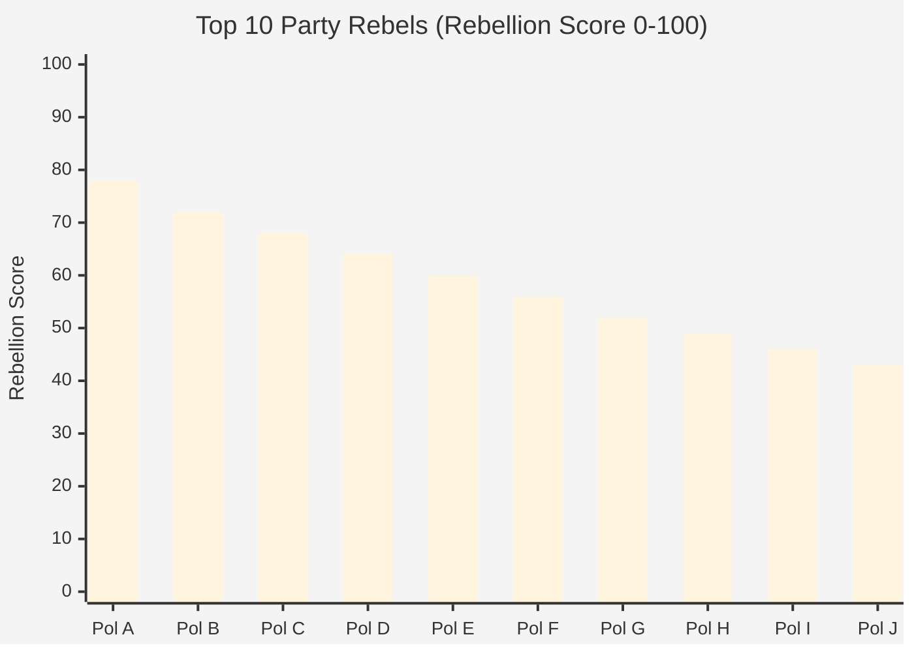

## Party Loyalty Analysis

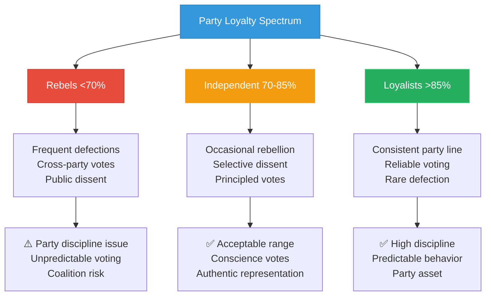

## Rebellion Types

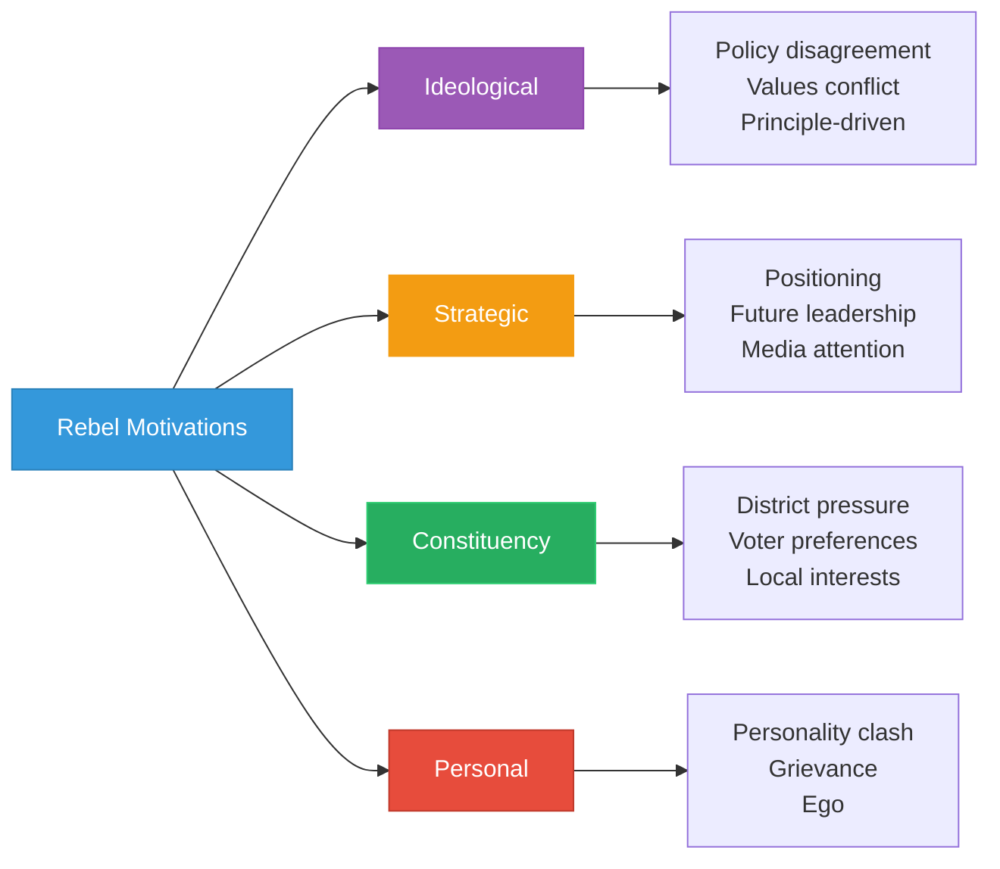

## Rebellion by Party

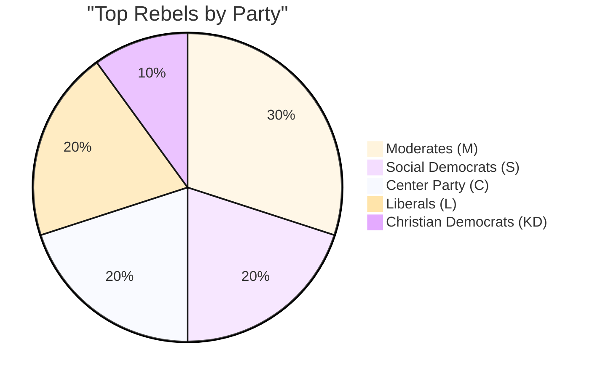

## Vote Defection Patterns

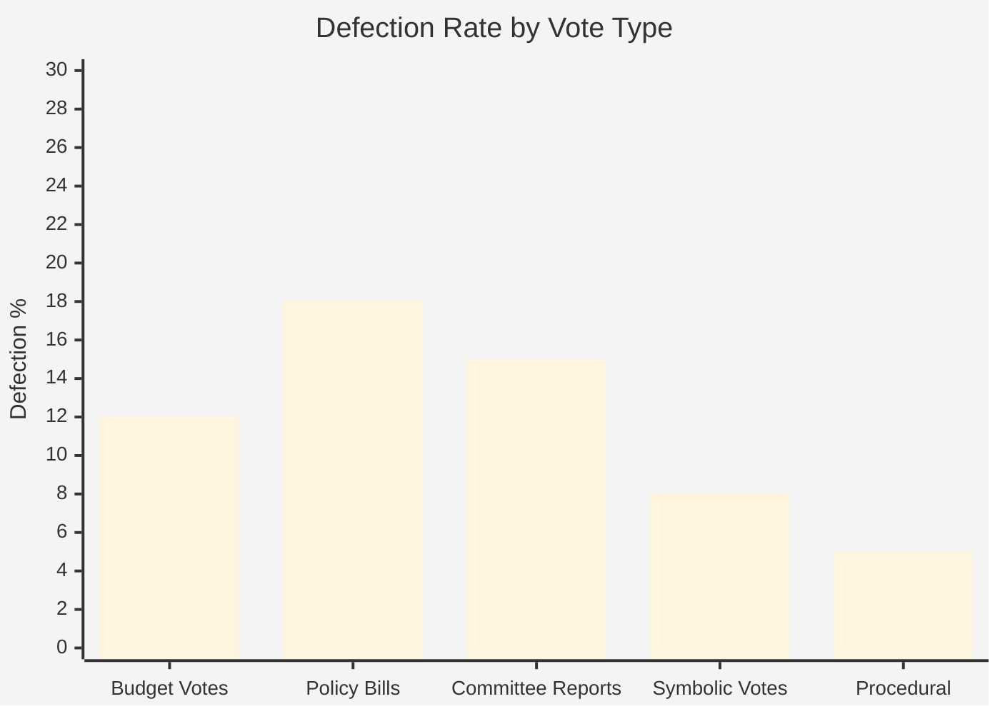

## Issue Areas of Rebellion

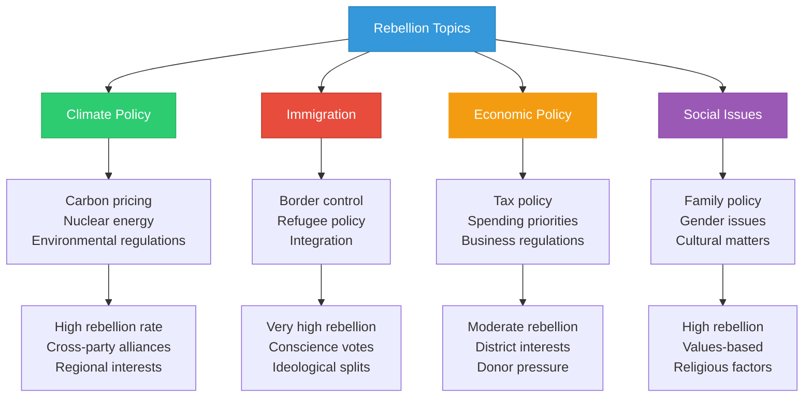

## Rebellion Timeline

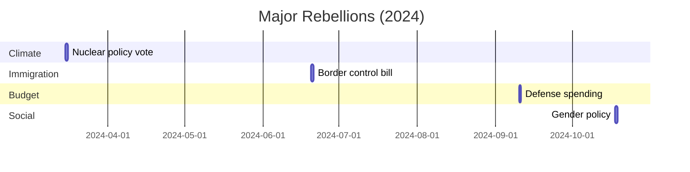

## Party Response Matrix

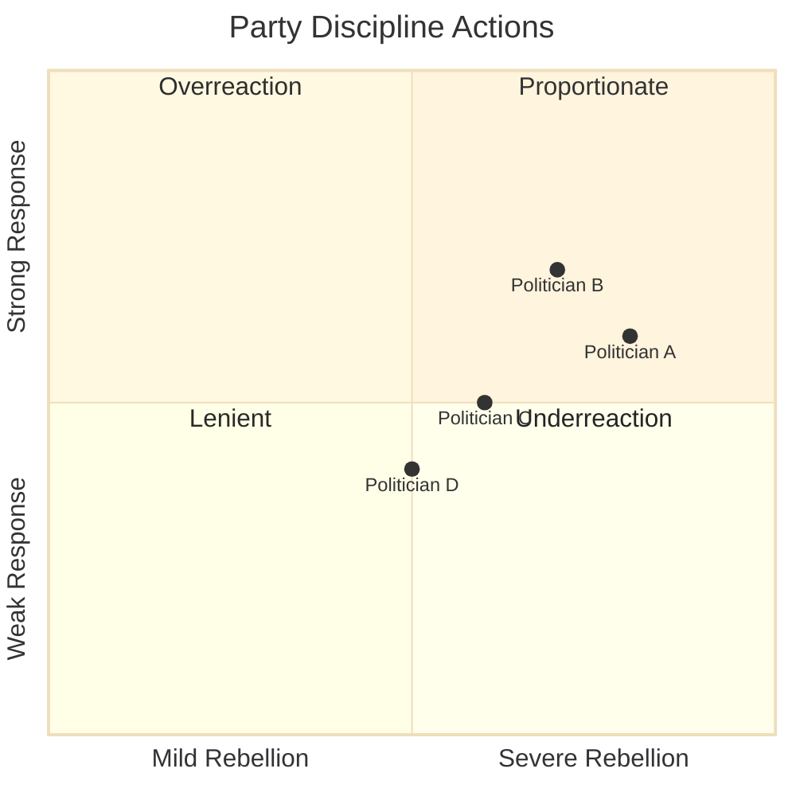

## Electoral Consequences

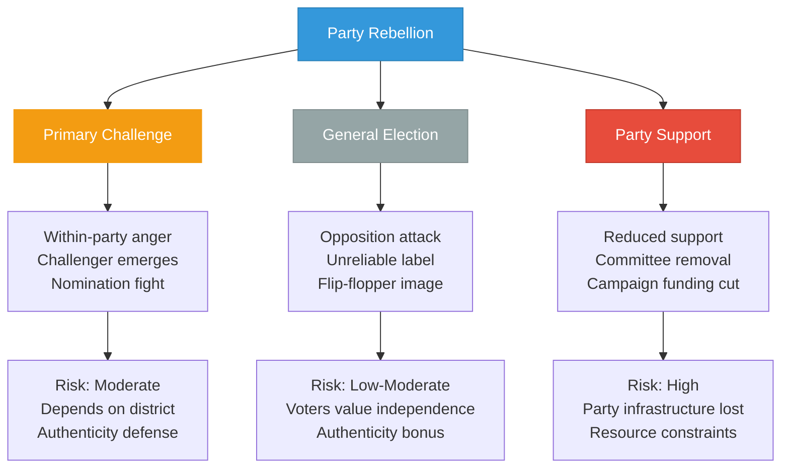

## Voter Perception

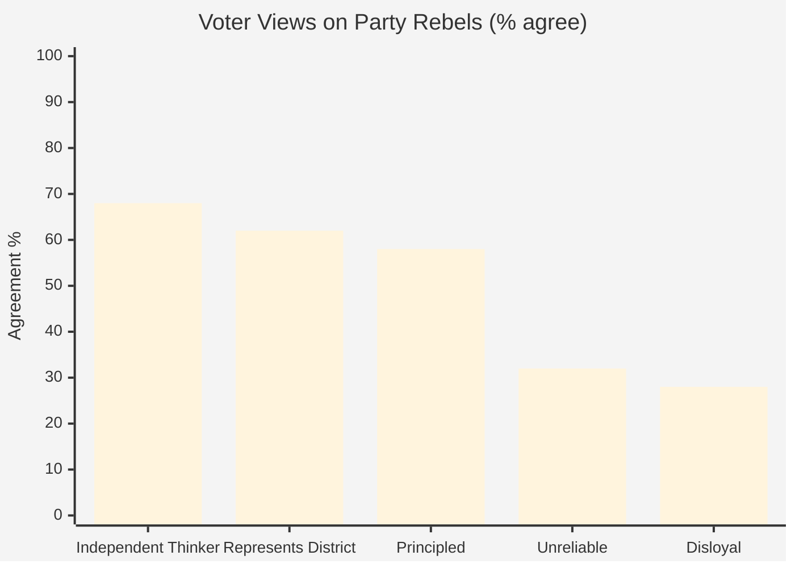

## Historical Rebel Outcomes

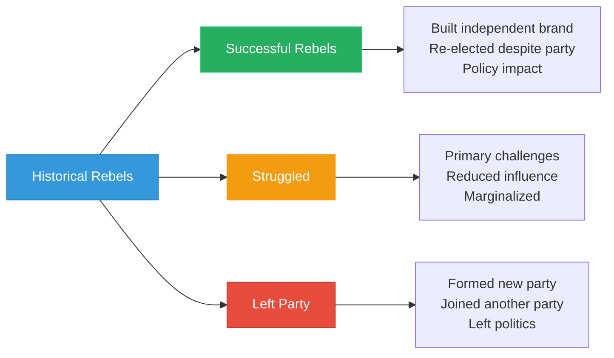

## Rebellion Frequency Over Time

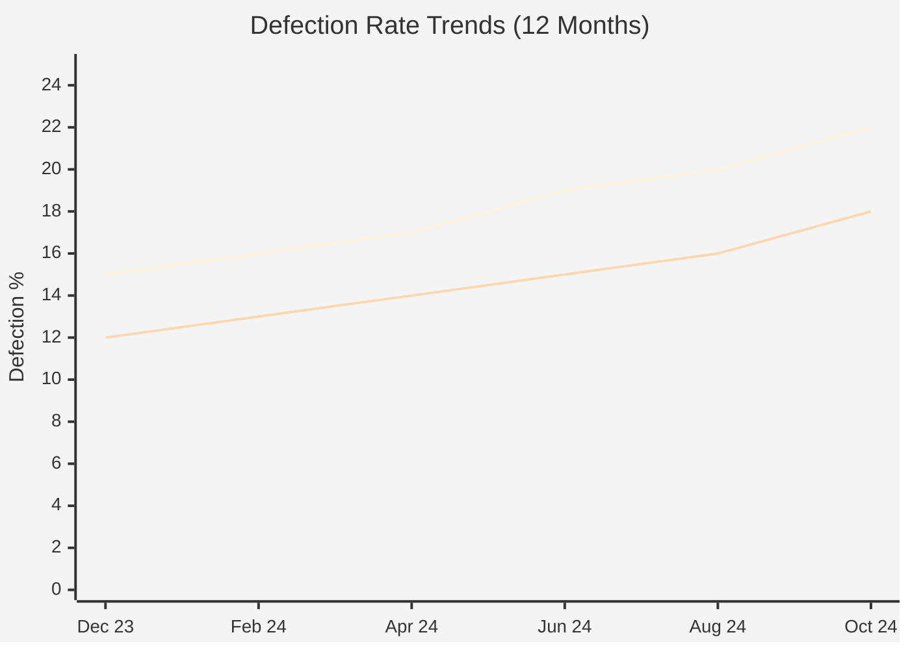

## Coalition Impact

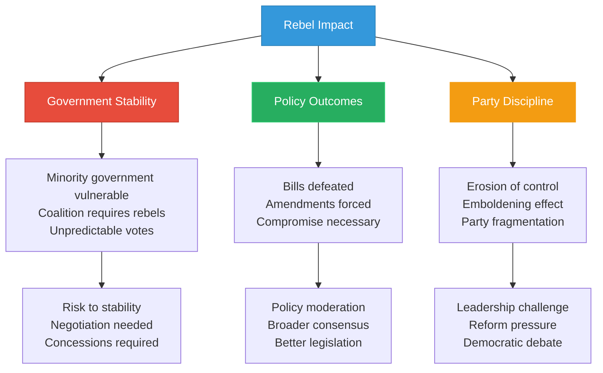

## Features

- **Rebel Rankings**: Top 10 by defection from party line
- **Loyalty Spectrum**: Classification by voting behavior
- **Motivation Analysis**: Why politicians rebel
- **Issue Tracking**: Topics generating most rebellion
- **Party Response**: Disciplinary actions taken
- **Electoral Impact**: Consequences for re-election
- **Voter Perception**: Public views on independence vs loyalty
- **Historical Patterns**: Outcomes for past rebels

## Usage Scenarios

1. **Party Management**: Identifying discipline challenges
2. **Coalition Analysis**: Assessing government stability risks
3. **Electoral Strategy**: Understanding vulnerable incumbents
4. **Media Analysis**: Profiling independent-minded politicians
5. **Voter Information**: Recognizing authentic vs performative rebellion
6. **Academic Research**: Studying party cohesion and democracy

## Data Sources

- **Source**: `view_riksdagen_vote`, `view_riksdagen_politician`
- **Loyalty Calculation**: % votes with party majority position
- **Threshold**: <85% = independent, <70% = rebel
- **Update Frequency**: After each vote, aggregated weekly
- **Historical Data**: Full legislative period for context

## Swedish Political Context

Swedish political parties traditionally maintain strong discipline, with most politicians voting >90% with their party. Rebellion is more common on conscience issues (immigration, ethics, social policy) than economic or security matters. The minority government structure makes rebels particularly influential, as their defection can defeat government proposals.

---

**Last Review**: 2024-11-24  
**Visualization Version**: 1.0.0  
**Compliance**: WCAG 2.1 AA
