# Top 10 Rising Stars

**Last Updated**: 2024-11-24

## Overview

Young politicians and newcomers showing highest potential for future leadership based on trajectory, performance, media presence, and party advancement.

## Rising Star Rankings

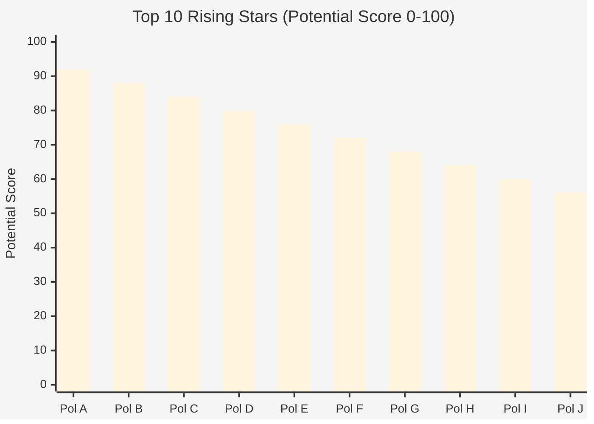

## Momentum Indicators

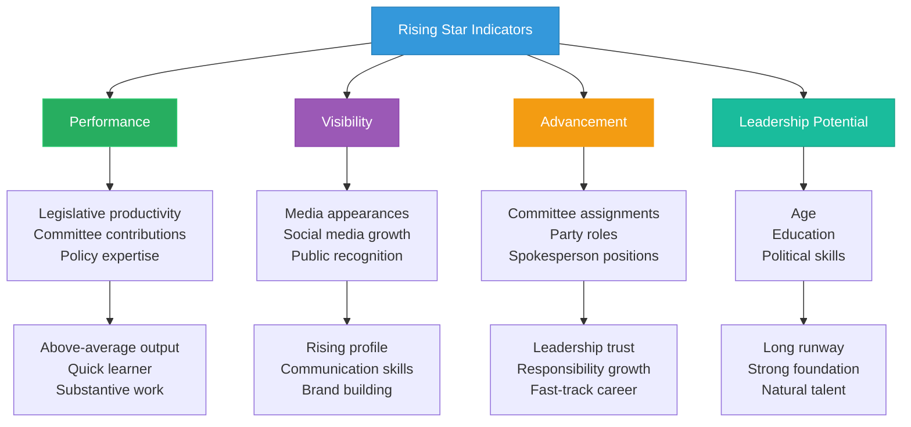

## Age & Experience Distribution

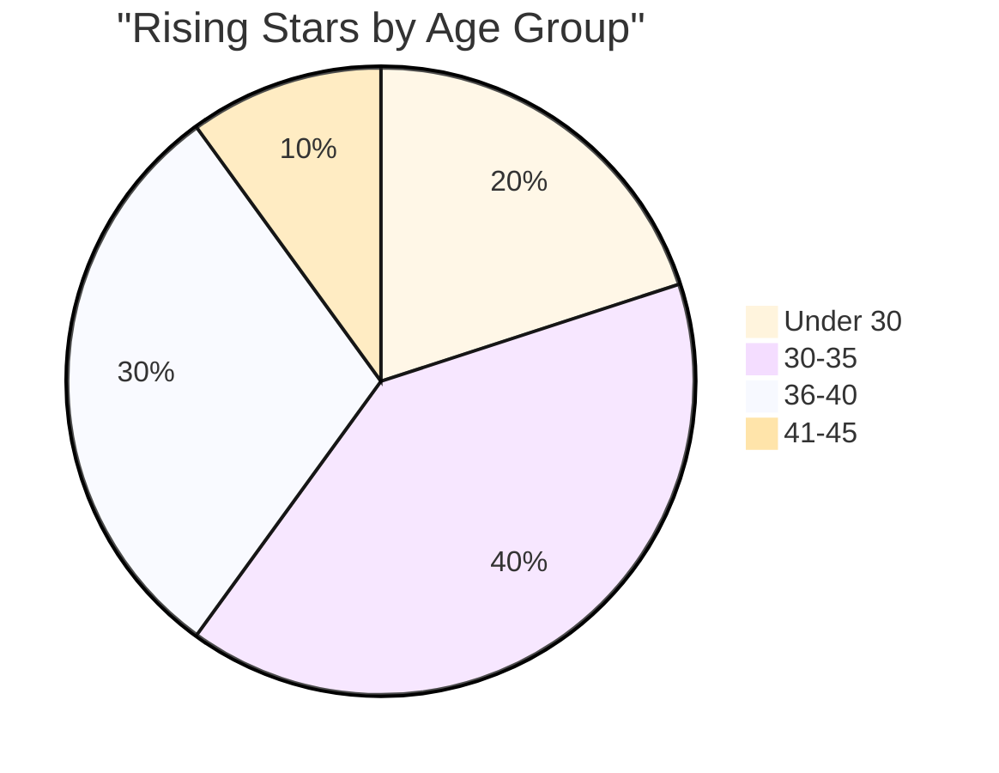

## Career Trajectory

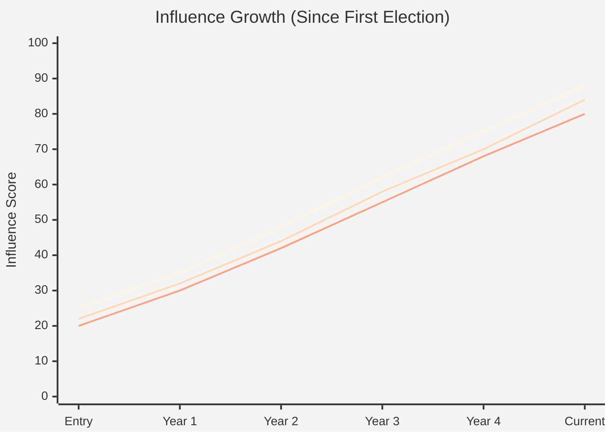

## Leadership Pipeline

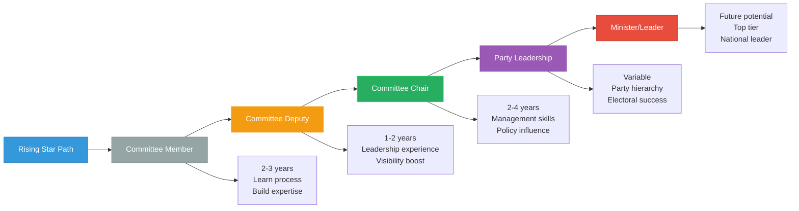

## Star Quality Assessment

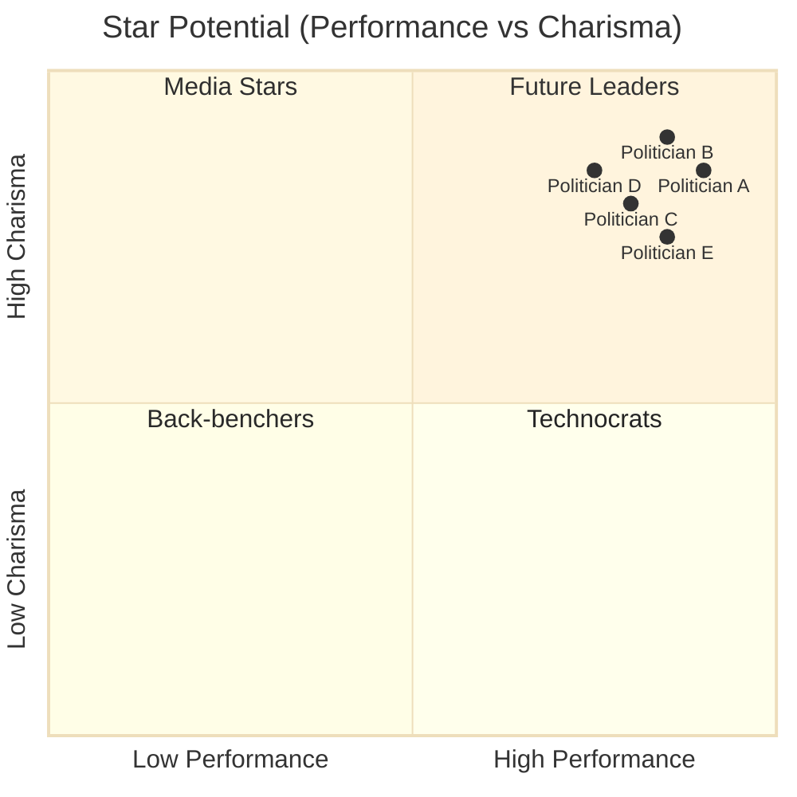

## Party Investment

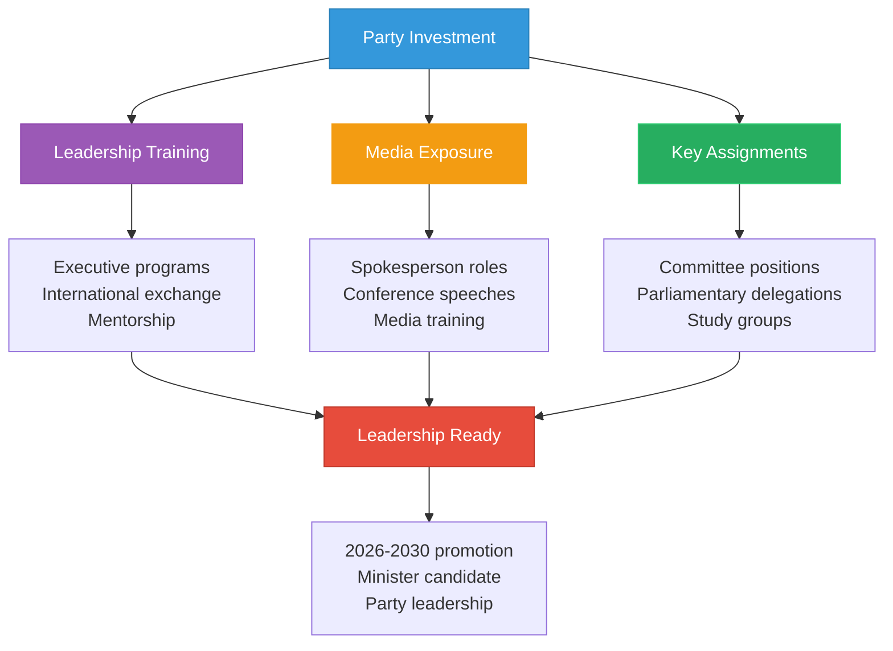

## Policy Specializations

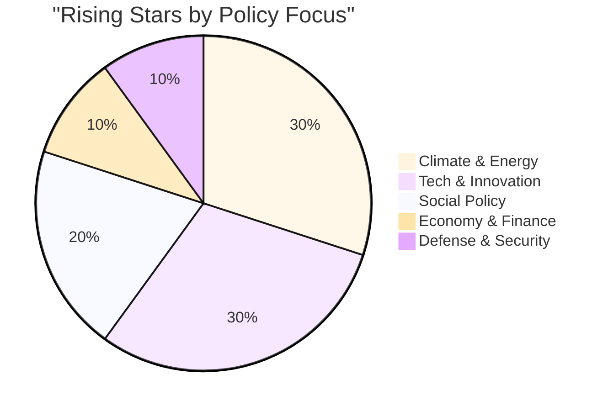

## Generational Advantage

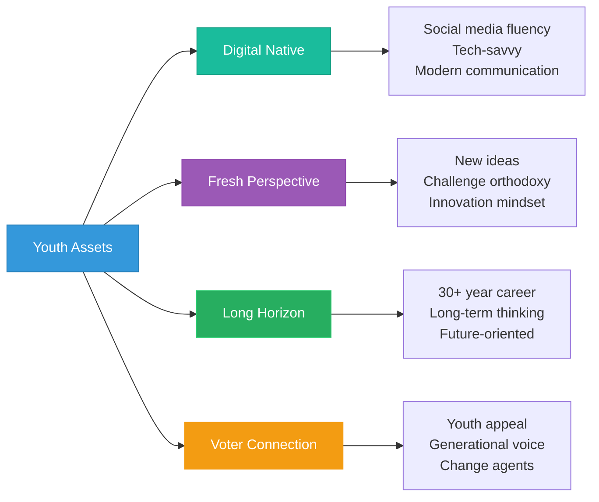

## Media Trajectory

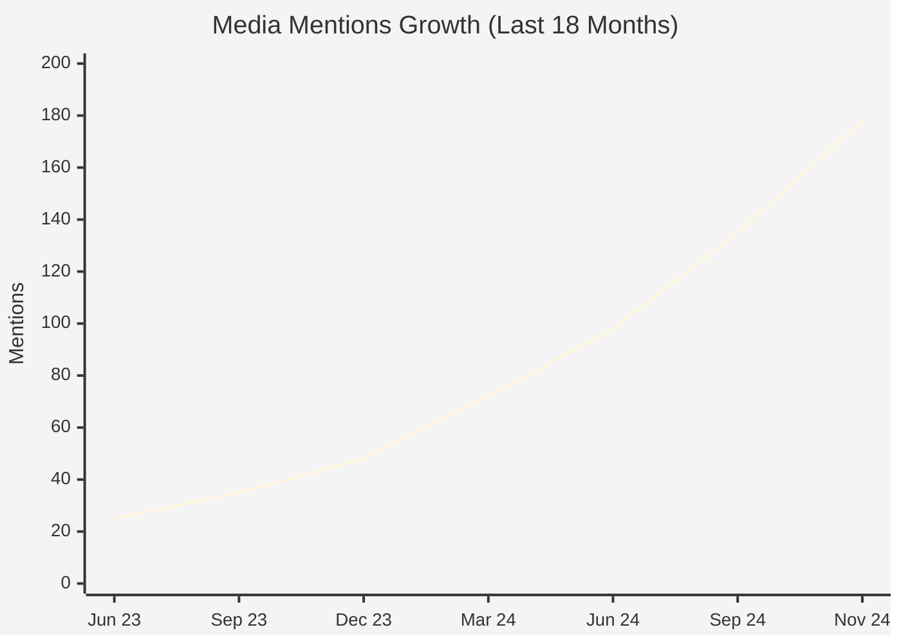

## Risk Factors

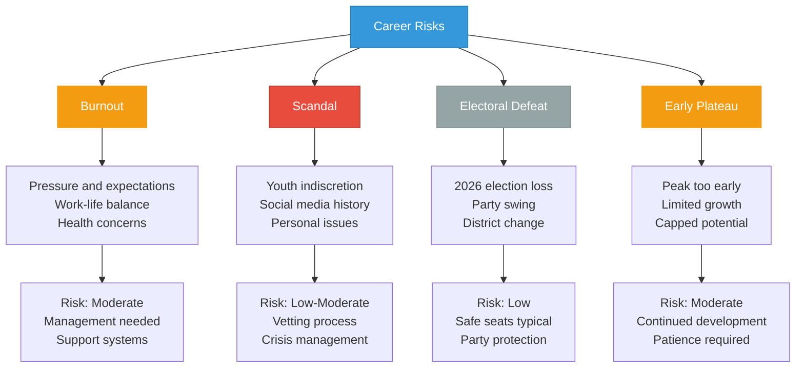

## Party Distribution

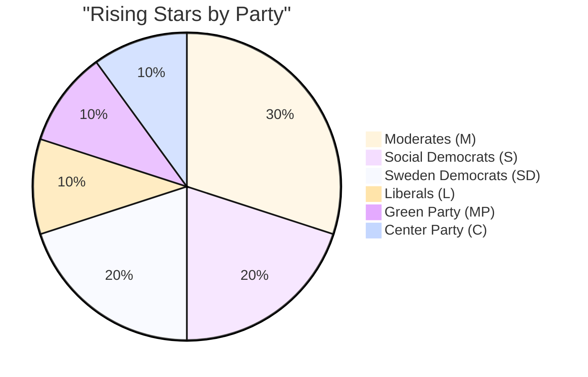

## Future Leadership Timeline

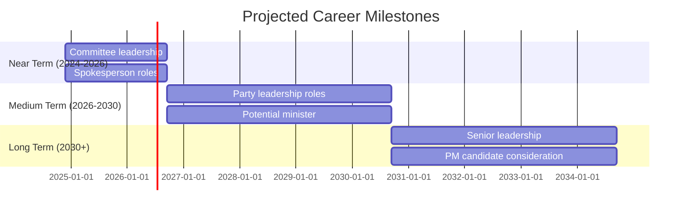

## Success Factors

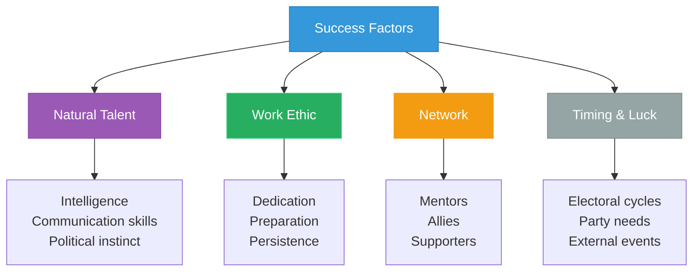

## Peer Competition

```mermaid
%%{init: {'theme':'base'}}%%
xychart-beta
    title "Competitive Landscape (Rising Stars Comparison)"
    x-axis ["Performance", "Visibility", "Party Support", "Trajectory", "Potential"]
    y-axis "Score" 0 --> 100
    bar [88, 82, 78, 85, 92]
    bar [85, 79, 82, 83, 88]
    bar [82, 85, 75, 80, 84]
```

## Features

- **Potential Rankings**: Top 10 by future leadership potential
- **Momentum Tracking**: Multi-factor growth assessment
- **Career Trajectory**: Influence evolution over time
- **Leadership Pipeline**: Typical advancement path
- **Star Quality**: Performance vs charisma matrix
- **Party Investment**: Resources allocated to development
- **Risk Analysis**: Potential career derailers
- **Timeline Projection**: Expected career milestones

## Usage Scenarios

1. **Talent Identification**: Spotting future leaders early
2. **Party Planning**: Leadership succession strategy
3. **Media Interest**: Profiling up-and-coming politicians
4. **Mentorship**: Connecting rising stars with veterans
5. **Voter Information**: Understanding next-generation leaders
6. **Opposition Research**: Monitoring emerging threats

## Data Sources

- **Source**: `view_riksdagen_politician`, performance metrics, media monitoring
- **Potential Model**: Age + trajectory + performance + visibility + advancement
- **Update Frequency**: Quarterly (major reassessment), Monthly (incremental)
- **Historical Data**: Comparison to past rising stars' trajectories
- **Validation**: Party insider input, peer nominations, expert assessment

## Swedish Political Context

Swedish political parties invest heavily in young talent development through youth wings (SSU, MUF, etc.), leadership academies, and mentorship programs. The parliamentary system allows rapid advancement, with some politicians becoming ministers in their 30s. Rising stars typically spend 4-8 years building expertise before reaching senior positions.

---

**Last Review**: 2024-11-24  
**Visualization Version**: 1.0.0  
**Compliance**: WCAG 2.1 AA
