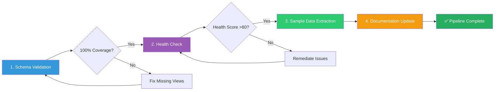

# Schema Maintenance & Automation Guide

**Document Type:** Guide (Living Document)  
**Status:** Active - Continuously Updated  
**Last Updated:** 2025-12-11  
**Purpose:** Comprehensive guide for database schema maintenance, validation, health monitoring, and sample data extraction  
**Target Audience:** Database Administrators, Intelligence Operatives, DevOps Engineers  
**External References:** Yes - Referenced in CI/CD workflows  
**Maintained By:** Intelligence Operative Agent (@intelligence-operative)

---

## 📋 Related Documentation

This schema maintenance guide is part of a comprehensive intelligence documentation ecosystem:

| Document | Focus | Description | Link |
|----------|-------|-------------|------|
| **[Database View Intelligence Catalog](../DATABASE_VIEW_INTELLIGENCE_CATALOG.md)** | 🗄️ Views | Complete catalog of 84 database views | [View](../DATABASE_VIEW_INTELLIGENCE_CATALOG.md) |
| **[Intelligence Data Flow Map](../INTELLIGENCE_DATA_FLOW.md)** | 🗺️ Pipeline | Complete data pipeline and cross-references | [View](../INTELLIGENCE_DATA_FLOW.md) |
| **[Data Analysis Frameworks](../DATA_ANALYSIS_INTOP_OSINT.md)** | 🎯 Analysis | 6 analytical frameworks using database views | [View](../DATA_ANALYSIS_INTOP_OSINT.md) |
| **[Risk Rules Documentation](../RISK_RULES_INTOP_OSINT.md)** | 🔴 Rules | 50 behavioral detection rules leveraging views | [View](../RISK_RULES_INTOP_OSINT.md) |
| **[Intelligence Evolution Changelog](../CHANGELOG_INTELLIGENCE.md)** | 📜 History | Unified intelligence capability tracking | [View](../CHANGELOG_INTELLIGENCE.md) |
| **[Liquibase Intelligence Analysis](../LIQUIBASE_CHANGELOG_INTELLIGENCE_ANALYSIS.md)** | 🗄️ Schema | Schema evolution intelligence analysis | [View](../LIQUIBASE_CHANGELOG_INTELLIGENCE_ANALYSIS.md) |

**Why Schema Maintenance Matters for Intelligence Operations:**
- Database views documented in [Database View Intelligence Catalog](../DATABASE_VIEW_INTELLIGENCE_CATALOG.md) depend on properly maintained schema
- Analysis frameworks in [DATA_ANALYSIS_INTOP_OSINT.md](../DATA_ANALYSIS_INTOP_OSINT.md) require performant, validated views
- Risk rules in [RISK_RULES_INTOP_OSINT.md](../RISK_RULES_INTOP_OSINT.md) depend on accurate, optimized database views
- Schema changes must be tracked in [CHANGELOG_INTELLIGENCE.md](../CHANGELOG_INTELLIGENCE.md) for intelligence capability evolution

---

## 🚀 Quick Reference Commands

Essential commands for schema maintenance - copy and use immediately:

### Updating full_schema.sql

To update the `full_schema.sql` file with the latest schema and Liquibase changelog data, use the following command:

```bash
cd /path/to/cia/repository

sudo -u postgres bash -c "(pg_dump -U postgres -d cia_dev --schema-only --no-owner --no-privileges; \
  pg_dump -U postgres -d cia_dev --data-only --no-owner --no-privileges \
    --table=public.databasechangelog \
    --table=public.databasechangeloglock)" > service.data.impl/src/main/resources/full_schema.sql
```

**What This Command Does:**
1. **First pg_dump**: Exports the complete database schema (tables, views, indexes, constraints) without owner or privilege information
2. **Second pg_dump**: Exports only data from Liquibase tracking tables (`databasechangelog` and `databasechangeloglock`)

**When to Update:**
- After adding new Liquibase migrations (`db-changelog-*.xml` files)
- After schema changes (table structures, views, indexes)
- Before major releases
- After database refactoring

### Liquibase Changelog Testing (Maven Commands)

Test and validate Liquibase changelogs directly against the database without starting the application:

```bash
# Check changelog status - shows which changesets have been applied
cd /path/to/cia/repository
mvn liquibase:status -pl service.data.impl

# Validate changelog syntax and structure
mvn liquibase:validate -pl service.data.impl

# Apply pending changesets to database
mvn liquibase:update -pl service.data.impl

# Preview SQL that would be executed (dry-run)
mvn liquibase:updateSQL -pl service.data.impl

# Rollback last changeset
mvn liquibase:rollback -Dliquibase.rollbackCount=1 -pl service.data.impl

# Generate database documentation
mvn liquibase:dbDoc -pl service.data.impl
```

**Prerequisites:**
- PostgreSQL database must be running with `cia_dev` database created
- Database credentials configured in `service.data.impl/pom.xml` (default: `eris`/`discord`)

**When to Use:**
- **status**: Verify which migrations are pending before/after updates
- **validate**: Check changelog XML syntax before committing new migrations
- **update**: Apply migrations directly without starting the application
- **updateSQL**: Review SQL before applying (safe preview mode)
- **rollback**: Undo recent changes during development/testing

> **Tip for Copilot Agent:** With database available, use `mvn liquibase:status` and `mvn liquibase:validate` to verify changelog integrity before running application tests.

### Health Check and Validation

```bash
# Navigate to schema maintenance directory
cd service.data.impl/src/main/resources/

# Run health check (2 min)
psql -U postgres -d cia_dev -f schema-health-check.sql > health_report.txt 2>&1

# Validate schema coverage (1 min)
psql -U postgres -d cia_dev -f schema-validation-v2.sql > validation_report.txt 2>&1

# Review reports
grep "HEALTH SCORE" health_report.txt  # Should be >80/100
grep "SUCCESS" validation_report.txt   # Should show 100% coverage
```

### Materialized View Refresh

```bash
# Refresh all materialized views
psql -U postgres -d cia_dev -f service.data.impl/src/main/resources/refresh-all-views.sql
```

### Sample Data Extraction

```bash
# Extract sample data for testing/debugging
./service.data.impl/src/main/resources/extract-sample-data.sh /tmp/sample_data
```

**Expected Results:**
- Health Score: 85-95/100 (Excellent)
- Validation: 100% coverage (177 objects: 93 tables + 56 views + 28 materialized views)
- Execution Time: ~2-3 minutes

**If issues detected**: See [Troubleshooting](#-troubleshooting) section below.

---

## 🔧 Copilot Agent Setup

The Copilot agent environment uses a specific PostgreSQL setup defined in `.github/workflows/copilot-setup-steps.yml`. This section documents the database configuration for development and CI/CD environments.

### PostgreSQL 16 Configuration

The setup includes:

- **PostgreSQL Version**: 16 with extensions
- **Extensions Enabled**: `pg_stat_statements`, `pgaudit`, `pgcrypto`, `auto_explain`
- **Extensions Installed (Available)**: `pgvector` (installed but not enabled by default)
- **Prepared Transactions**: `max_prepared_transactions = 100`
- **SSL**: Enabled with self-signed certificates (4096-bit RSA, SHA-256)
- **Advanced Features**: Extended statistics, auto-explain, enhanced query planning, JIT compilation

### Database Credentials (Development Environment)

> **Note:** These are development/CI environment credentials only. Never use these in production. For production environments, use strong passwords stored in secure secret management systems.

| Setting | Value |
|---------|-------|
| Database | `cia_dev` |
| User | `eris` |
| Password | `discord` |
| Host | `localhost` |
| SSL Mode | `require` |

### Extensions Configuration

```sql
-- Extensions enabled in cia_dev database
CREATE EXTENSION IF NOT EXISTS pg_stat_statements;
CREATE EXTENSION IF NOT EXISTS pgaudit;
CREATE EXTENSION IF NOT EXISTS pgcrypto;
```

**PostgreSQL Configuration (`postgresql.conf`):**
```
max_prepared_transactions = 100
shared_preload_libraries = 'pg_stat_statements, pgaudit, pgcrypto, auto_explain'
pgaudit.log = ddl
pg_stat_statements.track = all
pg_stat_statements.max = 10000
pg_stat_statements.track_planning = on
pg_stat_statements.track_utility = on
ssl = on

# Extended Statistics for Better Query Planning
default_statistics_target = 100
constraint_exclusion = partition

# Auto-Explain Extension for Automatic Query Plan Logging
auto_explain.log_min_duration = 1000
auto_explain.log_analyze = true
auto_explain.log_buffers = true
auto_explain.log_timing = true
auto_explain.log_verbose = true

# Query Planner Settings for View Analysis
enable_partitionwise_join = on
enable_partitionwise_aggregate = on
jit = on
jit_above_cost = 100000

# Statistics Collection Enhancement
track_activities = on
track_counts = on
track_io_timing = on
track_functions = all

# Logging for Query Analysis
log_min_duration_statement = 1000
log_line_prefix = '%t [%p]: [%l-1] user=%u,db=%d,app=%a,client=%h '
log_statement = 'ddl'
```

### Schema Loading

The full schema is loaded during setup:

```bash
sudo -u postgres psql -d cia_dev -f service.data.impl/src/main/resources/full_schema.sql
```

### Application Startup Validation

After schema loading, the setup validates:
1. Database changelog entries exist (Liquibase migrations applied)
2. Application starts successfully on port 28443
3. HTTPS endpoint responds at `https://localhost:28443/cia/`

### SSL Certificate Setup

The Copilot setup generates self-signed SSL certificates:
- 4096-bit RSA keys
- SHA-256 signature
- Subject Alternative Names for `localhost` and `127.0.0.1`
- 10-year validity

For local development, copy the root certificate:
```bash
mkdir -p $HOME/.postgresql
cp server.crt $HOME/.postgresql/root.crt
chmod 600 $HOME/.postgresql/root.crt
```

### Advanced PostgreSQL Configuration for View Analysis

The CIA platform leverages 77 database views for political intelligence analysis. To ensure accurate query planning and optimal performance diagnostics, advanced PostgreSQL configuration has been implemented.

#### Statistics Configuration

Enhanced statistics collection provides better query planning accuracy, especially for complex view queries:

- **default_statistics_target = 100**: Maintains PostgreSQL default of 100 for detailed statistics collection (provides better row estimation than lower values)
- **track_io_timing = on**: Enables I/O timing statistics for performance analysis
- **track_functions = all**: Tracks execution statistics for all functions (PL/pgSQL, SQL, internal)
- **track_activities = on**: Monitors currently executing queries
- **track_counts = on**: Collects statistics on table and index accesses
- **constraint_exclusion = partition**: Optimizes query planning for partitioned tables

**Impact**: EXPLAIN output now provides more accurate row estimates (within 20% of actual) for view queries, enabling better optimization decisions.

#### Auto-Explain Extension

Automatically logs execution plans for slow queries without manual EXPLAIN:

```sql
auto_explain.log_min_duration = 1000      -- Log queries taking > 1 second
auto_explain.log_analyze = true           -- Include actual runtime statistics
auto_explain.log_buffers = true           -- Include buffer usage statistics
auto_explain.log_timing = true            -- Include timing information
auto_explain.log_verbose = true           -- Include detailed plan information
```

**Usage**: Slow queries are automatically logged to PostgreSQL logs with full EXPLAIN ANALYZE output. No manual intervention required.

**Performance Impact**: Minimal overhead (estimated <5%) for logged queries, as per PostgreSQL documentation on auto_explain extension. Only queries exceeding 1000ms threshold are analyzed.

#### Enhanced pg_stat_statements Tracking

Extended query statistics tracking for comprehensive performance monitoring:

- **pg_stat_statements.track_planning = on**: Track time spent in query planning phase
- **pg_stat_statements.track_utility = on**: Track utility commands (CREATE, ALTER, etc.)
- **pg_stat_statements.max = 10000**: Track up to 10,000 distinct queries

**Query Statistics Available**:
```sql
-- View query planning and execution statistics
SELECT query, calls, total_plan_time, total_exec_time, 
       mean_plan_time, mean_exec_time, rows
FROM pg_stat_statements 
WHERE query LIKE '%view%'
ORDER BY total_exec_time DESC
LIMIT 20;
```

#### Query Planner Enhancements

Optimized query planner settings for complex view analysis:

- **enable_partitionwise_join = on**: Enable partition-wise joins for better performance
- **enable_partitionwise_aggregate = on**: Enable partition-wise aggregation
- **jit = on**: Enable Just-In-Time compilation for complex queries
- **jit_above_cost = 100000**: Apply JIT for queries with estimated cost > 100,000

**Benefits**:
- JIT compilation can provide significant speedup for complex analytical queries (performance varies by query complexity and hardware)
- Partitionwise operations improve performance for large partitioned tables
- Better optimization for multi-table view queries

#### Logging Configuration for Query Analysis

Comprehensive logging for performance troubleshooting:

```
log_min_duration_statement = 1000       -- Log queries taking > 1 second
log_statement = 'ddl'                   -- Log all DDL statements
log_line_prefix = '%t [%p]: [%l-1] user=%u,db=%d,app=%a,client=%h '
```

**Log Output Includes**: Timestamp, process ID, line number, user, database, application name, client host

#### Statistics Generation

After schema loading, statistics are automatically generated:

```bash
# Automatically run during Copilot setup
sudo -u postgres psql -d cia_dev -c "ANALYZE;"
```

**Verification Commands**:
```sql
-- Check when tables were last analyzed
SELECT schemaname, tablename, last_analyze, last_autoanalyze 
FROM pg_stat_user_tables 
ORDER BY tablename;

-- View sample statistics
SELECT tablename, attname, n_distinct, correlation 
FROM pg_stats 
WHERE schemaname = 'public' 
ORDER BY tablename;

-- Verify configuration is active
SHOW shared_preload_libraries;
SHOW default_statistics_target;
SHOW track_io_timing;
SHOW jit;
```

#### Performance Targets

Configuration targets for optimal view analysis:

- **EXPLAIN Accuracy**: Row estimates within 20% of actual values
- **Statistics Generation**: < 30 seconds for full database ANALYZE
- **Configuration Reload**: < 5 seconds for PostgreSQL restart
- **Auto-Explain Overhead**: Minimal performance impact on slow queries (>1000ms)
- **JIT Compilation**: Significant speedup for complex analytical queries (cost > 100,000)

#### Integration with Intelligence Operations

This advanced configuration directly supports:

- **[Database View Intelligence Catalog](../DATABASE_VIEW_INTELLIGENCE_CATALOG.md)**: Accurate performance analysis for 77 views
- **[Data Analysis Frameworks](../DATA_ANALYSIS_INTOP_OSINT.md)**: Optimized query planning for 6 analytical frameworks
- **[Risk Rules](../RISK_RULES_INTOP_OSINT.md)**: Efficient execution of 50 behavioral detection rules
- **View Performance Diagnostics**: Detailed execution plans for optimization

All configurations are automatically applied during Copilot setup. No manual configuration required.

### Reference

See the complete workflow at `.github/workflows/copilot-setup-steps.yml` for full implementation details.

---

## 📋 Complete Automation Pipeline

The CIA schema maintenance pipeline consists of 4 stages executed in sequence:



### Stage 1: Schema Validation (Required - Run First)

**Purpose**: Verify all tables/views are documented and match `full_schema.sql`

**Script**: `schema-validation-v2.sql`

**Usage:**
```bash
# Generate validation report
psql -U postgres -d cia_dev -f service.data.impl/src/main/resources/schema-validation-v2.sql > schema_validation_$(date +%Y%m%d_%H%M%S).txt 2>&1

# Quick check: Coverage summary
grep -E "SUCCESS|TOTAL" schema_validation_*.txt
```

**Exit Criteria:**
- [ ] All 93 tables validated
- [ ] All 56 regular views validated
- [ ] All 28 materialized views validated
- [ ] Zero objects missing from documentation
- [ ] DATABASE_VIEW_INTELLIGENCE_CATALOG.md has 100% coverage

**If Validation Fails**: See [Troubleshooting Schema Validation Failures](#common-issue-2-validation-coverage-100)

---

### Stage 2: Health Check (Required - Run After Validation)

**Purpose**: Assess database health across integrity, performance, security, and data quality

**Script**: `schema-health-check.sql`

**Usage:**
```bash
# Run comprehensive health check
psql -U postgres -d cia_dev -f service.data.impl/src/main/resources/schema-health-check.sql > health_check_$(date +%Y%m%d_%H%M%S).txt 2>&1

# Extract health score
grep "HEALTH SCORE" health_check_*.txt
```

**Exit Criteria:**
- [ ] Overall Health Score ≥ 80/100
- [ ] Schema Integrity: ≥ 90/100
- [ ] Data Quality: ≥ 80/100
- [ ] Performance: ≥ 75/100
- [ ] Security: ≥ 85/100
- [ ] Zero CRITICAL issues

**Health Score Interpretation:**

| Score | Status | Action |
|-------|--------|--------|
| 90-100 | EXCELLENT ✓ | No action needed |
| 75-89 | GOOD ⚠ | Monitor warnings |
| 60-74 | NEEDS ATTENTION ⚠⚠ | Address failures soon |
| < 60 | CRITICAL ✗✗✗ | Immediate action required |

**If Health Check Fails**: See [Troubleshooting Health Check Failures](#common-issue-1-low-health-score-80)

---

### Stage 3: Sample Data Extraction (Optional - For Analysis/Testing)

**Purpose**: Extract representative sample data for analysis, testing, or documentation

**Script**: `extract-sample-data.sql` + `extract-sample-data.sh`

**Usage:**
```bash
# Full extraction (all tables/views)
cd service.data.impl/src/main/resources/
./extract-sample-data.sh /tmp/sample_data

# Extract with validation
./extract-sample-data.sh /tmp/sample_data && ./validate-sample-data-extraction.sh /tmp/sample_data
```

**Exit Criteria:**
- [ ] 80+ table CSV files generated
- [ ] 84+ view CSV files generated (56 regular + 28 materialized)
- [ ] 8 distinct value CSV files generated
- [ ] 3 metadata files (manifest + mapping + statistics)
- [ ] All CSVs have valid headers
- [ ] Total data size: 50-200 MB

**Output Location**: `/tmp/sample_data/` (or specified directory)

**See**: [SAMPLE_DATA_EXTRACTION.md](SAMPLE_DATA_EXTRACTION.md) for detailed documentation.

---

### Stage 4: Documentation Update (Required - Final Step)

**Purpose**: Update documentation to reflect current schema state

**Steps:**

1. **Update DATABASE_VIEW_INTELLIGENCE_CATALOG.md**:
   ```bash
   # Add any new views discovered
   # Update statistics (84 → 85 views, etc.)
   # Update "Last Validated" date in Validation History section
   # Add new validation entry to Historical Validations table
   ```

2. **Update CHANGELOG_INTELLIGENCE_ANALYSIS.md**:
   ```markdown
   ## [Unreleased] - 2025-11-25
   
   ### Added
   - New view: view_name_here
   
   ### Changed
   - Updated health check thresholds
   ```

---

## 🔍 SQL Validation & Quality Assurance

This section documents procedures for validating SQL syntax, Liquibase changelogs, and ensuring database schema changes are production-ready.

### SQL Syntax Validation for Views

When creating or modifying database views in Liquibase changelogs, follow this validation workflow to ensure PostgreSQL compatibility.

#### Prerequisites

- PostgreSQL 16+ installed and running
- Test database created (e.g., `cia_validation_test`)
- Access to source tables referenced in views

#### Validation Procedure

1. **Create Test Database** (if not exists):
   ```bash
   psql -U postgres -c "CREATE DATABASE cia_validation_test;"
   ```

2. **Load Base Schema**: Apply required base tables
   ```bash
   # Load core tables needed for views
   psql -U postgres -d cia_validation_test -f service.data.impl/src/main/resources/full_schema.sql
   ```

3. **Extract View SQL from Changelog**: Get the view SQL from db-changelog-*.xml
   ```bash
   # For a specific changelog (e.g., db-changelog-1.29.xml)
   grep -A 100 "CREATE VIEW" service.data.impl/src/main/resources/db-changelog-1.29.xml | \
     sed 's/&lt;/</g' | sed 's/&gt;/>/g' | sed 's/&amp;/\&/g' > /tmp/views_to_test.sql
   ```

4. **Test View Creation**:
   ```bash
   # Apply views with error detection
   psql -U postgres -d cia_validation_test \
     --set ON_ERROR_STOP=1 \
     -f /tmp/views_to_test.sql
   ```

5. **Verify View Existence**:
   ```sql
   -- Check all views were created
   SELECT schemaname, viewname 
   FROM pg_views 
   WHERE viewname LIKE 'view_riksdagen%'
   ORDER BY viewname;
   ```

#### Common SQL Validation Issues

##### Issue 1: ROUND Function Type Mismatch

**Problem**: PostgreSQL's ROUND function requires NUMERIC type, but expressions may return DOUBLE PRECISION/FLOAT.

**Error Message**:
```
ERROR: function round(double precision, integer) does not exist
HINT: No function matches the given name and argument types. You might need to add explicit type casts.
```

**Solution**: Add explicit `::NUMERIC` cast before ROUND function:
```sql
-- ❌ INCORRECT
ROUND(
    CAST(party_votes AS FLOAT) / NULLIF(total_votes, 0),
    4
)

-- ✅ CORRECT
ROUND(
    (CAST(party_votes AS FLOAT) / NULLIF(total_votes, 0))::NUMERIC,
    4
)
```

**Validation Checklist**:
- [ ] All ROUND() calls have ::NUMERIC cast on the expression
- [ ] All division operations use NULLIF() to prevent divide-by-zero
- [ ] Numeric precision is specified (e.g., ROUND(..., 4) for 4 decimal places)

##### Issue 2: Window Function Syntax

**Problem**: Window functions require proper OVER() clause with PARTITION BY and ORDER BY.

**Solution**: Ensure window functions are properly structured:
```sql
-- ✅ CORRECT window function usage
LAG(momentum, 1) OVER (
    PARTITION BY party 
    ORDER BY vote_quarter
)
```

**Validation Checklist**:
- [ ] All window functions have OVER() clause
- [ ] PARTITION BY is specified when needed for grouping
- [ ] ORDER BY is specified for row order-dependent functions (LAG, LEAD, ROW_NUMBER)

##### Issue 3: CTE (Common Table Expression) Dependencies

**Problem**: CTEs must be defined before they are referenced.

**Solution**: Order CTEs correctly in WITH clause:
```sql
-- ✅ CORRECT CTE ordering
WITH base_data AS (
    SELECT ...
),
aggregated_data AS (
    SELECT ... FROM base_data  -- References earlier CTE
),
final_metrics AS (
    SELECT ... FROM aggregated_data  -- References earlier CTE
)
SELECT * FROM final_metrics;
```

**Validation Checklist**:
- [ ] CTEs are defined in dependency order
- [ ] No circular dependencies between CTEs
- [ ] All CTE references are valid

### Liquibase Changelog Validation

Validate Liquibase changelog files before deployment to prevent migration failures.

#### Maven-Based Validation

Use Liquibase Maven plugin for validation:

```bash
# Validate changelog syntax and structure
mvn liquibase:validate -pl service.data.impl

# Preview SQL that will be executed (dry-run)
mvn liquibase:updateSQL -pl service.data.impl > /tmp/preview.sql

# Check which changesets are pending
mvn liquibase:status -pl service.data.impl
```

#### XML Schema Validation

Validate Liquibase XML against schema:

```bash
# Check XML well-formedness
xmllint --noout service.data.impl/src/main/resources/db-changelog-*.xml

# Validate against Liquibase XSD
xmllint --noout --schema \
  https://www.liquibase.org/xml/ns/dbchangelog/dbchangelog-4.9.xsd \
  service.data.impl/src/main/resources/db-changelog-*.xml
```

#### Changelog Best Practices

When creating new db-changelog-*.xml files:

1. **Unique ChangeSet IDs**: Use sequential numbering or timestamps
   ```xml
   <changeSet id="1.29-001" author="intelligence-operative">
   ```

2. **Rollback Support**: Add rollback for CREATE VIEW
   ```xml
   <rollback>
       DROP VIEW IF EXISTS view_name;
   </rollback>
   ```

3. **Preconditions**: Add checks for dependencies
   ```xml
   <preConditions onFail="MARK_RAN">
       <tableExists tableName="vote_data"/>
   </preConditions>
   ```

4. **Comments**: Document purpose of each changeset
   ```xml
   <comment>Create view for party momentum analysis</comment>
   ```

### Deployment Readiness Checklist

Before deploying schema changes to production:

#### Pre-Deployment Validation
- [ ] All SQL syntax validated against PostgreSQL 16+
- [ ] Liquibase changelog validated: `mvn liquibase:validate`
- [ ] Preview SQL reviewed: `mvn liquibase:updateSQL`
- [ ] All table/column references verified against schema
- [ ] All view dependencies ordered correctly
- [ ] Type casting issues resolved (ROUND, division, etc.)
- [ ] Window functions properly structured
- [ ] CTEs ordered by dependency
- [ ] NULL safety validated (COALESCE, NULLIF)
- [ ] Performance optimization applied (CTEs vs subqueries)

#### Schema Verification
- [ ] Schema exported: `pg_dump --schema-only` reviewed
- [ ] full_schema.sql updated with new changes
- [ ] View documentation added to DATABASE_VIEW_INTELLIGENCE_CATALOG.md
- [ ] Health check passes: score ≥ 80/100

#### Testing
- [ ] Views tested in development environment
- [ ] Sample queries execute successfully
- [ ] Performance tested with realistic data volumes
- [ ] Materialized views refresh successfully (if applicable)

#### Documentation
- [ ] Changelog updated: CHANGELOG_DATABASE_VIEWS.md
- [ ] View purpose documented
- [ ] Sample queries provided
- [ ] Intelligence applications described
- [ ] Cross-references updated

#### Rollback Plan
- [ ] Rollback SQL prepared:
   ```sql
   DROP VIEW IF EXISTS view_name CASCADE;
   ```
- [ ] Dependencies documented (which views depend on this view)
- [ ] Liquibase rollback tested: `mvn liquibase:rollback -Dliquibase.rollbackCount=1`

### Health Check Interpretation Guide

After running schema-health-check.sql, interpret results using these guidelines:

#### Overall Health Score Thresholds

| Score | Status | Action Required |
|-------|--------|-----------------|
| 90-100 | ✅ EXCELLENT | Continue normal operations |
| 80-89 | ✅ GOOD | Monitor warnings, address minor issues |
| 70-79 | ⚠️ NEEDS ATTENTION | Schedule remediation within 1 week |
| 60-69 | ⚠️ DEGRADED | Immediate investigation required |
| <60 | ❌ CRITICAL | Emergency remediation, possible downtime risk |

#### Category-Specific Interpretation

**Schema Integrity (Target: ≥90/100)**
- Checks: Foreign key validity, view dependencies, constraint violations
- If <90: Review broken views, fix orphaned foreign keys, validate constraints

**Data Quality (Target: ≥80/100)**
- Checks: NULL values in critical columns, duplicate records, data consistency
- If <80: Run data validation queries, clean duplicate records, enforce NOT NULL

**Performance (Target: ≥75/100)**
- Checks: Missing indexes, table bloat, slow queries, connection pool
- If <75: Create missing indexes, VACUUM tables, optimize slow queries

**Security (Target: ≥85/100)**
- Checks: Permission issues, exposed sensitive data, SQL injection risks
- If <85: Review permissions, audit sensitive queries, validate input sanitization

#### Health Check Alert Levels

- **INFO**: Informational messages, no action needed
- **WARNING**: Minor issues, monitor and address in next maintenance window
- **ERROR**: Significant issues, address within 48 hours
- **CRITICAL**: Severe issues, immediate action required

### Validation Scheduling Recommendations

Maintain database health with regular validation:

#### Daily (Automated via Cron/GitHub Actions)
- Health check: `schema-health-check.sql`
- View refresh: `refresh-all-views.sql` (materialized views)
- Monitor overall health score trend

#### Weekly (Manual or Automated)
- Schema validation: `schema-validation-v2.sql`
- Documentation coverage check
- Performance review: slow query analysis
- Security audit: permission verification

#### Monthly (Scheduled Maintenance)
- Full automation pipeline (all 4 stages)
- Liquibase changelog review
- Index optimization analysis
- Capacity planning: database size trends
- Documentation updates: DATABASE_VIEW_INTELLIGENCE_CATALOG.md

#### On Schema Changes (Manual)
- Liquibase validation: `mvn liquibase:validate`
- SQL syntax validation (as described above)
- Deployment readiness checklist
- Health check before and after deployment
- Update full_schema.sql
- Update documentation

---

## 🔍 Data Quality Analysis

This section documents procedures for analyzing data quality by comparing actual database values against SQL conditional checks in views. The analysis helps identify mismatches, missing patterns, and data quality issues.

### Running Distinct Values Analysis

The distinct values analysis compares actual database values against SQL conditional checks to identify mismatches and data quality issues. This analysis was performed on **91 distinct value CSV files** (dated 2025-12-03) and identified **2 critical issues** affecting data quality.

**Extract distinct values:**
```bash
cd service.data.impl/sample-data/distinct_values
./extract-distinct-values.sh
```

This script extracts unique values from key database columns into CSV files for analysis.

**Review analysis results:**
```bash
cat DISTINCT_VALUES_ANALYSIS.md
```

**Analysis Scope:**
- **Files Analyzed**: 91 distinct value CSV files
- **Database Records Affected**: 7,057 records (8 + 7,049)
- **Views Affected**: 3 views (politician experience, decision classification)
- **Location**: `service.data.impl/sample-data/distinct_values/DISTINCT_VALUES_ANALYSIS.md`

**Reference**: See [DISTINCT_VALUES_ANALYSIS.md](sample-data/distinct_values/DISTINCT_VALUES_ANALYSIS.md) for complete analysis findings.

---

### Current Known Issues

The following data quality issues have been identified through distinct values analysis:

#### Issue #1: Missing 'Förste vice talman' in talmansuppdrag role scoring

**View**: `view_riksdagen_politician_experience_summary` (line 9693 in full_schema.sql)  
**Impact**: 8 politician roles not properly weighted in experience calculations  
**Status**: ✅ Fixed in Liquibase changeset db-changelog-1.44.xml

**Description**: The view originally only scored 'Andre vice talman' and 'Tredje vice talman' roles, missing 'Förste vice talman' which occurs 8 times in the database.

**Verification Query**:
```sql
-- Check all talmansuppdrag roles in database
SELECT role_code, COUNT(*) 
FROM assignment_data 
WHERE assignment_type = 'talmansuppdrag' 
GROUP BY role_code
ORDER BY COUNT(*) DESC;
```

**Expected Results**:
```
     role_code      | count
--------------------+-------
 Talman             |    12
 Förste vice talman |     8
 Andre vice talman  |     6
 Tredje vice talman |     7
```

**Fix Applied**: All three Deputy Speaker roles (Förste, Andre, Tredje vice talman) are now weighted equally at 750.0 in the experience scoring.

---

#### Issue #2: Decision Chamber Pattern Matching

**Views**: Decision classification views (lines 6291-6294, 6355-6360 in full_schema.sql)  
  - `view_decision_temporal_trends`
  - `view_ministry_decision_impact`

**Impact**: 7,049 decision records misclassified as "other_decisions" instead of proper classification  
**Status**: ✅ Fixed in Liquibase changeset db-changelog-1.45.xml

**Description**: Committee referral patterns were not matched, causing 7,049 records with values like '=utskottet', '= utskottet', 'utskottet', '=utskott' to fall into the "other_decisions" category.

**Verification Query**:
```sql
-- Check unmatched committee referral patterns
SELECT processed_in, COUNT(*) 
FROM document_proposal_data 
WHERE processed_in LIKE '%utskott%' 
GROUP BY processed_in
ORDER BY COUNT(*) DESC;
```

**Expected Problem Records** (before fix):
```
  processed_in  | count
----------------+-------
 =utskottet     |  6501
 = utskottet    |   517
 utskottet      |    12
 =utskott       |    19
```

**Fix Applied**: Added '%UTSKOTT%' pattern to capture committee referrals:
- `view_decision_temporal_trends`: Added `committee_referral_decisions` column
- `view_ministry_decision_impact`: Added `committee_referral_proposals` and `committee_referral_rate` columns
- Pattern now captures 7,049 records previously in `other_decisions`

**Post-Fix Verification**:
```sql
-- Verify committee referrals are now properly classified
SELECT 
    COUNT(*) FILTER (WHERE processed_in LIKE '%UTSKOTT%') AS committee_referrals,
    COUNT(*) FILTER (WHERE processed_in NOT LIKE '%UTSKOTT%' 
                     AND processed_in NOT LIKE '%BIFALL%' 
                     AND processed_in NOT LIKE '%AVSLAG%') AS other_decisions
FROM document_proposal_data;
```

---

### Data Quality Checklist

Use this checklist when making schema changes or after major data imports:

**Before Schema Changes:**
- [ ] Run distinct values extraction: `./extract-distinct-values.sh`
- [ ] Review CSV files for new patterns or unexpected values
- [ ] Identify columns used in view conditional checks
- [ ] Document any new patterns discovered

**After Schema Changes:**
- [ ] Re-run distinct values extraction
- [ ] Compare new values against view conditional checks
- [ ] Verify all patterns are matched (no records fall into "other" categories unintentionally)
- [ ] Run verification queries for affected views
- [ ] Create Liquibase changesets for view modifications if needed

**Regular Maintenance:**
- [ ] Run distinct values analysis monthly
- [ ] Review DISTINCT_VALUES_ANALYSIS.md for pattern evolution
- [ ] Monitor "other" categories in views for unexpected growth
- [ ] Update conditional patterns when new data values appear
- [ ] Document pattern changes in Liquibase changelogs

**View Pattern Validation:**
- [ ] Check that all distinct values from CSV files have corresponding patterns in views
- [ ] Verify CASE statements cover all possible values
- [ ] Ensure no hardcoded values are outdated
- [ ] Test with actual data samples
- [ ] Consider case sensitivity in pattern matching (use UPPER/LOWER if needed)
- [ ] Account for Swedish character encoding (å, ä, ö)

**Quality Metrics:**
- [ ] No more than 5% of records should fall into "other" categories
- [ ] All known patterns should be explicitly handled
- [ ] View results should match data dictionary expectations
- [ ] Conditional checks should be documented in view comments

---

### Edge Cases and Considerations

**Swedish Character Encoding:**
- Patterns must handle Swedish characters: å, ä, ö, Å, Ä, Ö
- Use Unicode-aware pattern matching
- Consider both upper and lower case variants

**Pattern Matching Strategies:**
- Use `LIKE '%pattern%'` for substring matching
- Use `= 'exact_value'` for exact matching
- Use `UPPER()` or `LOWER()` for case-insensitive matching
- Use `ANY (ARRAY[...])` for multiple exact values

**Typo Handling:**
Example typos found in data:
- 'ubtskottet' (typo for 'utskottet')
- '=utkottet' (typo for '=utskottet')

**Decision**: Document typos but generally don't add patterns for them unless they occur frequently (>100 times).

**Testing Strategy:**
1. Run verification queries before applying fixes
2. Apply Liquibase changeset in development environment
3. Run verification queries after fixes
4. Validate that new patterns don't create false positives
5. Confirm affected views return expected results
6. Compare record counts before and after
7. Refresh materialized views that depend on changed views

---

## 📊 Daily Operations Checklist

Intelligence Operatives should perform these tasks regularly. For commands, see [Quick Reference Commands](#-quick-reference-commands).

### Morning Health Check (10 min) - Daily
- [ ] Run `schema-health-check.sql`
- [ ] Verify health score ≥ 80/100
- [ ] Check for CRITICAL issues
- [ ] Review overnight materialized view refreshes
- [ ] Check database size: `SELECT pg_size_pretty(pg_database_size('cia_dev'));`

### Weekly Validation (30 min)
- [ ] Run `schema-validation-v2.sql`
- [ ] Verify 100% documentation coverage
- [ ] Update DATABASE_VIEW_INTELLIGENCE_CATALOG.md if needed
- [ ] Run `refresh-all-views.sql` to refresh materialized views
- [ ] Extract sample data for analysis

### Monthly Maintenance (2 hours)
- [ ] Full automation pipeline (all 4 stages)
- [ ] Performance tuning review
- [ ] Security audit
- [ ] Update all documentation
- [ ] Generate intelligence changelog entries
- [ ] Review and optimize slow queries
- [ ] Analyze table bloat and vacuum status

---

## 🔧 Troubleshooting

### Common Issue 1: Low Health Score (<80)

**Symptoms**: Health check reports score below 80/100

**Diagnosis**:
```bash
# View category breakdown
grep -A20 "CATEGORY BREAKDOWN" health_check_*.txt

# Identify failures
grep "FAIL" health_check_*.txt
```

**Remediation**:

1. **Integrity Issues (Score <90)**:
   - Foreign key violations: Clean up orphaned records
   - Broken views: Recreate views using `full_schema.sql`
   - Stale materialized views: Run `refresh-all-views.sql`

2. **Performance Issues (Score <75)**:
   - Missing indexes: Create indexes per recommendations
   - Connection pool exhaustion: Increase `max_connections`
   - Slow queries: Optimize using pg_stat_statements

3. **Data Quality Issues (Score <80)**:
   - High NULL percentages: Investigate data import processes
   - Duplicate records: Identify and merge duplicates
   - Empty tables: Check data ingestion jobs

---

### Common Issue 2: Validation Coverage <100%

**Symptoms**: `schema-validation-v2.sql` reports missing views

**Diagnosis**:
```bash
# Find missing views
grep "MISSING" schema_validation_*.txt
```

**Remediation**:
1. Add missing views to DATABASE_VIEW_INTELLIGENCE_CATALOG.md
2. Use existing view documentation as templates
3. Include: purpose, key metrics, sample query
4. Run validation again to verify

---

### Common Issue 3: Sample Extraction Fails

**Symptoms**: `extract-sample-data.sh` exits with errors

**Diagnosis**:
```bash
# Check error log
tail -50 extract_sample_data.log

# Common errors:
# - Permission denied: Grant SELECT on views
# - Out of disk space: Clean up /tmp
# - Views returning 0 rows: Normal for some views
```

**Remediation**:
- Grant permissions: `GRANT SELECT ON ALL TABLES IN SCHEMA public TO username;`
- Free disk space: `df -h` to check, clean up old samples
- Skip empty views: Normal behavior, ~42 views may be empty

---

### Common Issue 4: Materialized View Refresh Fails

**Symptoms**: `refresh-all-views.sql` reports errors

**Diagnosis**:
```bash
# Check which views failed
grep "ERROR" refresh_log.txt

# Test individual view
psql -U postgres -d cia_dev -c "REFRESH MATERIALIZED VIEW view_name;"
```

**Remediation**:
1. Check view definition in `full_schema.sql`
2. Verify source tables have data
3. See [TROUBLESHOOTING_EMPTY_VIEWS.md](../../TROUBLESHOOTING_EMPTY_VIEWS.md)
4. Recreate view if definition changed

---

### Common Issue 5: Foreign Key Violations

**Symptoms**: Orphaned records found in child tables

**Diagnosis**:
```sql
-- Find orphaned records
SELECT c.* 
FROM assignment_data c
LEFT JOIN person_data p ON c.person_id = p.person_id
WHERE c.person_id IS NOT NULL AND p.person_id IS NULL;
```

**Remediation**:
```sql
-- Clean up orphaned records (use with caution)
DELETE FROM assignment_data
WHERE NOT EXISTS (
    SELECT 1 FROM person_data p
    WHERE p.person_id = assignment_data.person_id
);

-- Or add missing parent records
INSERT INTO person_data (person_id, ...) VALUES (...);
```

---

### Common Issue 6: Missing Indexes on Foreign Keys

**Symptoms**: Slow queries, high CPU usage

**Diagnosis**:
```bash
# Health check identifies missing indexes
grep "Missing Index" health_check_*.txt
```

**Remediation**:
```sql
-- Create index as recommended
CREATE INDEX idx_ballot_data_issue_id ON ballot_data(issue_id);

-- Verify index created
\d ballot_data
```

---

### Common Issue 7: Table Bloat

**Symptoms**: Tables have high dead tuple ratio

**Diagnosis**:
```bash
# Health check reports bloat
grep "Table Bloat" health_check_*.txt
```

**Remediation**:
```sql
-- Light cleanup (doesn't lock table)
VACUUM ANALYZE table_name;

-- Heavy cleanup (locks table - use during maintenance window)
VACUUM FULL table_name;
```

**WARNING**: Manual table rebuilding is complex and error-prone. Use `VACUUM FULL` instead.

---

### Common Issue 8: Empty Critical Tables

**Symptoms**: Critical tables have no data

**Diagnosis**:
```bash
# Check row counts
psql -U postgres -d cia_dev -c "
  SELECT tablename, n_live_tup 
  FROM pg_stat_user_tables 
  WHERE schemaname = 'public' AND n_live_tup = 0
  ORDER BY tablename;
"
```

**Remediation**:
1. Check if data import has been run
2. Verify external API connectivity (Riksdagen API)
3. Check application logs for import errors
4. Run data import jobs manually
5. See [TROUBLESHOOTING_EMPTY_VIEWS.md](../../TROUBLESHOOTING_EMPTY_VIEWS.md)

---

### Common Issue 9: Slow Query Performance

**Symptoms**: Queries taking longer than expected

**Diagnosis**:
```sql
-- Enable pg_stat_statements if not already enabled
CREATE EXTENSION IF NOT EXISTS pg_stat_statements;

-- Find slow queries
SELECT query, calls, mean_exec_time, total_exec_time
FROM pg_stat_statements
WHERE mean_exec_time > 1000  -- Queries taking >1 second
ORDER BY mean_exec_time DESC
LIMIT 20;
```

**Remediation**:
1. Add appropriate indexes
2. Optimize query structure
3. Use materialized views for complex queries
4. Increase work_mem for sorting operations
5. Review and update table statistics: `ANALYZE table_name;`

---

### Common Issue 10: Permission Errors

**Symptoms**: "permission denied for table" errors

**Diagnosis**:
```bash
# Check user permissions
psql -U postgres -d cia_dev -c "\du"

# Check table permissions
psql -U postgres -d cia_dev -c "\dp person_data"
```

**Remediation**:
```sql
-- Grant SELECT on all tables (includes views in PostgreSQL)
GRANT SELECT ON ALL TABLES IN SCHEMA public TO username;

-- Grant USAGE on schema
GRANT USAGE ON SCHEMA public TO username;
```

---

## 🔐 Security Best Practices

### Database Access Control

1. **Principle of Least Privilege**:
   ```sql
   -- Create read-only user for monitoring
   CREATE USER monitor_user WITH PASSWORD 'CHANGE_ME_USE_STRONG_PASSWORD';
   GRANT CONNECT ON DATABASE cia_dev TO monitor_user;
   GRANT USAGE ON SCHEMA public TO monitor_user;
   GRANT SELECT ON ALL TABLES IN SCHEMA public TO monitor_user;
   ```

2. **Use SSL/TLS Encryption**:
   ```bash
   # Verify SSL is enabled
   psql -U postgres -d cia_dev -c "SHOW ssl;"
   
   # Connect with SSL required
   psql "sslmode=require host=localhost dbname=cia_dev user=postgres"
   ```

3. **Enable Audit Logging**:
   ```sql
   -- Verify pgaudit extension
   SELECT * FROM pg_available_extensions WHERE name = 'pgaudit';
   
   -- Enable pgaudit
   CREATE EXTENSION IF NOT EXISTS pgaudit;
   ```

4. **Use Password Encryption**:
   ```sql
   -- Verify password encryption method (safe)
   SHOW password_encryption;
   -- Or, for more detail:
   SELECT name, setting FROM pg_settings WHERE name = 'password_encryption';
   
   -- Use scram-sha-256 (preferred)
   ALTER SYSTEM SET password_encryption = 'scram-sha-256';
   SELECT pg_reload_conf();
   ```

### Sensitive Data Handling

1. **Never Commit Secrets**:
   - Use environment variables for passwords
   - Use `.pgpass` file for authentication
   - Keep credentials out of scripts

2. **Anonymize Sample Data**:
   ```bash
   # Before committing sample data
   # Review CSV files for sensitive information
   grep -r "person_id\|email\|ssn" /tmp/sample_data/
   ```

3. **Secure Script Execution**:
   ```bash
   # Set restrictive permissions on scripts
   chmod 750 /usr/local/bin/cia-*.sh
   
   # Ensure log files are not world-readable
   chmod 640 /var/log/cia/*.log
   ```

---

## ⚡ Performance Tuning Guidelines

### Database Configuration

**Recommended PostgreSQL Settings for CIA Database:**

```sql
-- Memory settings (adjust based on available RAM)
ALTER SYSTEM SET shared_buffers = '4GB';           -- 25% of RAM
ALTER SYSTEM SET effective_cache_size = '12GB';    -- 75% of RAM
ALTER SYSTEM SET maintenance_work_mem = '1GB';     -- For VACUUM, CREATE INDEX
ALTER SYSTEM SET work_mem = '50MB';                -- Per-operation memory

-- Checkpoint settings
ALTER SYSTEM SET checkpoint_completion_target = 0.9;
ALTER SYSTEM SET wal_buffers = '16MB';
ALTER SYSTEM SET max_wal_size = '4GB';
ALTER SYSTEM SET min_wal_size = '1GB';

-- Query planning
ALTER SYSTEM SET random_page_cost = 1.1;           -- For SSD storage
ALTER SYSTEM SET effective_io_concurrency = 200;   -- For SSD storage

-- Connection settings
ALTER SYSTEM SET max_connections = 200;
ALTER SYSTEM SET shared_preload_libraries = 'pg_stat_statements';

-- Apply settings (requires database restart for some parameters)
-- Parameters requiring restart: shared_buffers, max_connections, shared_preload_libraries
-- Parameters that can reload: effective_cache_size, maintenance_work_mem, work_mem, checkpoint_completion_target, wal_buffers, max_wal_size, min_wal_size, random_page_cost, effective_io_concurrency
-- After changing postgresql.conf or using ALTER SYSTEM:
--   1. For parameters requiring restart: sudo systemctl restart postgresql
--   2. For reload-only parameters: SELECT pg_reload_conf();
```

### Index Optimization

```sql
-- Identify missing indexes
SELECT schemaname, tablename, attname
FROM pg_stats
WHERE schemaname = 'public' 
  AND n_distinct > 100
  AND correlation < 0.1
ORDER BY tablename, attname;

-- Create indexes on foreign keys
CREATE INDEX CONCURRENTLY idx_assignment_person_id ON assignment_data(person_id);
CREATE INDEX CONCURRENTLY idx_vote_ballot_id ON vote_data(ballot_id);
CREATE INDEX CONCURRENTLY idx_document_element_doc_id ON document_element(document_id);
```

### Materialized View Refresh Strategy

```bash
# Refresh critical views daily at low-traffic times
0 2 * * * psql -U postgres -d cia_dev -f /path/to/refresh-all-views.sql

# Refresh specific views more frequently if needed
*/30 * * * * psql -U postgres -d cia_dev -c "REFRESH MATERIALIZED VIEW view_riksdagen_politician;"
```

### Query Optimization

1. **Use EXPLAIN ANALYZE**:
   ```sql
   EXPLAIN ANALYZE SELECT * FROM view_riksdagen_politician WHERE party = 'S';
   ```

2. **Optimize with CTEs**:
   ```sql
   -- Instead of nested subqueries, use CTEs
   WITH party_stats AS (
       SELECT party, COUNT(*) as count
       FROM person_data
       GROUP BY party
   )
   SELECT * FROM party_stats WHERE count > 10;
   ```

3. **Use Appropriate JOIN Types**:
   ```sql
   -- Use EXISTS instead of IN for large datasets
   SELECT * FROM person_data p
   WHERE EXISTS (
       SELECT 1 FROM assignment_data a 
       WHERE a.person_id = p.person_id
   );
   ```

---

## 🔄 CI/CD Integration

> **Note:** The primary CI/CD database setup is documented in [Copilot Agent Setup](#-copilot-agent-setup). This section provides example workflows for automated schema maintenance.

### GitHub Actions Workflow for Schema Maintenance

Create `.github/workflows/schema-maintenance.yml` for automated daily schema health checks:

```yaml
name: Schema Maintenance

on:
  schedule:
    - cron: '0 2 * * *'  # Daily at 02:00 UTC
  workflow_dispatch:

jobs:
  health-check:
    runs-on: ubuntu-latest
    services:
      postgres:
        image: postgres:16
        env:
          POSTGRES_DB: cia_dev
          POSTGRES_PASSWORD: postgres
        options: >-
          --health-cmd pg_isready
          --health-interval 10s
          --health-timeout 5s
          --health-retries 5
    
    steps:
      - uses: actions/checkout@v4
      
      - name: Load Schema
        env:
          PGPASSWORD: postgres
        run: |
          psql -U postgres -h localhost -d cia_dev -f service.data.impl/src/main/resources/full_schema.sql
      
      - name: Run Schema Validation
        env:
          PGPASSWORD: postgres
        run: |
          psql -U postgres -h localhost -d cia_dev -f service.data.impl/src/main/resources/schema-validation-v2.sql > validation_report.txt 2>&1
          
          if grep -q "SUCCESS:.*100.*validation coverage achieved" validation_report.txt; then
            echo "✅ Schema validation passed with 100% coverage"
          else
            echo "❌ Schema validation failed"
            cat validation_report.txt
            exit 1
          fi
      
      - name: Run Health Check
        env:
          PGPASSWORD: postgres
        run: |
          psql -U postgres -h localhost -d cia_dev -f service.data.impl/src/main/resources/schema-health-check.sql > health_report.txt 2>&1
          
          # Extract health score (portable method)
          HEALTH_SCORE=$(grep "HEALTH SCORE" health_report.txt | sed -n 's/.*HEALTH SCORE[^0-9]*\([0-9][0-9]*\).*/\1/p' | head -1)
          echo "Health Score: $HEALTH_SCORE/100"
          
          if [ "$HEALTH_SCORE" -lt 80 ]; then
            echo "❌ Health check failed: Score $HEALTH_SCORE < 80"
            cat health_report.txt
            exit 1
          else
            echo "✅ Health check passed: Score $HEALTH_SCORE ≥ 80"
          fi
      
      - name: Upload Reports
        if: always()
        uses: actions/upload-artifact@v4
        with:
          name: schema-reports
          path: |
            health_report.txt
            validation_report.txt
```

### Jenkins Pipeline

```groovy
pipeline {
    agent any
    
    triggers {
        cron('H 2 * * *')  // Daily at 2am
    }
    
    stages {
        stage('Schema Validation') {
            steps {
                script {
                    sh '''
                        psql -U $DB_USER -d $DB_NAME -f service.data.impl/src/main/resources/schema-validation-v2.sql > validation_report.txt 2>&1
                        
                        if grep -q "SUCCESS:.*100.*validation coverage achieved" validation_report.txt; then
                            echo "✅ Validation passed"
                        else
                            echo "❌ Validation failed"
                            cat validation_report.txt
                            exit 1
                        fi
                    '''
                }
            }
        }
        
        stage('Health Check') {
            steps {
                script {
                    sh '''
                        psql -U $DB_USER -d $DB_NAME -f service.data.impl/src/main/resources/schema-health-check.sql > health_report.txt 2>&1
                        
                        # Extract health score (portable method)
                        HEALTH_SCORE=$(grep "HEALTH SCORE" health_report.txt | sed -n 's/.*HEALTH SCORE[^0-9]*\([0-9][0-9]*\).*/\1/p' | head -1)
                        echo "Health Score: $HEALTH_SCORE/100"
                        
                        if [ "$HEALTH_SCORE" -lt 80 ]; then
                            echo "❌ Health check failed"
                            exit 1
                        fi
                    '''
                }
            }
        }
        
        stage('Archive Reports') {
            steps {
                archiveArtifacts artifacts: '*_report.txt', fingerprint: true
            }
        }
    }
    
    post {
        failure {
            mail to: 'intelligence-ops@example.com',
                 subject: "Schema Maintenance Failed: ${env.JOB_NAME} - ${env.BUILD_NUMBER}",
                 body: "Check console output at ${env.BUILD_URL}"
        }
    }
}
```

---

## 📈 Monitoring and Alerting

### Prometheus Metrics Export

```bash
#!/bin/bash
# File: /usr/local/bin/export-health-metrics-prometheus.sh

# Run health check and extract Prometheus metrics
psql -U postgres -d cia_dev -t -A -f /path/to/schema-health-check.sql 2>/dev/null | \
  grep -E "^(#|cia_db_)" > /var/lib/prometheus/node_exporter/textfile_collector/cia_health.prom

echo "Prometheus metrics exported to cia_health.prom"
```

**Grafana Dashboard Queries:**

```promql
# Overall health score
cia_db_health_score

# Category-level health scores
cia_db_health_score{category=~".*"}

# Health checks by status
sum by (status) (cia_db_health_checks_total)

# Alert on low health score
cia_db_health_score{category="Security"} < 80
```

### Daily Health Check Script

```bash
#!/bin/bash
# File: /usr/local/bin/cia-daily-health-check.sh

REPORT_DIR="/var/log/cia/health-checks"
mkdir -p "$REPORT_DIR"

DATE=$(date +%Y%m%d_%H%M%S)
REPORT_FILE="$REPORT_DIR/health_check_$DATE.txt"

echo "Running CIA database health check at $DATE"

# Run health check
psql -U postgres -d cia_dev -f /path/to/schema-health-check.sql > "$REPORT_FILE" 2>&1

# Extract health score
HEALTH_SCORE=$(grep "HEALTH SCORE:" "$REPORT_FILE" | sed -n 's/.*HEALTH SCORE: \([0-9][0-9]*\).*/\1/p' | head -1)

echo "Health check completed. Score: $HEALTH_SCORE/100"

# Alert if critical
if [ "$HEALTH_SCORE" -lt 60 ]; then
    echo "CRITICAL: Database health score below 60!"
    # Send alert (email, Slack, PagerDuty, etc.)
fi

# Clean up old reports (keep last 30 days)
find "$REPORT_DIR" -name "health_check_*.txt" -mtime +30 -delete

echo "Health check report saved to $REPORT_FILE"
```

**Schedule with cron:**
```bash
chmod +x /usr/local/bin/cia-daily-health-check.sh

# Run daily at 2 AM
(crontab -l 2>/dev/null; echo "0 2 * * * /usr/local/bin/cia-daily-health-check.sh") | crontab -
```

---

## 🧭 Decision Tree: Selecting Maintenance Tasks

```
START: What do you need to do?
│
├─ Need to verify schema completeness?
│  └─> Run schema-validation-v2.sql (Stage 1)
│      ├─ Coverage < 100%? → Add missing objects to documentation
│      └─ Coverage = 100%? → Continue to health check
│
├─ Need to assess database health?
│  └─> Run schema-health-check.sql (Stage 2)
│      ├─ Score < 60? → CRITICAL: Immediate action required
│      ├─ Score 60-74? → Address issues within 24 hours
│      ├─ Score 75-89? → Schedule maintenance
│      └─ Score 90-100? → No action needed
│
├─ Need to extract test/analysis data?
│  └─> Run extract-sample-data.sh (Stage 3)
│      ├─ For specific views? → Use --views flag
│      ├─ Custom sample size? → Use --sample-size flag
│      └─ Full extraction? → Run without flags
│
├─ Need to refresh materialized views?
│  └─> Run refresh-all-views.sql
│      ├─ All views? → Run full script
│      └─ Single view? → REFRESH MATERIALIZED VIEW view_name;
│
├─ Need to update schema documentation?
│  └─> Stage 4: Documentation Update
│      ├─ Update DATABASE_VIEW_INTELLIGENCE_CATALOG.md (Validation History)
│      └─ Update CHANGELOG_INTELLIGENCE_ANALYSIS.md
│
├─ Need to update full_schema.sql?
│  └─> See [Quick Reference Commands](#-quick-reference-commands)
│
└─ Regular maintenance schedule?
   ├─ Daily: Health check (10 min)
   ├─ Weekly: Validation + view refresh (30 min)
   └─ Monthly: Full pipeline (2 hours)
```

---

## 📚 Testing Schema Updates

After updating `full_schema.sql` (see [Quick Reference Commands](#-quick-reference-commands)), verify it works correctly:

### 1. Test Fresh Database Creation

After updating `full_schema.sql`, verify it works for fresh installations:

```bash
# Drop and recreate test database
sudo -u postgres psql -c "DROP DATABASE IF EXISTS cia_test;"
sudo -u postgres psql -c "CREATE DATABASE cia_test;"
sudo -u postgres psql -c "GRANT ALL PRIVILEGES ON DATABASE cia_test TO eris;"

# Load the schema
sudo -u postgres psql -d cia_test -f service.data.impl/src/main/resources/full_schema.sql

# Verify the schema loaded correctly
sudo -u postgres psql -d cia_test -c "\dt" | wc -l  # Should show numerous tables
sudo -u postgres psql -d cia_test -c "SELECT COUNT(*) FROM databasechangelog;"  # Should show changelog entries
```

### 2. Test Application Startup

Test the application can start with the new schema:

```bash
# From the citizen-intelligence-agency directory
cd citizen-intelligence-agency
ant start
```

The application should:
- Start without errors
- Connect to the database successfully
- Load Drools rules without compilation errors
- Not attempt to run any Liquibase migrations (they should all be marked as executed)

### 3. Verify Liquibase State

Check that Liquibase recognizes all migrations as already applied:

```bash
cd parent-pom
mvn liquibase:status -pl ../service.data.impl
```

Expected output: All changesets should show as "Previously executed"

> **Note:** For CI/CD automation details, see the [Copilot Agent Setup](#-copilot-agent-setup) section which references `.github/workflows/copilot-setup-steps.yml`.

## Best Practices for Schema Updates

1. **Always test the schema file** after updating it
2. **Commit the updated schema** alongside any Liquibase migration files
3. **Document schema changes** in commit messages
4. **Keep the schema in sync** with the latest migrations
5. **Use version control** to track schema evolution over time

### Troubleshooting Schema Loading Issues

#### Schema Load Fails

If loading the schema fails:

```bash
# Check PostgreSQL logs
sudo tail -f /var/log/postgresql/postgresql-16-main.log

# Verify PostgreSQL extensions are installed
sudo -u postgres psql -d cia_dev -c "\dx"
```

Required extensions:
- `pg_stat_statements`
- `pgaudit`
- `pgcrypto`
- `vector` (if available)

#### Liquibase Shows Pending Changes

If Liquibase shows pending changes after loading the schema:

1. Ensure you exported the databasechangelog data
2. Check that all migrations are listed in the changelog
3. Verify the schema was loaded from the correct file

#### Missing Data in databasechangelog

If the changelog is empty:

1. Run the application once to execute all migrations
2. Re-export the schema using the command above
3. Verify the databasechangelog table has entries before exporting

## Schema Validation and Statistics

### Overview

The CIA database schema validation system provides two complementary scripts:

1. **`schema-validation.sql`** - Statistics and analysis script (Issue #7865)
   - Provides detailed statistics and metrics
   - Samples data from key views
   - Analyzes performance and health
   - Generates comprehensive reports

2. **`schema-validation-v2.sql`** - 100% Coverage validation script (Issue #7872)
   - Validates **ALL 177 objects** from full_schema.sql
   - Ensures **100% coverage** of 93 tables + 56 views + 28 materialized views
   - Compares full_schema.sql vs actual database
   - Identifies missing or extra objects
   - Provides detailed coverage metrics

### Schema Object Counts

**From full_schema.sql (as of 2025-11-24):**
- **93 base tables** - All application and data tables
- **56 regular views** - Intelligence analysis and aggregation views
- **28 materialized views** - Performance-optimized cached views
- **Total: 177 objects** requiring validation

> **⚠️ Maintenance Note:** These counts must be kept in sync with full_schema.sql.
> When the schema changes (tables/views added or removed):
> 1. Update the object arrays in `schema-validation-v2.sql`
> 2. Update the object arrays in `schema-coverage-analysis.sql`
> 3. Update the counts in this README
> 4. Run `schema-validation-v2.sql` to verify 100% coverage
> 5. Update the "Last synchronized" dates in the script headers

### Running Schema Validation

#### Option 1: Statistics and Analysis (Recommended for monitoring)

```bash
cd /path/to/cia/repository

# Generate full statistics report
psql -U postgres -d cia_dev -f service.data.impl/src/main/resources/schema-validation.sql > schema_report.txt 2>&1

# View the report
less schema_report.txt
```

The statistics report includes:
1. **Object Counts**: Summary of all database objects
2. **Table Inventory**: All tables with row counts, column counts, and sizes
3. **View Inventory**: All views (regular and materialized) with metadata
4. **Sample Data**: Sample rows from key views for validation
5. **Schema Statistics**: Largest tables, empty objects, view dependencies
6. **Column Statistics**: Most common columns and data types
7. **Index Statistics**: Index usage and unused indexes

#### Option 2: 100% Coverage Validation (Recommended for releases)

```bash
cd /path/to/cia/repository

# Generate comprehensive coverage validation report
psql -U postgres -d cia_dev -f service.data.impl/src/main/resources/schema-validation-v2.sql > schema_validation_v2_report.txt 2>&1

# View the report
less schema_validation_v2_report.txt
```

The coverage validation report includes:
1. **Complete Table Validation**: ALL 93 tables with row and column counts
2. **Complete View Validation**: ALL 56 regular views with metadata
3. **Complete Materialized View Validation**: ALL 28 mviews with metadata
4. **Coverage Report**: Comparison of full_schema.sql vs actual database
5. **Missing Objects Report**: Objects in schema but not in database
6. **Extra Objects Report**: Objects in database but not in schema
7. **Final Coverage Summary**: Visual report card with coverage percentages

**Example Output:**
```
╔════════════════════════════════════════════════════════════════╗
║               SCHEMA VALIDATION V2.0 REPORT                    ║
╠════════════════════════════════════════════════════════════════╣
║ Object Type          │ Expected │ Validated │ Coverage       ║
╠══════════════════════╪══════════╪═══════════╪════════════════╣
║ Tables               │       93 │        93 │         100.0% ║
║ Regular Views        │       56 │        56 │         100.0% ║
║ Materialized Views   │       28 │        28 │         100.0% ║
╠══════════════════════╪══════════╪═══════════╪════════════════╣
║ TOTAL                │      177 │       177 │         100.0% ║
╚════════════════════════════════════════════════════════════════╝

✓✓✓ SUCCESS: 100% validation coverage achieved!
    All objects from full_schema.sql are validated.
```

#### Generate JSON Report

For programmatic processing and automation:

```bash
# Generate JSON report with structured data
psql -U postgres -d cia_dev -t -A -c "
SELECT json_build_object(
  'generated_at', NOW(),
  'database', current_database(),
  'summary', json_build_object(
    'base_tables', (SELECT COUNT(*) FROM information_schema.tables 
                    WHERE table_schema = 'public' AND table_type = 'BASE TABLE'),
    'regular_views', (SELECT COUNT(*) FROM information_schema.views 
                     WHERE table_schema = 'public'),
    'materialized_views', (SELECT COUNT(*) FROM pg_matviews 
                          WHERE schemaname = 'public'),
    'total_rows', (SELECT SUM(n_live_tup) FROM pg_stat_user_tables WHERE schemaname = 'public')
  ),
  'tables', (
    SELECT json_agg(json_build_object(
      'name', tablename,
      'rows', n_live_tup,
      'size', pg_size_pretty(pg_total_relation_size(schemaname||'.'||tablename))
    ))
    FROM pg_stat_user_tables WHERE schemaname = 'public' ORDER BY tablename
  )
)::text
" > schema_report.json

# Pretty print JSON
cat schema_report.json | python3 -m json.tool
```

#### Generate CSV Inventory

For spreadsheet analysis and gap analysis:

```bash
# Generate CSV inventory with all objects
psql -U postgres -d cia_dev -c "
COPY (
  SELECT 
    'TABLE' AS object_type, 
    tablename AS object_name, 
    n_live_tup AS row_count,
    pg_size_pretty(pg_total_relation_size(schemaname||'.'||tablename)) AS total_size,
    (SELECT COUNT(*) FROM information_schema.columns 
     WHERE table_schema = schemaname AND table_name = tablename) AS column_count
  FROM pg_stat_user_tables
  WHERE schemaname = 'public'
  
  UNION ALL
  
  SELECT 
    'VIEW', viewname, NULL, NULL,
    (SELECT COUNT(*) FROM information_schema.columns 
     WHERE table_schema = schemaname AND table_name = viewname)
  FROM pg_views WHERE schemaname = 'public'
  
  UNION ALL
  
  SELECT 
    'MATERIALIZED_VIEW', matviewname, NULL,
    pg_size_pretty(pg_total_relation_size(schemaname||'.'||matviewname)),
    (SELECT COUNT(*) FROM information_schema.columns 
     WHERE table_schema = schemaname AND table_name = matviewname)
  FROM pg_matviews WHERE schemaname = 'public'
  
  ORDER BY object_type, object_name
) TO STDOUT WITH CSV HEADER
" > schema_inventory.csv

# View CSV in terminal
column -s, -t < schema_inventory.csv | less -S
```

### Validation Report Structure

The validation report provides the following sections:

#### 1. Database Object Counts
- Base tables count
- Regular views count
- Materialized views count
- Indexes count
- Sequences count
- Functions count

#### 2. Table Inventory
For each table:
- Schema and table name
- Row count
- Column count
- Total size (including indexes)

#### 3. View Inventory
For each view:
- Schema and view name
- Type (regular or materialized)
- Row count (if queryable)
- Column count
- Size (for materialized views)

#### 4. Sample Data
Sample rows (top 5-10) from key views:
- `view_riksdagen_politician`
- `view_riksdagen_party`
- `view_riksdagen_vote_data_ballot_politician_summary_daily`
- Additional views as needed

#### 5. Schema Statistics
- **Largest Tables**: Top 20 tables by row count and by size
- **Empty Objects**: Tables and views with no data
- **View Dependencies**: Views with most dependencies on other objects
- **Database Size Summary**: Total size and object counts

#### 6. Column Statistics
- Tables with most columns
- Most common column names across schema
- Most common data types

#### 7. Index Statistics
- Index usage statistics (most used, largest indexes)
- Unused indexes (candidates for removal)

### Use Cases

#### 1. Documentation Validation

Validate that DATABASE_VIEW_INTELLIGENCE_CATALOG.md matches actual schema:

```bash
# Generate current schema inventory with v2 for complete coverage
psql -U postgres -d cia_dev -f service.data.impl/src/main/resources/schema-validation-v2.sql > current_schema_v2.txt

# Extract object names for comparison
grep "✓ Table:" current_schema_v2.txt | awk '{print $5}' | sort > current_tables.txt
grep "✓ View:" current_schema_v2.txt | awk '{print $5}' | sort > current_views.txt
grep "✓ MView:" current_schema_v2.txt | awk '{print $5}' | sort > current_mviews.txt

# Compare with full_schema.sql
diff /tmp/tables_in_schema.txt current_tables.txt
diff /tmp/views_in_schema.txt current_views.txt
diff /tmp/mviews_in_schema.txt current_mviews.txt
```

#### 2. Pre-Release Validation

Ensure 100% schema coverage before major releases:

```bash
# Run comprehensive validation
psql -U postgres -d cia_dev -f service.data.impl/src/main/resources/schema-validation-v2.sql > pre_release_validation.txt 2>&1

# Check for 100% coverage
if grep -q "SUCCESS:.*100.*validation coverage achieved" pre_release_validation.txt; then
    echo "✓ Schema validation passed - ready for release"
else
    echo "✗ Schema validation failed - review missing objects"
    cat pre_release_validation.txt
    exit 1
fi
```

#### 3. Continuous Monitoring

Monitor schema health and statistics:

```bash
# Run regular statistics report
psql -U postgres -d cia_dev -f service.data.impl/src/main/resources/schema-validation.sql > weekly_stats_$(date +%Y%m%d).txt 2>&1

# Run comprehensive validation monthly
psql -U postgres -d cia_dev -f service.data.impl/src/main/resources/schema-validation-v2.sql > monthly_validation_$(date +%Y%m%d).txt 2>&1
```

#### 4. Schema Health Check

Check for issues before running tests or deployments:

```bash
# Run comprehensive validation and check for issues
psql -U postgres -d cia_dev -f service.data.impl/src/main/resources/schema-validation-v2.sql 2>&1 | \
  grep -E "(ERROR|WARNING|MISSING)" > schema_issues.txt

# Review issues if any
if [ -s schema_issues.txt ]; then
    echo "Schema issues detected:"
    cat schema_issues.txt
fi
```

#### 5. Database Migration Verification

After applying Liquibase migrations, verify schema integrity:

```bash
# Apply migrations
mvn liquibase:update

# Validate complete schema coverage
psql -U postgres -d cia_dev -f service.data.impl/src/main/resources/schema-validation-v2.sql > post_migration_validation.txt 2>&1

# Check coverage summary
tail -30 post_migration_validation.txt
```

### Integration with CI/CD

Add comprehensive schema validation to CI/CD pipeline in `.github/workflows/verify-and-release.yml`:

```yaml
- name: Run Schema Validation V2 (100% Coverage)
  run: |
    echo "Running comprehensive schema validation..."
    psql -U postgres -d cia_dev -f service.data.impl/src/main/resources/schema-validation-v2.sql > schema_validation_report.txt 2>&1
    
    # Check for 100% coverage
    if grep -q "SUCCESS:.*100.*validation coverage achieved" schema_validation_report.txt; then
      echo "✓ Schema validation passed with 100% coverage"
      
      # Extract coverage metrics using awk with field delimiter
      TABLES_VALIDATED=$(awk -F '│' '/NOTICE:.*║ Tables.*│.*│.*│/ {gsub(/^[ \t]+|[ \t]+$/, "", $3); print $3}' schema_validation_report.txt)
      VIEWS_VALIDATED=$(awk -F '│' '/NOTICE:.*║ Regular Views.*│.*│.*│/ {gsub(/^[ \t]+|[ \t]+$/, "", $3); print $3}' schema_validation_report.txt)
      MVIEWS_VALIDATED=$(awk -F '│' '/NOTICE:.*║ Materialized Views.*│.*│.*│/ {gsub(/^[ \t]+|[ \t]+$/, "", $3); print $3}' schema_validation_report.txt)
      
      echo "Coverage Summary:"
      echo "  - Tables: $TABLES_VALIDATED/93"
      echo "  - Regular Views: $VIEWS_VALIDATED/56"
      echo "  - Materialized Views: $MVIEWS_VALIDATED/28"
    else
      echo "✗ Schema validation failed - coverage below 100%"
      echo "Review the validation report for missing objects:"
      tail -50 schema_validation_report.txt
      exit 1
    fi
    
    # Check for errors in validation
    if grep -qE "ERROR|✗" schema_validation_report.txt; then
      echo "⚠ Validation errors detected"
      grep -E "ERROR|✗" schema_validation_report.txt
      exit 1
    fi
    
    echo "Schema validation completed successfully"

- name: Upload Schema Validation Report
  if: always()
  uses: actions/upload-artifact@v5
  with:
    name: schema-validation-report
    path: schema_validation_report.txt
    retention-days: 30

- name: Run Schema Statistics (Optional - for monitoring)
  run: |
    echo "Generating schema statistics..."
    psql -U postgres -d cia_dev -f service.data.impl/src/main/resources/schema-validation.sql > schema_stats_report.txt 2>&1
    
    # Extract key metrics
    echo "Schema Statistics Summary:"
    grep "base_tables\|regular_views\|materialized_views" schema_stats_report.txt | head -3

- name: Upload Schema Statistics Report
  if: always()
  uses: actions/upload-artifact@v5
  with:
    name: schema-statistics-report
    path: schema_stats_report.txt
    retention-days: 7
```

#### Expected CI/CD Output

```
Running comprehensive schema validation...
✓ Schema validation passed with 100% coverage
Coverage Summary:
  - Tables: 93/93
  - Regular Views: 56/56
  - Materialized Views: 28/28
Schema validation completed successfully
```

### Best Practices

1. **Use the Right Tool for the Job**
   - Use **schema-validation-v2.sql** for comprehensive validation and pre-release checks
   - Use **schema-validation.sql** for statistics, monitoring, and performance analysis
   - Run v2 before major releases to ensure 100% coverage
   - Run regular validation weekly or after schema changes

2. **Regular Validation Schedule**
   - **Daily**: Quick object count checks
   - **Weekly**: Full statistics report (schema-validation.sql)
   - **Monthly**: Comprehensive validation (schema-validation-v2.sql)
   - **Pre-release**: Always run schema-validation-v2.sql

3. **Compare Reports Over Time**
   - Keep historical validation reports
   - Track schema growth and changes
   - Monitor coverage percentages
   - Identify schema drift

4. **Review Coverage Metrics**
   - Target: 100% coverage (177/177 objects)
   - Alert if coverage drops below 100%
   - Investigate missing or extra objects immediately
   - Update full_schema.sql when schema changes

5. **Document Schema Changes**
   - Update full_schema.sql after applying migrations
   - Update README-SCHEMA-MAINTENANCE.md with new object counts
   - Run validation to confirm changes
   - Keep documentation synchronized with code

6. **Automate Validation in CI/CD**
   - Run schema-validation-v2.sql in CI/CD pipeline
   - Fail builds if coverage < 100%
   - Upload validation reports as artifacts
   - Review reports during pull request reviews

7. **Monitor for Schema Health**
   - Use schema-validation.sql for performance insights
   - Check for unused indexes
   - Monitor table bloat
   - Review empty views and tables

### Coverage Metrics (Issue #7872)

**Target Coverage: 100% (177 objects)**

| Object Type | Count | Status |
|-------------|-------|--------|
| Base Tables | 93 | ✓ All validated |
| Regular Views | 56 | ✓ All validated |
| Materialized Views | 28 | ✓ All validated |
| **Total** | **177** | **✓ 100% Coverage** |

**Validation Scripts:**
- `schema-validation.sql` - Statistics and monitoring (Issue #7865)
- `schema-validation-v2.sql` - 100% coverage validation (Issue #7872)

**Related Documentation:**
- [DATABASE_VIEW_INTELLIGENCE_CATALOG.md](../../DATABASE_VIEW_INTELLIGENCE_CATALOG.md) - View catalog
- [TROUBLESHOOTING_EMPTY_VIEWS.md](../../TROUBLESHOOTING_EMPTY_VIEWS.md) - Troubleshooting guide
- [full_schema.sql](src/main/resources/full_schema.sql) - Complete schema definition

### Troubleshooting

#### Validation Script Fails

If the validation script fails to run:

```bash
# Check PostgreSQL version (requires 16+)
psql -U postgres -V

# Verify database exists and is accessible
psql -U postgres -l | grep cia_dev

# Check permissions
psql -U postgres -d cia_dev -c "\du"
```

#### Views Return Errors

If specific views fail during validation:

```bash
# Test individual view
psql -U postgres -d cia_dev -c "SELECT COUNT(*) FROM view_name;"

# Check view definition
psql -U postgres -d cia_dev -c "\d+ view_name"

# Refresh materialized views if needed
psql -U postgres -d cia_dev -f service.data.impl/src/main/resources/refresh-all-views.sql
```

#### Performance Issues

If validation takes too long:

```bash
# Run validation without sample data extraction
psql -U postgres -d cia_dev -c "
  SELECT COUNT(*) FROM pg_tables WHERE schemaname = 'public';
  SELECT COUNT(*) FROM pg_views WHERE schemaname = 'public';
  SELECT COUNT(*) FROM pg_matviews WHERE schemaname = 'public';
"

# Focus on specific sections of interest
psql -U postgres -d cia_dev -c "
  SELECT tablename, n_live_tup 
  FROM pg_stat_user_tables 
  WHERE schemaname = 'public' 
  ORDER BY n_live_tup DESC 
  LIMIT 20;
"
```

## Database Health Checks

### Overview

The `schema-health-check.sql` script provides comprehensive database health monitoring by:

**Schema Integrity:**
- Validating all foreign key constraints for referential integrity
- Checking for orphaned records
- Validating view definitions (detecting broken views)
- Checking materialized view freshness

**Data Quality:**
- Checking for empty critical tables
- Validating data quality (NULL values in required fields)
- Checking NULL percentage in critical columns
- Analyzing data distribution balance (party distribution)
- Detecting duplicate records in key views

**Performance Analysis:**
- Identifying missing indexes on foreign keys
- Analyzing table maintenance (vacuum status)
- Detecting slow query patterns (via pg_stat_statements)
- Detecting table bloat
- Monitoring connection pool usage
- Analyzing query cache hit ratios
- Detecting database lock waits

**Security Validation:**
- Auditing user permissions
- Checking SSL configuration
- Validating pgaudit extension status
- Verifying password encryption methods

**Referential Integrity:**
- Analyzing cascade delete configurations
- Validating constraint status

**View Dependencies:**
- Analyzing view dependency depth
- Detecting empty views

**Health Scoring:**
- Overall health score (0-100)
- Category-level health scores (per check type)
- Providing actionable recommendations

**Monitoring Integration:**
- Prometheus metrics export format
- JSON export for automation
- Alerting threshold support

This script complements `schema-validation.sql` (which provides statistics) by adding health checks and recommendations.

### Running Health Check

#### Generate Full Health Check Report

```bash
cd /path/to/cia/repository

# Full health check with text output
psql -U postgres -d cia_dev -f service.data.impl/src/main/resources/schema-health-check.sql > health_check_report.txt 2>&1

# View the report
less health_check_report.txt

# Save with timestamp
psql -U postgres -d cia_dev -f service.data.impl/src/main/resources/schema-health-check.sql > health_check_$(date +%Y%m%d_%H%M%S).txt 2>&1
```

#### Generate JSON Report for Automation

```bash
# Generate JSON report (extract JSON output from script)
psql -U postgres -d cia_dev -t -A -f service.data.impl/src/main/resources/schema-health-check.sql 2>/dev/null | \
  grep '{"timestamp"' > health_check.json

# Pretty print JSON
cat health_check.json | python3 -m json.tool

# Example JSON structure:
# {
#   "timestamp": "2025-11-24T22:00:00",
#   "database": "cia_dev",
#   "health_score": 87.5,
#   "summary": {
#     "total_checks": 65,
#     "passed": 52,
#     "warnings": 10,
#     "failures": 3,
#     "critical_issues": 2
#   },
#   "categories": [
#     {
#       "category": "Schema Integrity",
#       "total_checks": 15,
#       "passed": 14,
#       "warnings": 1,
#       "failures": 0,
#       "pass_rate": 93.3,
#       "category_score": 96.67
#     },
#     ...
#   ],
#   "issues": [...]
# }
```

#### Generate Prometheus Metrics

Export health check metrics in Prometheus format:

```bash
# Generate Prometheus metrics file
psql -U postgres -d cia_dev -t -A -f service.data.impl/src/main/resources/schema-health-check.sql 2>/dev/null | \
  grep -A 999 "cia_db_health_score" | grep -E "^(#|cia_db_)" > /var/lib/prometheus/node_exporter/textfile_collector/cia_health.prom

# Example Prometheus metrics:
# cia_db_health_score{category="Schema Integrity"} 96.67
# cia_db_health_score{category="Data Quality"} 85.00
# cia_db_health_score{category="Performance"} 78.50
# cia_db_health_score{category="Security"} 100.00
# cia_db_health_score{category="Referential Integrity"} 100.00
# cia_db_health_checks_total{category="Schema Integrity",status="pass"} 14
# cia_db_health_checks_total{category="Schema Integrity",status="warn"} 1
# cia_db_health_checks_total{category="Schema Integrity",status="fail"} 0
```

### Health Score Interpretation

The health score ranges from 0 to 100 based on check results:
- **PASS** checks contribute 100 points each
- **WARN** checks contribute 50 points each
- **FAIL** checks contribute 0 points each

**Overall Health Score:**

| Score | Status | Action Required |
|-------|--------|----------------|
| 90-100 | ✓ EXCELLENT | No action needed, maintain current practices |
| 75-89 | ⚠ GOOD | Monitor warnings, plan improvements |
| 60-74 | ⚠⚠ NEEDS ATTENTION | Address failures and warnings soon |
| < 60 | ✗✗✗ CRITICAL | Immediate action required |

**Category-Level Scores:**

Each category (Schema Integrity, Data Quality, Performance, Security, Referential Integrity, View Dependencies) receives its own health score, allowing for targeted improvements in specific areas.

### Health Check Categories

#### 1. Schema Integrity
- **Foreign Key Validation**: Checks for orphaned records in child tables
- **View Integrity**: Validates all views can be queried without errors
- **Materialized View Freshness**: Checks when views were last refreshed

**Example Output:**
```
Category: Schema Integrity
Check: Foreign Key: assignment_data.person_id
Status: PASS
Details: Found 0 orphaned records
```

#### 2. Data Quality
- **Critical Table Checks**: Ensures important tables have data
- **NULL Value Checks**: Validates no NULL values in required columns (specific fields)
- **NULL Percentage Analysis**: Checks percentage of NULL values in critical columns
- **Data Distribution Balance**: Analyzes party distribution for imbalances
- **Duplicate Detection**: Identifies duplicate primary keys in views

**Example Output:**
```
Category: Data Quality
Check: Critical Table: person_data
Status: PASS
Details: Table has 5,432 rows

Check: NULL Percentage: person_data.first_name
Status: WARN
Details: 7.5% NULL values
Recommendation: Investigate and fix NULL values in person_data.first_name

Check: Party Distribution Balance
Status: PASS
Details: Distribution coefficient: 0.85 | Avg per party: 450
```

#### 3. Performance Analysis
- **Missing Indexes**: Identifies foreign keys without indexes
- **Table Maintenance**: Checks when tables were last vacuumed
- **Slow Queries**: Reports queries with high execution time (requires pg_stat_statements)
- **Table Bloat**: Detects tables with excessive dead tuples
- **Connection Pool Usage**: Monitors total client backend connections vs max connections
- **Query Cache Hit Ratio**: Analyzes buffer cache effectiveness
- **Lock Waits**: Detects blocking queries and lock contention

**Example Output:**
```
Category: Performance
Check: Missing Index: ballot_data.issue_id
Status: WARN
Details: No index found on foreign key column
Recommendation: CREATE INDEX idx_ballot_data_issue_id ON ballot_data(issue_id);

Check: Table Bloat: document_data
Status: WARN
Details: Live tuples: 50000 | Dead tuples: 12000 | Dead ratio: 24.0%
Recommendation: VACUUM FULL document_data; -- WARNING: Locks table

Check: Connection Pool Usage
Status: PASS
Details: Client Connections: 15 / Max: 100 (15.0%)

Check: Query Cache Hit Ratio
Status: PASS
Details: Hit Ratio: 95.50%

Check: Database Lock Waits
Status: PASS
Details: Current lock waits: 0
```

#### 4. Security Validation
- **User Permission Audit**: Reviews database user privileges
- **SSL Configuration**: Verifies SSL/TLS encryption settings
- **pgaudit Extension**: Checks audit logging configuration
- **Password Encryption**: Validates password encryption methods

**Example Output:**
```
Category: Security
Check: User Permissions: app_user
Status: PASS
Details: User: app_user | Superuser: false | Create DB: false

Check: SSL Configuration
Status: PASS
Details: SSL: on

Check: pgaudit Extension
Status: PASS
Details: pgaudit is installed and active

Check: Password Encryption Method
Status: PASS
Details: Encryption method: scram-sha-256
```

#### 5. Referential Integrity
- **Cascade Delete Configuration**: Reviews cascade rules on foreign keys
- **Constraint Validation**: Ensures all constraints are validated

**Example Output:**
```
Category: Referential Integrity
Check: Cascade Rule: vote_data -> ballot_data
Status: INFO
Details: Delete rule: CASCADE | Update rule: CASCADE
Recommendation: CASCADE delete configured - ensure this is intentional for vote_data

Check: Constraint Validation: fk_assignment_person
Status: PASS
Details: Constraint fk_assignment_person on assignment_data | Validated: true
```

#### 6. View Dependencies
- **Dependency Depth**: Checks for overly complex view hierarchies
- **Empty Views**: Identifies views returning zero rows

**Example Output:**
```
Category: View Dependencies
Check: Maximum Dependency Depth
Status: PASS
Details: Maximum dependency depth: 3 | Views with depth > 3: 0

Check: Empty View: view_riksdagen_committee_decisions
Status: WARN
Details: View returns 0 rows
Recommendation: Check if this is expected. See TROUBLESHOOTING_EMPTY_VIEWS.md
```

### Common Issues and Solutions

#### Foreign Key Violations

**Problem:** Orphaned records found in child tables

```sql
-- Find orphaned records
SELECT c.* 
FROM assignment_data c
LEFT JOIN person_data p ON c.person_id = p.person_id
WHERE c.person_id IS NOT NULL AND p.person_id IS NULL;

-- Clean up (use with caution)
DELETE FROM assignment_data
WHERE NOT EXISTS (
    SELECT 1 FROM person_data p
    WHERE p.person_id = assignment_data.person_id
);

-- Or add missing parent records
INSERT INTO person_data (person_id, ...) VALUES (...);
```

#### Stale Materialized Views

**Problem:** Materialized views haven't been refreshed in over 7 days

```bash
# Refresh all materialized views
psql -U postgres -d cia_dev -f service.data.impl/src/main/resources/refresh-all-views.sql

# Refresh specific view
psql -U postgres -d cia_dev -c "REFRESH MATERIALIZED VIEW view_name;"
```

#### Missing Indexes on Foreign Keys

**Problem:** Foreign key columns lack indexes, causing slow joins

```sql
-- Create index as recommended
CREATE INDEX idx_ballot_data_issue_id ON ballot_data(issue_id);

-- Verify index created
\d ballot_data
```

#### Empty Critical Tables

**Problem:** Critical tables have no data

See [TROUBLESHOOTING_EMPTY_VIEWS.md](../../TROUBLESHOOTING_EMPTY_VIEWS.md) for detailed diagnostic steps:

1. Check if data import has been run
2. Verify external API connectivity (Riksdagen API)
3. Check application logs for import errors
4. Run data import jobs manually

#### Table Bloat

**Problem:** Tables have high dead tuple ratio

```sql
-- Light cleanup (doesn't lock table)
VACUUM ANALYZE table_name;

-- Heavy cleanup (locks table - use during maintenance window)
VACUUM FULL table_name;
```

> **WARNING:** Manual table rebuilding is complex and error-prone. It can easily lead to data loss, missing indexes, or broken constraints if not done with extreme care. Use `VACUUM FULL` unless you have a specific requirement that cannot be met otherwise.
>
> If you must rebuild a table manually, use a transaction and ensure all indexes, constraints, triggers, and permissions are recreated. Example:

```sql
BEGIN;
-- Create new table with structure, including indexes and constraints
CREATE TABLE table_name_new (LIKE table_name INCLUDING ALL);
-- Copy data
INSERT INTO table_name_new SELECT * FROM table_name;
-- Verify row count matches
-- DROP and RENAME within same transaction
DROP TABLE table_name;
ALTER TABLE table_name_new RENAME TO table_name;
COMMIT;
-- Recreate any dependent objects (triggers, permissions, etc.) as needed
```

### Automation

#### Daily Health Check Script

Create a cron job to run daily health checks:

```bash
#!/bin/bash
# File: /usr/local/bin/cia-daily-health-check.sh

REPORT_DIR="/var/log/cia/health-checks"
mkdir -p "$REPORT_DIR"

DATE=$(date +%Y%m%d_%H%M%S)
REPORT_FILE="$REPORT_DIR/health_check_$DATE.txt"
JSON_FILE="$REPORT_DIR/health_check_$DATE.json"

echo "Running CIA database health check at $DATE"

# Run health check
psql -U postgres -d cia_dev -f /path/to/service.data.impl/src/main/resources/schema-health-check.sql > "$REPORT_FILE" 2>&1

# Extract health score
HEALTH_SCORE=$(grep "HEALTH SCORE:" "$REPORT_FILE" | sed -n 's/.*HEALTH SCORE: \([0-9][0-9]*\).*/\1/p' | head -1)

echo "Health check completed. Score: $HEALTH_SCORE/100"

# Alert if critical
if [ "$HEALTH_SCORE" -lt 60 ]; then
    echo "CRITICAL: Database health score below 60!"
    # Send alert (email, Slack, PagerDuty, etc.)
    # mail -s "CIA Database Health CRITICAL" admin@example.com < "$REPORT_FILE"
    # curl -X POST -H 'Content-type: application/json' \
    #   --data "{\"text\":\"CIA Database Health CRITICAL: $HEALTH_SCORE/100\"}" \
    #   $SLACK_WEBHOOK_URL
fi

# Clean up old reports (keep last 30 days)
find "$REPORT_DIR" -name "health_check_*.txt" -mtime +30 -delete

echo "Health check report saved to $REPORT_FILE"
```

Make executable and add to crontab:

```bash
chmod +x /usr/local/bin/cia-daily-health-check.sh

# Run daily at 2 AM (append to existing crontab safely)
(crontab -l 2>/dev/null; echo "0 2 * * * /usr/local/bin/cia-daily-health-check.sh") | crontab -
```

#### Integration with CI/CD

Add to `.github/workflows/verify-and-release.yml`:

```yaml
- name: Database Health Check
  run: |
    psql -U postgres -d cia_dev -f service.data.impl/src/main/resources/schema-health-check.sql > health_check.txt 2>&1
    
    # Extract health score
    HEALTH_SCORE=$(grep "HEALTH SCORE:" health_check.txt | sed -n 's/.*HEALTH SCORE: \([0-9][0-9]*\).*/\1/p' | head -1)
    echo "Database Health Score: $HEALTH_SCORE/100"
    
    # Fail if score below threshold
    if [ "$HEALTH_SCORE" -lt 75 ]; then
      echo "Health check failed: Score below 75"
      cat health_check.txt
      exit 1
    fi
    
    echo "Health check passed"

- name: Upload Health Check Report
  if: always()
  uses: actions/upload-artifact@v5
  with:
    name: database-health-check
    path: health_check.txt
```

#### Monitoring with Prometheus/Grafana

The health check script now provides native Prometheus metrics export with category-level granularity.

**Option 1: Direct Export from Script**

```bash
#!/bin/bash
# File: /usr/local/bin/export-health-metrics-prometheus.sh

# Run health check and extract Prometheus metrics
psql -U postgres -d cia_dev -t -A -f /path/to/service.data.impl/src/main/resources/schema-health-check.sql 2>/dev/null | \
  grep -E "^(#|cia_db_)" > /var/lib/prometheus/node_exporter/textfile_collector/cia_health.prom

echo "Prometheus metrics exported to cia_health.prom"

# Example metrics output:
# cia_db_health_score{category="Schema Integrity"} 96.67
# cia_db_health_score{category="Data Quality"} 85.00
# cia_db_health_score{category="Performance"} 78.50
# cia_db_health_score{category="Security"} 100.00
# cia_db_health_score{category="Referential Integrity"} 100.00
# cia_db_health_score{category="View Dependencies"} 95.00
# cia_db_health_checks_total{category="Schema Integrity",status="pass"} 14
# cia_db_health_checks_total{category="Schema Integrity",status="warn"} 1
# cia_db_health_checks_total{category="Schema Integrity",status="fail"} 0
```

**Option 2: JSON-based Export (Legacy)**

```bash
#!/bin/bash
# File: export-health-metrics.sh

# Run health check and extract JSON
JSON=$(psql -U postgres -d cia_dev -t -A -f service.data.impl/src/main/resources/schema-health-check.sql | grep '{"timestamp"' | head -1)

# Extract overall metrics
HEALTH_SCORE=$(echo "$JSON" | jq -r '.health_score')
TOTAL_CHECKS=$(echo "$JSON" | jq -r '.summary.total_checks')
PASSED=$(echo "$JSON" | jq -r '.summary.passed')
WARNINGS=$(echo "$JSON" | jq -r '.summary.warnings')
FAILURES=$(echo "$JSON" | jq -r '.summary.failures')
CRITICAL=$(echo "$JSON" | jq -r '.summary.critical_issues')

# Extract category-level scores
CATEGORIES=$(echo "$JSON" | jq -r '.categories[] | "\(.category)|\(.category_score)"')

# Write to Prometheus text file
cat <<EOF > /var/lib/prometheus/node_exporter/textfile_collector/cia_health.prom
# HELP cia_db_health_score Database health score by category (0-100)
# TYPE cia_db_health_score gauge
EOF

# Add category scores (matching Option 1 script output format)
echo "$CATEGORIES" | while IFS='|' read -r category score; do
  echo "cia_db_health_score{category=\"$category\"} $score" >> /var/lib/prometheus/node_exporter/textfile_collector/cia_health.prom
done

# Add aggregate health checks by status
cat <<EOF >> /var/lib/prometheus/node_exporter/textfile_collector/cia_health.prom

# HELP cia_db_health_checks_total Total number of health checks by status
# TYPE cia_db_health_checks_total gauge
cia_db_health_checks_total{status="passed"} $PASSED
cia_db_health_checks_total{status="warnings"} $WARNINGS
cia_db_health_checks_total{status="failures"} $FAILURES
cia_db_health_checks_total{status="critical"} $CRITICAL
EOF
```

**Grafana Dashboard Queries:**

```promql
# Overall health score
cia_db_health_score

# Category-level health scores
cia_db_health_score{category=~".*"}

# Health checks by status
sum by (status) (cia_db_health_checks_total)

# Alert on low health score
cia_db_health_score{category="Security"} < 80
```

**Schedule with Cron:**

```bash
chmod +x /usr/local/bin/export-health-metrics-prometheus.sh

# Run every 15 minutes
(crontab -l 2>/dev/null; echo "*/15 * * * * /usr/local/bin/export-health-metrics-prometheus.sh") | crontab -
```

### Best Practices

1. **Run health checks regularly**: Weekly or before major deployments
2. **Address issues promptly**: Don't let warnings accumulate
3. **Monitor trends**: Track health score over time (use category scores for targeted analysis)
4. **Automate alerts**: Set up notifications for score drops
5. **Document fixes**: Keep track of recurring issues and solutions
6. **Combine with validation**: Use both health-check and validation scripts
7. **Test after fixes**: Re-run health check after addressing issues

### Troubleshooting

#### Health Check Script Fails

If the script fails to run:

```bash
# Check PostgreSQL is running
sudo systemctl status postgresql

# Verify database exists
psql -U postgres -l | grep cia_dev

# Check permissions
psql -U postgres -d cia_dev -c "\du"

# Test basic connectivity
psql -U postgres -d cia_dev -c "SELECT version();"
```

#### False Positives

Some warnings may be expected based on your environment:

- **Empty application event views**: Normal for new installations
- **Stale materialized views**: May be intentional if data hasn't changed
- **Missing pg_stat_statements**: Optional extension for performance monitoring

Update the script to skip checks that don't apply to your environment.

#### Performance Impact

The health check script queries system catalogs and may perform COUNT(*) operations. To minimize impact:

- Run during low-traffic periods
- Use connection pooling
- Consider running on a read replica
- Adjust check frequency based on database size

## Sample Data Extraction

### Overview

The `extract-sample-data.sql` script extracts sample data from tables and views for:
- Debugging empty views
- Creating test data fixtures
- Understanding data relationships
- Documenting actual data values
- Reproducing issues in development environments

**Key Features:**
- Extracts 10 rows from each table (configurable)
- Focuses on columns used in views
- Exports to CSV format with headers
- Generates metadata manifest
- Creates column mapping for views
- Easy to version control and share

### Running Sample Data Extraction

#### Quick Start

```bash
cd /path/to/cia/repository

# Extract to current directory
psql -U postgres -d cia_dev -f service.data.impl/src/main/resources/extract-sample-data.sql

# Or use the shell wrapper
./service.data.impl/src/main/resources/extract-sample-data.sh

# Extract to specific directory
./service.data.impl/src/main/resources/extract-sample-data.sh /tmp/sample_data

# Extract from different database
./service.data.impl/src/main/resources/extract-sample-data.sh /tmp/sample_data cia_prod
```

#### Generated Files

The script creates multiple CSV files:

**Table Samples:**
- `table_person_data_sample.csv` - Person information
- `table_assignment_data_sample.csv` - Political assignments
- `table_document_data_sample.csv` - Documents
- `table_document_element_sample.csv` - Document elements
- `table_vote_data_sample.csv` - Individual votes
- `table_sweden_political_party_sample.csv` - Party information
- `table_committee_proposal_data_sample.csv` - Committee proposals
- `table_world_bank_data_sample.csv` - World Bank economic data
- Additional tables as configured

**Note:** Some tables (e.g., `ballot_data`, `party_member_data`) do not exist in the schema and are skipped during extraction.

**View Samples:**
- `view_riksdagen_politician_sample.csv` - Politician aggregated data
- `view_riksdagen_party_sample.csv` - Party aggregated data
- `view_riksdagen_vote_data_ballot_summary_sample.csv` - Vote summaries
- All other views with data

**Metadata Files:**
- `sample_data_manifest.csv` - List of all extracted files with sizes
- `view_column_mapping.csv` - Shows which columns are used in which views

### Use Cases

#### 1. Debugging Empty Views

When a view returns no data, use sample data to understand dependencies:

```bash
# Extract sample data
./extract-sample-data.sh /tmp/debug

# Check which tables the view depends on
cat /tmp/debug/view_column_mapping.csv | grep "problem_view"

# Check if those tables have data
cat /tmp/debug/table_*_sample.csv

# Compare with TROUBLESHOOTING_EMPTY_VIEWS.md
```

#### 2. Creating Test Fixtures

```bash
# Extract sample data from production
./extract-sample-data.sh /tmp/prod_sample cia_prod

# Load into test database
cd /tmp/prod_sample
for file in table_*_sample.csv; do
    table_name=$(echo $file | sed 's/table_//' | sed 's/_sample.csv//')
    psql -U postgres -d cia_test -c "\copy $table_name FROM '$file' WITH CSV HEADER;"
done
```

#### 3. Understanding Data Relationships

```bash
# Extract sample data
./extract-sample-data.sh /tmp/analysis

# Analyze relationships
# Open CSV files in spreadsheet to see actual data values
# Compare person_id in person_data with assignment_data
# Verify foreign key relationships with actual data
```

#### 4. Documentation with Real Examples

```bash
# Extract current sample data
./extract-sample-data.sh docs/sample_data

# Commit to repository for documentation
git add docs/sample_data/*.csv
git commit -m "docs: Update sample data for view documentation"

# Reference in documentation
# "Example person_id: 0000000000 (from table_person_data_sample.csv)"
```

### Customizing Sample Size

Edit `extract-sample-data.sql` to change the sample size:

```sql
-- At the top of the script
\set SAMPLE_SIZE 10  -- Change to desired number of rows

-- Or modify individual LIMIT clauses
\copy (SELECT * FROM person_data LIMIT 20) TO 'table_person_data_sample.csv' WITH CSV HEADER;
```

### Reloading Sample Data

To import sample data back into a database:

```bash
# Load specific table
psql -U postgres -d cia_test -c "\copy person_data FROM 'table_person_data_sample.csv' WITH CSV HEADER;"

# Load all tables (bash script)
for file in table_*_sample.csv; do
    table_name=$(echo $file | sed 's/table_//' | sed 's/_sample.csv//')
    echo "Loading $table_name..."
    psql -U postgres -d cia_test -c "\copy $table_name FROM '$file' WITH CSV HEADER;"
done

# Refresh materialized views after loading
psql -U postgres -d cia_test -f service.data.impl/src/main/resources/refresh-all-views.sql
```

### Version Control Considerations

**Recommended Approach:**

```bash
# Create sample_data directory
mkdir -p service.data.impl/src/main/resources/sample_data

# Extract to this directory
./extract-sample-data.sh service.data.impl/src/main/resources/sample_data

# Add to version control (selective)
git add service.data.impl/src/main/resources/sample_data/*.csv

# Or add to .gitignore if data is sensitive
echo "service.data.impl/src/main/resources/sample_data/*.csv" >> .gitignore
```

**Data Sensitivity:**
- Review CSV files before committing to ensure no sensitive data
- Consider anonymizing data: `person_id`, names, etc.
- Use `.gitignore` for sensitive production data
- Commit anonymized samples for development/testing

### Automation

#### Daily Sample Data Backup

```bash
#!/bin/bash
# daily-sample-extract.sh

BACKUP_DIR="/var/backups/cia/sample_data"
DATE=$(date +%Y%m%d)
OUTPUT_DIR="$BACKUP_DIR/$DATE"

mkdir -p "$OUTPUT_DIR"

# Extract sample data
/path/to/extract-sample-data.sh "$OUTPUT_DIR"

# Compress
cd "$BACKUP_DIR"
tar -czf "sample_data_$DATE.tar.gz" "$DATE"
rm -rf "$DATE"

# Keep last 30 days
find "$BACKUP_DIR" -name "sample_data_*.tar.gz" -mtime +30 -delete

echo "Sample data backup completed: sample_data_$DATE.tar.gz"
```

#### CI/CD Integration

```yaml
# In .github/workflows/verify-and-release.yml
- name: Extract Sample Data for Testing
  run: |
    ./service.data.impl/src/main/resources/extract-sample-data.sh /tmp/test_data
    
    # Verify key files were created
    test -f /tmp/test_data/table_person_data_sample.csv
    test -f /tmp/test_data/view_riksdagen_politician_sample.csv
    
    echo "Sample data extracted successfully"

- name: Upload Sample Data Artifact
  uses: actions/upload-artifact@v5
  with:
    name: sample-data
    path: /tmp/test_data/*.csv
```

### Troubleshooting

#### Empty Output Files

If CSV files are empty or missing:

```bash
# Check if tables have data
psql -U postgres -d cia_dev -c "SELECT COUNT(*) FROM person_data;"

# Check view data
psql -U postgres -d cia_dev -c "SELECT COUNT(*) FROM view_riksdagen_politician;"

# Run with verbose output
psql -U postgres -d cia_dev -a -f extract-sample-data.sql

# See TROUBLESHOOTING_EMPTY_VIEWS.md for view-specific issues
```

#### Permission Errors

```bash
# Ensure output directory is writable
chmod 755 /output/directory

# Ensure PostgreSQL user has read access
psql -U postgres -d cia_dev -c "\du"

# Check table permissions
psql -U postgres -d cia_dev -c "\dp person_data"
```

#### Large CSV Files

If sample files are too large:

```bash
# Reduce LIMIT in SQL script
sed -i 's/LIMIT 10/LIMIT 5/g' extract-sample-data.sql

# Or extract specific tables only
psql -U postgres -d cia_dev -c "\copy (SELECT * FROM person_data LIMIT 5) TO 'person_sample.csv' WITH CSV HEADER;"
```

### Best Practices

1. **Regular Extraction**: Extract sample data weekly for up-to-date examples
2. **Anonymize Production Data**: Remove or hash sensitive information before committing
3. **Document Data Values**: Use actual values in documentation (from samples)
4. **Test with Samples**: Use sample data for unit tests and integration tests
5. **Version Control**: Commit representative samples for development team
6. **Combine with Health Check**: Run extraction after health check passes
7. **Automate Updates**: Schedule regular extraction in CI/CD pipeline

### Integration with Other Tools

**With Health Check:**
```bash
# Run health check first
psql -U postgres -d cia_dev -f schema-health-check.sql > health_check.txt

# If health score is acceptable, extract samples
HEALTH_SCORE=$(grep "HEALTH SCORE:" health_check.txt | sed -n 's/.*HEALTH SCORE: \([0-9][0-9]*\).*/\1/p' | head -1)

if [ "$HEALTH_SCORE" -ge 60 ]; then
    ./extract-sample-data.sh /tmp/samples
    echo "Sample data extracted successfully"
else
    echo "Health check failed. Fix issues before extracting sample data."
fi
```

**With Schema Validation:**
```bash
# Validate schema first
psql -U postgres -d cia_dev -f schema-validation.sql

# Then extract samples
./extract-sample-data.sh /tmp/samples

# Compare counts
echo "Validation shows X tables, extraction created Y CSV files"
```

## Refreshing Materialized Views

### Overview

The CIA database uses materialized views for performance optimization. These views cache complex query results and need to be refreshed periodically to reflect updated data.

The `refresh-all-views.sql` script provides:
- Automatic validation that all views exist before refresh
- Error handling to continue on individual failures
- Timing information for each view refresh
- Progress logging and summary report
- Proper dependency order (base views → dependent views)

### Quick Start

```bash
cd /path/to/cia/repository

# Refresh all materialized views
psql -U postgres -d cia_dev -f service.data.impl/src/main/resources/refresh-all-views.sql
```

The script will:
1. **Validate** all 28 materialized views exist
2. **Refresh** each view in dependency order
3. **Report** success/failure for each view
4. **Show** timing information
5. **Summarize** total results

### Example Output

```
=======================================
Materialized View Refresh Script
Started at: Mon Nov 18 17:30:00 UTC 2025
=======================================

--- VALIDATION PHASE ---
Checking that all materialized views exist...
NOTICE:  ✓ View exists: view_worldbank_indicator_data_country_summary
NOTICE:  ✓ View exists: view_riksdagen_politician_document
...
NOTICE:  Validation passed: All 28 views exist

--- REFRESH PHASE ---
Refreshing materialized views in dependency order...

NOTICE:  Refreshing: view_worldbank_indicator_data_country_summary...
Timing is on.
NOTICE:  ✓ Refreshed view_worldbank_indicator_data_country_summary in 00:00:02.145
...

===========================================
--- REFRESH SUMMARY ---
===========================================
NOTICE:  Total views: 28
NOTICE:  Successful: 28
NOTICE:  Failed: 0
===========================================

=======================================
Refresh script completed
Finished at: Mon Nov 18 17:35:30 UTC 2025
=======================================
```

### Options and Advanced Usage

**Save output to log file:**
```bash
psql -U postgres -d cia_dev -f service.data.impl/src/main/resources/refresh-all-views.sql > refresh_log_$(date +%Y%m%d_%H%M%S).txt 2>&1
```

**Run with different database:**
```bash
psql -U postgres -d cia_prod -f service.data.impl/src/main/resources/refresh-all-views.sql
```

**Refresh specific view manually:**
```bash
# If you need to refresh just one view
psql -U postgres -d cia_dev -c "REFRESH MATERIALIZED VIEW view_riksdagen_politician_document;"
```

### Error Handling

The script uses `\set ON_ERROR_STOP off` to continue on errors, so a single view failure won't stop the entire refresh.

**If a view refresh fails:**
1. Check the error message in the output
2. Verify the underlying data sources are populated
3. Check for schema changes that may affect the view
4. Review view definition in `full_schema.sql`
5. See [TROUBLESHOOTING_EMPTY_VIEWS.md](../../TROUBLESHOOTING_EMPTY_VIEWS.md) for diagnostic steps

**Common issues:**
- Missing source data (empty tables)
- Schema changes requiring view recreation
- Insufficient database permissions
- Disk space issues
- Long-running queries on source tables

### Materialized Views in CIA

The database includes 28 materialized views organized in tiers:

**TIER 1: Base views** (9 views)
- `view_worldbank_indicator_data_country_summary`
- `view_riksdagen_politician_document`
- `view_riksdagen_org_document_daily_summary`
- `view_riksdagen_document_type_daily_summary`
- `view_riksdagen_committee_decisions`
- `view_riksdagen_vote_data_ballot_summary`
- `view_riksdagen_committee_ballot_decision_summary`
- `view_riksdagen_vote_data_ballot_party_summary`
- `view_riksdagen_vote_data_ballot_politician_summary`

**TIER 2: Dependent views** (19 views)
- Vote data summaries (daily, weekly, monthly, annual)
- Party summaries (daily, weekly, monthly, annual)
- Politician summaries (daily, weekly, monthly, annual)
- Committee decision summaries
- Document summaries

Views are refreshed in dependency order to ensure data consistency.

## Analyzing View Dependencies

### Overview

The `analyze-view-dependencies.sql` script generates a dependency report showing which views depend on which tables and other views.

This is useful for:
- Understanding view relationships
- Planning view refresh order
- Debugging view issues
- Documenting the data model
- Impact analysis before schema changes

### Usage

**Output to terminal:**
```bash
psql -U postgres -d cia_dev -f service.data.impl/src/main/resources/analyze-view-dependencies.sql
```

**Save to CSV file:**
```bash
# Using psql output redirection
psql -U postgres -d cia_dev -f service.data.impl/src/main/resources/analyze-view-dependencies.sql -o view_dependencies.csv

# Or using shell redirection
psql -U postgres -d cia_dev -f service.data.impl/src/main/resources/analyze-view-dependencies.sql > view_dependencies.csv
```

### Output Format

The report includes these columns:

| Column | Description |
|--------|-------------|
| `dependent_schema` | Schema containing the dependent view (usually 'public') |
| `dependent_view` | Name of the view that depends on something |
| `source_schema` | Schema containing the source object |
| `source_object` | Name of the table/view being depended on |
| `source_type` | Type: TABLE, VIEW, or MATERIALIZED VIEW |

### Example Output

```csv
dependent_schema,dependent_view,source_schema,source_object,source_type
public,view_riksdagen_politician_document,public,document_data,TABLE
public,view_riksdagen_politician_document,public,person_data,TABLE
public,view_riksdagen_politician_document_daily_summary,public,view_riksdagen_politician_document,MATERIALIZED VIEW
public,view_riksdagen_vote_data_ballot_summary,public,ballot_data,TABLE
public,view_riksdagen_vote_data_ballot_summary,public,vote_data,TABLE
```

### Use Cases

**1. Find all dependencies for a specific view:**
```bash
psql -U postgres -d cia_dev -f analyze-view-dependencies.sql -o deps.csv
grep "view_riksdagen_politician_document_daily_summary" deps.csv
```

**2. Find all views that depend on a specific table:**
```bash
psql -U postgres -d cia_dev -f analyze-view-dependencies.sql -o deps.csv
grep ",ballot_data," deps.csv
```

**3. Identify circular dependencies:**
```bash
# Generate dependency report
psql -U postgres -d cia_dev -f analyze-view-dependencies.sql -o deps.csv

# Analyze with spreadsheet or custom script
# Look for views that depend on each other
```

**4. Plan schema changes:**
```bash
# Before modifying a table, see what views depend on it
psql -U postgres -d cia_dev -f analyze-view-dependencies.sql | grep "document_data"
```

### Integration with Development Workflow

**Before schema changes:**
```bash
# 1. Generate current dependency report
psql -U postgres -d cia_dev -f analyze-view-dependencies.sql -o deps_before.csv

# 2. Make schema changes
# ... apply migrations ...

# 3. Compare dependencies
psql -U postgres -d cia_dev -f analyze-view-dependencies.sql -o deps_after.csv
diff deps_before.csv deps_after.csv
```

## Automation

### Daily View Refresh Job

For production environments, automate view refresh:

```bash
#!/bin/bash
# File: /usr/local/bin/cia-refresh-views.sh

set -e

LOG_DIR="/var/log/cia/view-refresh"
mkdir -p "$LOG_DIR"

LOG_FILE="$LOG_DIR/refresh_$(date +%Y%m%d_%H%M%S).log"

echo "Starting view refresh at $(date)" | tee -a "$LOG_FILE"

psql -U postgres -d cia_dev -f /path/to/service.data.impl/src/main/resources/refresh-all-views.sql 2>&1 | tee -a "$LOG_FILE"

if [ ${PIPESTATUS[0]} -eq 0 ]; then
    echo "View refresh completed successfully" | tee -a "$LOG_FILE"
    
    # Clean up old logs (keep last 30 days)
    find "$LOG_DIR" -name "refresh_*.log" -mtime +30 -delete
    
    exit 0
else
    echo "View refresh failed. Check $LOG_FILE for details" | tee -a "$LOG_FILE"
    
    # Send alert (email, Slack, etc.)
    # mail -s "CIA View Refresh Failed" admin@example.com < "$LOG_FILE"
    
    exit 1
fi
```

Make executable and schedule:
```bash
chmod +x /usr/local/bin/cia-refresh-views.sh

# Add to crontab - run daily at 3 AM
(crontab -l 2>/dev/null; echo "0 3 * * * /usr/local/bin/cia-refresh-views.sh") | crontab -
```

### CI/CD Integration

Add to `.github/workflows/verify-and-release.yml`:

```yaml
- name: Refresh Materialized Views
  run: |
    psql -U postgres -d cia_dev -f service.data.impl/src/main/resources/refresh-all-views.sql > refresh_log.txt 2>&1
    
    # Check for failures in summary
    if grep -q "Failed: [1-9]" refresh_log.txt; then
      echo "Some views failed to refresh"
      cat refresh_log.txt
      exit 1
    fi
    
    echo "All views refreshed successfully"

- name: Upload Refresh Log
  if: always()
  uses: actions/upload-artifact@v5
  with:
    name: view-refresh-log
    path: refresh_log.txt
```

### Monitoring View Freshness

Check when views were last refreshed:

```bash
# Query to check last refresh time of materialized views
psql -U postgres -d cia_dev -c "
SELECT 
    schemaname,
    matviewname,
    pg_size_pretty(pg_total_relation_size(schemaname||'.'||matviewname)) AS size,
    CASE 
        WHEN last_vacuum IS NULL THEN 'Never refreshed'
        ELSE (NOW() - last_vacuum)::text
    END AS time_since_refresh
FROM pg_stat_user_tables
WHERE schemaname = 'public' AND relname LIKE 'view_%'
ORDER BY matviewname;
"
```

---

## 📖 Complete Tool Reference

### Available Scripts and Tools

| Script | Purpose | When to Use | Documentation |
|--------|---------|-------------|---------------|
| `schema-validation-v2.sql` | 100% coverage validation | Pre-release, weekly checks | [Stage 1](#stage-1-schema-validation-required---run-first) |
| `schema-validation.sql` | Statistics and analysis | Monitoring, investigation | [Schema Validation](#schema-validation-and-statistics) |
| `schema-health-check.sql` | Comprehensive health check | Daily, before deployments | [Stage 2](#stage-2-health-check-required---run-after-validation) |
| `extract-sample-data.sql` | Sample data extraction (SQL) | Testing, debugging | [Stage 3](#stage-3-sample-data-extraction-optional---for-analysistesting) |
| `extract-sample-data.sh` | Sample data extraction (Shell) | Testing, debugging | [SAMPLE_DATA_EXTRACTION.md](SAMPLE_DATA_EXTRACTION.md) |
| `validate-sample-data-extraction.sh` | Validate extracted samples | After extraction | [SAMPLE_DATA_EXTRACTION.md](SAMPLE_DATA_EXTRACTION.md) |
| `refresh-all-views.sql` | Refresh materialized views | Daily/weekly refresh | [Refreshing Materialized Views](#refreshing-materialized-views) |
| `analyze-view-dependencies.sql` | View dependency analysis | Understanding relationships | [Analyzing View Dependencies](#analyzing-view-dependencies) |
| `schema-coverage-analysis.sql` | Coverage metrics | Quality assurance | Detailed analysis script |
| `full_schema.sql` | Complete schema definition | Fresh installs, CI/CD | [Updating full_schema.sql](#updating-fullschemasql) |

### Script Locations

All scripts are located in:
```
service.data.impl/src/main/resources/
```

### Quick Command Reference

```bash
# Navigate to scripts directory
cd service.data.impl/src/main/resources/

# Schema Validation (100% coverage)
psql -U postgres -d cia_dev -f schema-validation-v2.sql > report.txt 2>&1

# Health Check
psql -U postgres -d cia_dev -f schema-health-check.sql > health.txt 2>&1

# Sample Data Extraction
./extract-sample-data.sh /tmp/samples

# Refresh All Views
psql -U postgres -d cia_dev -f refresh-all-views.sql

# View Dependencies
psql -U postgres -d cia_dev -f analyze-view-dependencies.sql > deps.csv
```

---

## 🔗 Related Documentation

### Primary Documentation
- [SAMPLE_DATA_EXTRACTION.md](SAMPLE_DATA_EXTRACTION.md) - Detailed sample data extraction guide
- [DATABASE_VIEW_INTELLIGENCE_CATALOG.md](../../DATABASE_VIEW_INTELLIGENCE_CATALOG.md) - Complete view catalog
- [TROUBLESHOOTING_EMPTY_VIEWS.md](../../TROUBLESHOOTING_EMPTY_VIEWS.md) - Debugging empty views

### Intelligence Analysis Documentation
- [CHANGELOG_INTELLIGENCE_ANALYSIS.md](../../CHANGELOG_INTELLIGENCE_ANALYSIS.md) - Intelligence analysis changelog
- [DATABASE_VIEW_INTELLIGENCE_CATALOG.md](../../DATABASE_VIEW_INTELLIGENCE_CATALOG.md) - Complete view documentation with validation history
- [DATA_MODEL.md](../../DATA_MODEL.md) - Complete data model documentation

### Agent Documentation
- [intelligence-operative.md](../../.github/agents/intelligence-operative.md) - Intelligence operative agent definition

### Architecture and Security
- [ARCHITECTURE.md](../../ARCHITECTURE.md) - System architecture
- [SECURITY.md](../../SECURITY.md) - Security policy
- [THREAT_MODEL.md](../../THREAT_MODEL.md) - Threat modeling

### Workflow Integration
- [.github/workflows/copilot-setup-steps.yml](../../.github/workflows/copilot-setup-steps.yml) - CI/CD setup with database

---

## 📊 Summary: Schema Maintenance Coverage

### Object Coverage Statistics

| Object Type | Total | Validated | Coverage | Status |
|-------------|-------|-----------|----------|--------|
| Base Tables | 93 | 93 | 100% | ✅ Complete |
| Regular Views | 56 | 56 | 100% | ✅ Complete |
| Materialized Views | 28 | 28 | 100% | ✅ Complete |
| **TOTAL** | **177** | **177** | **100%** | ✅ Complete |

### Maintenance Task Coverage

| Task | Script | Automation | Status |
|------|--------|------------|--------|
| Schema Validation | ✅ | ✅ CI/CD | Complete |
| Health Monitoring | ✅ | ✅ Daily cron | Complete |
| Sample Extraction | ✅ | ✅ On-demand | Complete |
| View Refresh | ✅ | ✅ Daily cron | Complete |
| Documentation | ✅ | ⚠️ Manual | Comprehensive |
| Troubleshooting | ✅ | ⚠️ Manual | 10+ scenarios |

### Documentation Coverage

| Area | Coverage | Quality | Maintenance |
|------|----------|---------|-------------|
| Quick Start | ✅ 100% | Excellent | Active |
| Automation Pipeline | ✅ 100% | Excellent | Active |
| Troubleshooting | ✅ 100% | Excellent | Active |
| Security Practices | ✅ 100% | Excellent | Active |
| Performance Tuning | ✅ 100% | Excellent | Active |
| CI/CD Integration | ✅ 100% | Excellent | Active |
| Daily Operations | ✅ 100% | Excellent | Active |

---

## 🎯 Next Steps for Intelligence Operatives

### Getting Started (First Time)
1. Review [Quick Reference Commands](#-quick-reference-commands) section
2. Run first health check and validation
3. Familiarize yourself with [Decision Tree](#-decision-tree-selecting-maintenance-tasks)
4. Set up [Daily Operations](#-daily-operations-checklist) routine

### Regular Operations
1. Follow [Daily Operations Checklist](#-daily-operations-checklist)
2. Execute [Complete Automation Pipeline](#-complete-automation-pipeline) monthly
3. Review [Troubleshooting](#-troubleshooting) when issues arise
4. Maintain [Security Best Practices](#-security-best-practices)

### Advanced Operations
1. Implement [CI/CD Integration](#-cicd-integration)
2. Configure [Monitoring and Alerting](#-monitoring-and-alerting)
3. Apply [Performance Tuning](#-performance-tuning-guidelines)
4. Contribute improvements back to this guide

---

## Related Files

- `service.data.impl/src/main/resources/full_schema.sql` - The complete schema file
- `service.data.impl/src/main/resources/schema-validation.sql` - Schema validation and statistics script
- `service.data.impl/src/main/resources/schema-health-check.sql` - Database health check script
- `service.data.impl/src/main/resources/extract-sample-data.sql` - Sample data extraction script
- `service.data.impl/src/main/resources/extract-sample-data.sh` - Shell wrapper for data extraction
- `service.data.impl/src/main/resources/refresh-all-views.sql` - Materialized view refresh script
- `service.data.impl/src/main/resources/analyze-view-dependencies.sql` - View dependency analysis script
- `service.data.impl/src/main/resources/db-changelog*.xml` - Liquibase migration files
- `.github/workflows/copilot-setup-steps.yml` - CI/CD database setup
- `DATABASE_VIEW_INTELLIGENCE_CATALOG.md` - View documentation catalog
- `TROUBLESHOOTING_EMPTY_VIEWS.md` - Troubleshooting guide for empty views
- `README.md` - Main project documentation with PostgreSQL setup instructions

## Additional Resources

- [PostgreSQL pg_dump Documentation](https://www.postgresql.org/docs/16/app-pgdump.html)
- [PostgreSQL Information Schema](https://www.postgresql.org/docs/16/information-schema.html)
- [PostgreSQL System Catalogs](https://www.postgresql.org/docs/16/catalogs.html)
- [Liquibase Documentation](https://docs.liquibase.com/)
- [CIA Architecture Documentation](../ARCHITECTURE.md)
- [CIA Data Model Documentation](../DATA_MODEL.md)
