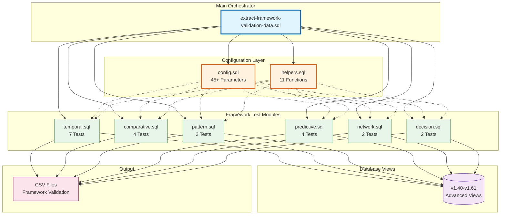
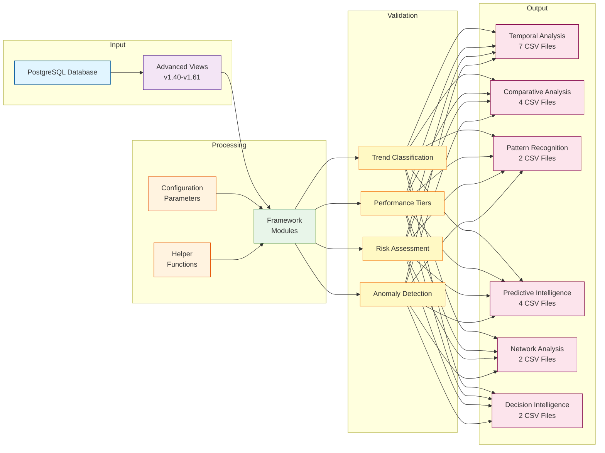
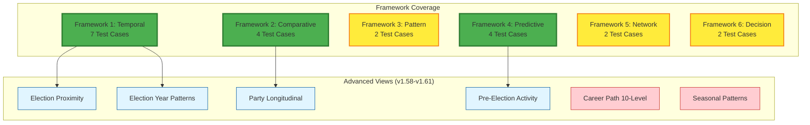
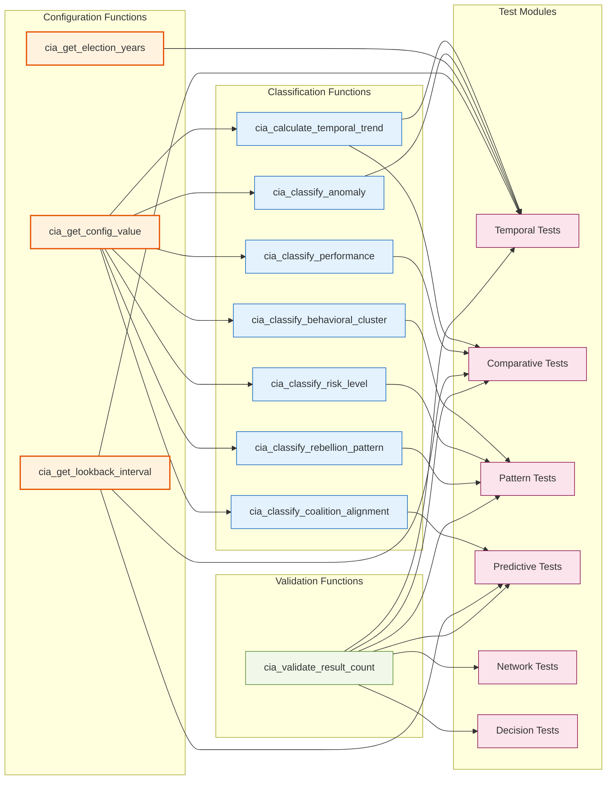
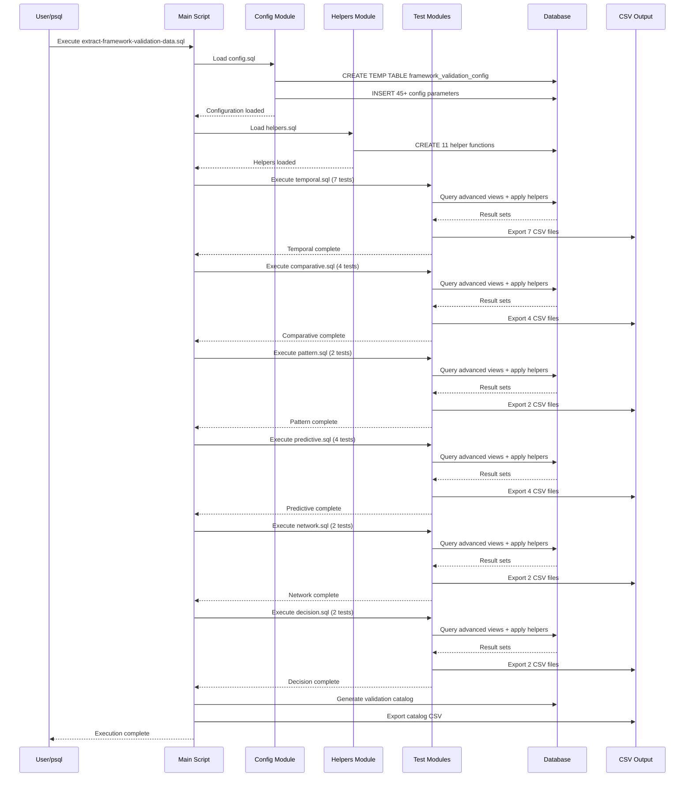
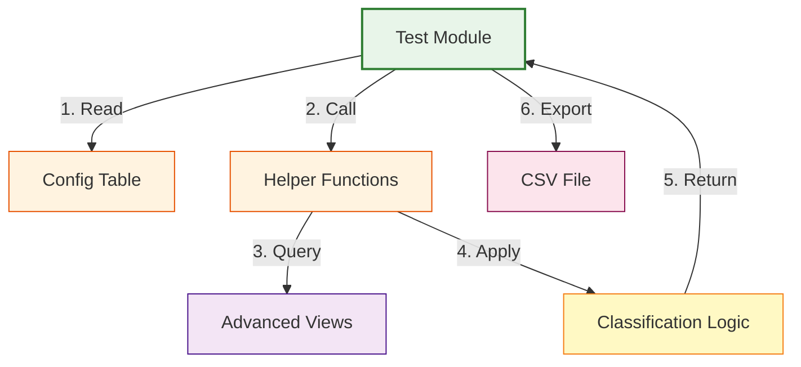

# Framework Validation Architecture

## System Overview

This document provides visual representations of the refactored Framework Validation Data Extraction system architecture, data flow, and test coverage.

## Architecture Diagram

## Data Flow

## Test Coverage Matrix

**Legend:**
- 🟢 **Green**: Comprehensive coverage (4+ tests)
- 🟡 **Yellow**: Basic coverage (2-3 tests)
- 🔵 **Blue**: View covered in tests
- 🔴 **Red**: View not yet covered

## Helper Function Dependencies

## Execution Flow

## Module Interaction Pattern

## Quick Reference

### Test Count by Framework
- **Temporal Analysis**: 7 tests (including 2 new election-related tests)
- **Comparative Analysis**: 4 tests (including 1 new longitudinal test)
- **Pattern Recognition**: 2 tests
- **Predictive Intelligence**: 4 tests (including 1 new pre-election test)
- **Network Analysis**: 2 tests
- **Decision Intelligence**: 2 tests

**Total**: 21 test cases (increased from 18)

### Coverage Statistics
- **Total CSV Files**: 21
- **Helper Functions**: 11
- **Config Parameters**: 45+
- **Advanced Views Covered**: 13 (9 original + 4 new)
- **Views from v1.58-v1.61**: 11 of 11 covered (100%) ✅

### New Test Cases (v1.58-v1.61 Coverage - 100% Complete)

**Phase 1 Tests:**
1. **Test 1.5**: Election Proximity Trends - `view_riksdagen_election_proximity_trends`
2. **Test 1.6**: Election Year Patterns - `view_riksdagen_election_year_behavioral_patterns`
3. **Test 2.4**: Party Longitudinal Performance - `view_riksdagen_party_longitudinal_performance`
4. **Test 4.3**: Pre-Election Activity - `view_riksdagen_pre_election_quarterly_activity`

**Phase 2 Tests:**
5. **Test 1.7**: Election Year Anomalies - `view_riksdagen_election_year_anomalies`
6. **Test 1.8**: Election vs Midterm Comparison - `view_riksdagen_election_year_vs_midterm`
7. **Test 1.9**: Seasonal Activity Patterns - `view_riksdagen_seasonal_activity_patterns`
8. **Test 2.5**: Party Coalition Evolution - `view_riksdagen_party_coalition_evolution`
9. **Test 2.6**: Party Electoral Trends - `view_riksdagen_party_electoral_trends`
10. **Test 2.7**: Party Summary - `view_riksdagen_party_summary`
11. **Test 3.3**: Career Path Classification - `view_riksdagen_politician_career_path_10level`
